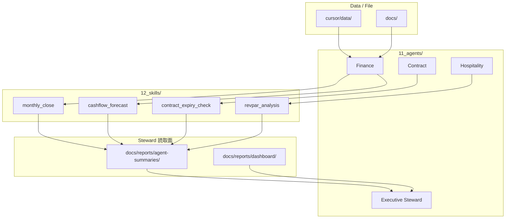

# Steward OS — Agent / Skill アーキテクチャ

**版:** 2026-06-07 · **上位:** [steward_os_principles.md](steward_os_principles.md)

---

## 情報フロー

---

## 論理フォルダ（steward-os/）

| 番号 | 論理 | 現行パス（Phase 0） |
|------|------|-------------------|
| 00 | company | `cursor/data/company.yaml` · `docs/corporate/` |
| 01 | business_plan | `cursor/data/plans/` · `docs/plans/` |
| 02 | properties | `cursor/data/properties/` |
| 03 | finance | `cursor/data/finances/` · `docs/corporate/tax/` |
| 04 | contracts | `cursor/data/contracts/` · `docs/contracts/` |
| 05 | rental | `docs/plans/rental/`（新設予定） |
| 06 | hospitality | `docs/operations/lodging/` |
| 07 | compliance | `docs/corporate/regulations/` · `docs/iso/` |
| 08 | operations | `docs/inbox/` · `docs/outbox/` |
| 09 | reports | `docs/reports/` |
| 10 | decisions | `docs/corporate/*gijiroku*` · `executive-remaining-tasks.md` |
| 11 | agents | `11_agents/` |
| 12 | skills | `12_skills/` |
| 13 | rules | `13_rules/` |
| 14 | prompts | `14_prompts/` |
| 99 | archive | `docs/plans/archive/` |

**Phase 0:** 物理移行なし。`cursor/data/` と `src/` は維持。

---

## Agent 一覧

| Agent | 定義 | 要約出力先 |
|-------|------|-----------|
| Executive Steward | [11_agents/executive_steward_agent.md](../11_agents/executive_steward_agent.md) | `docs/reports/` · `executive-notes/` |
| Finance | [11_agents/finance_agent.md](../11_agents/finance_agent.md) | `agent-summaries/finance/` |
| Contract | [11_agents/contract_agent.md](../11_agents/contract_agent.md) | `agent-summaries/contract/` |
| Property Rental | [11_agents/property_rental_agent.md](../11_agents/property_rental_agent.md) | `agent-summaries/prop-001/` |
| Hospitality | [11_agents/hospitality_agent.md](../11_agents/hospitality_agent.md) | `agent-summaries/prop-002/` |
| Compliance | [11_agents/compliance_agent.md](../11_agents/compliance_agent.md) | `agent-summaries/compliance/` |
| Operations | [11_agents/operations_agent.md](../11_agents/operations_agent.md) | `agent-summaries/operations/` |

---

## Skill 一覧（Phase 0）

| Skill | 定義 | 主 Agent |
|-------|------|---------|
| executive_dashboard | [12_skills/executive_dashboard.md](../12_skills/executive_dashboard.md) | Executive Steward |
| monthly_close | [12_skills/monthly_close.md](../12_skills/monthly_close.md) | Finance |
| cashflow_forecast | [12_skills/cashflow_forecast.md](../12_skills/cashflow_forecast.md) | Finance |
| contract_register | [12_skills/contract_register.md](../12_skills/contract_register.md) | Contract · Operations |
| contract_expiry_check | [12_skills/contract_expiry_check.md](../12_skills/contract_expiry_check.md) | Contract |
| noi_analysis | [12_skills/noi_analysis.md](../12_skills/noi_analysis.md) | Property Rental |
| revpar_analysis | [12_skills/revpar_analysis.md](../12_skills/revpar_analysis.md) | Hospitality |
| capex_planning | [12_skills/capex_planning.md](../12_skills/capex_planning.md) | Finance |
| permit_expiry_check | [12_skills/permit_expiry_check.md](../12_skills/permit_expiry_check.md) | Compliance |

追加 Skill は [12_skills/](../12_skills/00-このフォルダについて.md) に随時追加。

---

## CLI = Skill 実装

| CLI | 対応 Skill |
|-----|-----------|
| `steward dashboard` | executive_dashboard |
| `steward sync all` | contract_register / monthly_close |
| `steward forecast` | cashflow_forecast |
| `steward analyze property` | noi_analysis / revpar_analysis |
| `steward alerts` | contract_expiry_check · permit_expiry_check |
| `steward io *` | contract_register（归档） |

実装: `src/commands/` · 定義: `12_skills/`

---

## 横断タスク

事業計画分解等の **Orchestrator プロンプト** は Agent ではなく [14_prompts/](../14_prompts/00-このフォルダについて.md)。Executive が委譲する。

---

## 関連

- [docs/agent_architecture.md](../docs/agent_architecture.md) — 現行パス詳細（レガシー索引）
- [folder_access_policy.md](folder_access_policy.md)
