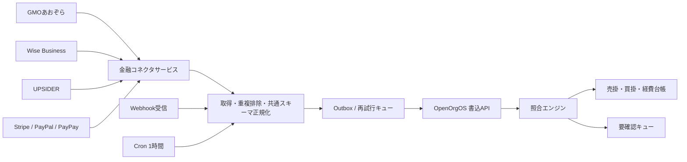

# 外部金融コネクタ設計（初版）

## 前提

この設計は、各社の契約・開発者審査・レート制限・Webhook 対象範囲を実アカウントで確認する前の実装境界である。「月額0円」は当社の中継サービス費用を含まない意味に限定し、各社の有料プラン、振込手数料、API 利用条件、税務上の証憑要件は別途確認する。API 仕様を推測して本番 URL や権限を固定しない。

## 構成

コネクタは `fetch(since, cursor)` と `verifyWebhook(headers, body)` を持つアダプタとして分離する。資格情報は Secret Manager または gitignore 対象の実行環境に置き、テナント YAML、ログ、イベント本文へ出力しない。受信イベントは `source + raw_event_id` を一意キーにして冪等化し、失敗時は指数バックオフする。

## 認証実装指針

| サービス | 実装境界 |
|---|---|
| GMOあおぞら | OAuth 2.0 の認可・トークン更新を専用アダプタに隔離。スコープと参照系権限を設定で指定し、実 API のエンドポイントは契約資料で確定する。|
| Wise Business | API Token は Secret Manager から読み、`Authorization` ヘッダへ注入。アカウント・残高・通貨を設定で選択し、ページングを必須化する。|
| UPSIDER | Read-only キーまたは署名付き Webhook のどちらを利用できるか実テナントで確認。署名検証、timestamp 許容幅、再送処理を実装する。|
| Stripe / PayPal / PayPay | Webhook を主経路、Cron を補完経路とする。署名検証後に raw event id で冪等化し、決済成功・返金・チャージバックを別イベントとして扱う。|

## 自動照合

1. 正規化後、`source + transaction_id` の取り込み済み記録を確認する。
2. 取引種別に応じ、未決済の売掛または買掛・経費候補をテナント境界内で検索する。
3. 名義を NFKC・大文字化し、空白・記号を除去する。名義一致かつ通貨・金額一致が一件だけなら照合候補を作る。
4. 複数件、金額不一致、名義未登録、為替換算が必要な場合は `REVIEW` とし、自動で台帳を確定しない。
5. 確定・却下・再照合は OpenOrgOS の承認・監査経路を通し、コネクタが人間承認を代行しない。

## 開発計画

| Phase | 実装項目 | 完了条件 |
|---|---|---|
| 1 | 各社の開発者登録、契約・無料条件・スコープ確認、アダプタ雛形、sandbox fixture、OAuth/API key/Webhook 検証 | 実アカウントを使わず fixture で取得・署名検証・ページング・再試行が再現できる |
| 2 | 共通スキーマ、重複排除、outbox、OpenOrgOS 書込 API の permission/audit 接続 | 同一イベント再送で一件、失敗は再試行、秘密情報がログに出ない |
| 3 | 売掛・経費照合、曖昧・不一致の要確認キュー、承認後の適用 | matched/review の境界テスト、テナント分離、期間ロックを確認 |
| 4 | Cron、Webhook公開、監視、レート制限、障害復旧、sandbox→本番切替 | 監査ログ、アラート、再送、停止手順、手動照合手順を含む受入記録 |

## リスクと未確認事項

各サービスが本当に基本料金0円で対象 API を提供すること、UPSIDER と PayPay の法人 API の利用可否、GMO の現在の参照 API 契約、為替レートの会計採用時点は未検証である。Phase 1 の契約確認が完了するまで、本番接続や「完全無料」の表示を行わない。
