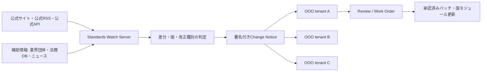

# Standards Watch構成

## 方針

法律、規制、ISO、JIS、PMBOK、金融API仕様を各OOOが直接巡回しない。中央のStandards Watch Serverだけが外部ソースを確認し、公式ソースを正本、補助ソースを検知・補完用として扱う。各OOOは軽量な署名付き通知を受信し、通知を保存して人間レビューへ送る。

## 情報源の扱い

- official_sources: 改正の判定と採用根拠。ISO、JIS、日本郵便、J-LIS、官公庁、PMI、金融事業者の公式開発者ポータルを登録する。
- auxiliary_sources: 早期検知、要約、影響範囲の補助。改正の最終根拠にはしない。
- source-unavailable: 公式サイトが取得不能な場合は通知するが、現行版を自動変更しない。

## 軽量化

- 重い巡回・PDF比較・差分解析は中央サーバだけで行う。
- 公式RSS/Atom/HTTP HEAD/ETag/Last-Modifiedを優先し、本文取得は差分がある場合だけ行う。
- 各OOOは通知の署名検証、標準ID照合、保存、レビュー起票だけを行う。
- 通知は標準ID、版、URL、要約、ハッシュ、署名だけにし、全文を配信しない。
- criticalは即時通知、highは日次集約、normalは週次、lowは月次に集約する。

## 反映ルール

通知受信は自動で行うが、法律・税制・会計・承認・ISO 20022マッピングは自動適用しない。郵便番号や公開コードの差分など、登録済みの低リスクデータだけを`auto_apply: true`にできる。その他はWork Orderを作り、人間レビュー後に国モジュールやスキーマを更新する。

## 初期監視対象

| ID | 公式ソース | 補助ソース | 周期 |
|---|---|---|---|
| ISO-3166 | ISO Online Browsing Platform | UN / 国際機関 | weekly |
| ISO-4217 | ISO Maintenance Agency | SWIFT / ECB | weekly |
| ISO-20022 | ISO / ISO 20022 Registration Authority | SWIFT /各決済機関 | weekly |
| JIS-X0401-0402 | 日本規格協会・官公庁 | e-Stat / J-LIS | monthly |
| JP-POSTAL | 日本郵便 | J-LIS | monthly |
| JP-LAW-TAX | e-Gov / 国税庁 | 税務専門機関 | daily |
| PMBOK | PMI | PMI認定教育機関 | monthly |
| FIN-API | 各金融事業者公式開発者ポータル | SDK/GitHub changelog | daily |
