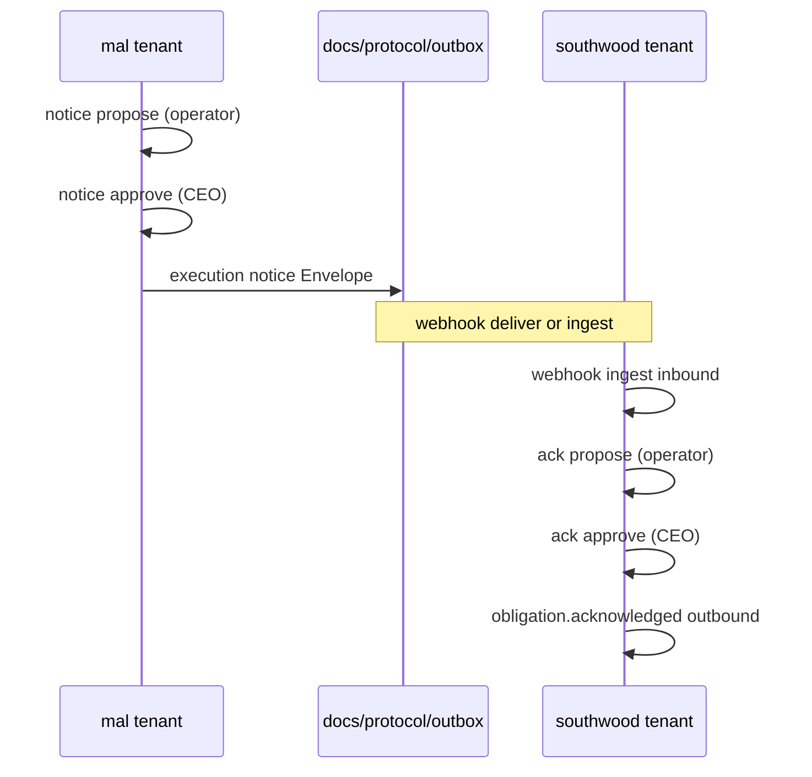

# Inter-org Protocol · 2 組織デモ

**目的:** OpenOrgOS Core の 4 要素（Org Event · identity · authority · transaction + audit）を、**2 つの独立テナント**が実際にやり取りする形で再現する。

## 登場組織

| テナント ID | 法人（L1 ダミー） | 役割 |
|-------------|-------------------|------|
| `mal` | 株式会社 MAL | **貸主** · 本社ビル（千代田区二番町1）オーナー |
| `southwood` | 株式会社サウスウッド | **借主** · MAL 本社内オフィス区画を賃借 |

シナリオ: **CTR-012 オフィス賃貸借契約**（既締結）に基づく **実行通知**（`contract.execution.notice`）を、**オペレータ起案 → CEO 承認** の後に相手 Org へ送る。

**設計原則:** Steward Agent は自組織内のみ。組織間 wire は **人間オペレータ + 承認者** が `protocol notice` CLI で明示的に行う。詳細: [inter-org-operator-model.md](inter-org-operator-model.md)



## 前提

- リポジトリルートで `npm install` 済み
- Privacy Mode / L2: wire には **ID リンクのみ**（口座番号 · 個人連絡先は載せない）

## 1. デモデータ生成

```bash
npm run demo:inter-org
```

デモは **HUB-A / HUB-B**（9474/9475）を起動し、`witness-pool.yaml` を両テナントに生成 · execution notice の **sent/received attestation** まで fan-out します。要件: [witness-hub-requirements.md](witness-hub-requirements.md)

再実行可能（各テナントの `data/protocol/` と `docs/protocol/outbox/` を再生成）。

生成内容:

| 組織 | 生成物 |
|------|--------|
| **mal** | `pending-notices.yaml` · approved notice · `transactions-registry.yaml` · outbox |
| **southwood** | webhook inbound · ack `pending-notices` · outbox |
| **共有** | execution notice の `event_id` で inbound をリンク · ack は `correlation_event_id` |

あわせて `tenants/mal/data/contracts/CTR-012.yaml` を `status: executed` に更新。

## 2. 各組織の台帳確認

```bash
npm run demo:inter-org

# MAL — 起案・承認・送信記録
npm run steward -- --tenant mal protocol notice list
npm run steward -- --tenant mal protocol transaction list
npm run steward -- --tenant mal protocol audit verify

# サウスウッド — 借主側 inbound + ack
npm run steward -- --tenant southwood protocol transaction list
npm run steward -- --tenant southwood protocol audit verify
```

手動で同じ流れ:

```bash
npm run steward -- --tenant mal protocol notice propose \
  --peer PEER-001 --contract CTR-012 --operator "秘書オペレータ"
npm run steward -- --tenant mal protocol notice approve \
  --id NOTICE-YYYYMMDD-001 --approver "段燕燕"
```

## 3. Outbox（送信用 Envelope）

| パス | 内容 |
|------|------|
| `tenants/mal/docs/protocol/outbox/01-mal-identity-presented.json` | 自社 identity 提示 |
| `tenants/mal/docs/protocol/outbox/02-mal-delegation-contract-sign.json` | Contract Agent への署名権限委譲 |
| `tenants/mal/docs/protocol/outbox/03-mal-execution-notice.json` | **実行通知**（`contract.execution.notice` · CEO 承認済） |
| `tenants/southwood/docs/protocol/inbox/*.json` | webhook ingest ミラー（受信 Envelope） |
| `tenants/southwood/docs/protocol/outbox/03-vendor-obligation-ack.json` | 受諾確認 outbound（CEO 承認済） |

現状の Transport は **ファイル outbox**（Phase 6: webhook dual mode も利用可）。

## 4. Webhook で inbound をシミュレート（任意）

```bash
npm run steward -- --tenant southwood webhook ingest \
  --file tenants/mal/docs/protocol/outbox/03-mal-execution-notice.json
```

## 5. 手動で 1 件送る場合

Outbound は **notice フロー必須**（Steward Agent は cross-org 送信しない）:

```bash
npm run steward -- --tenant mal protocol peer register \
  --name "株式会社サウスウッド" --jurisdiction JP --stakeholder STK-001

npm run steward -- --tenant mal protocol notice propose \
  --peer PEER-001 --contract CTR-012 --operator "秘書オペレータ"

npm run steward -- --tenant mal protocol notice approve \
  --id NOTICE-YYYYMMDD-001 --approver "段燕燕"
```

`CTR-012` は `status: executed` である必要あり。詳細: [inter-org-operator-model.md](inter-org-operator-model.md)

## データ配置（正本）

| 層 | mal | southwood |
|----|-----|-----------|
| Peer 台帳 | `data/protocol/peers.yaml` | `data/protocol/peers.yaml` |
| 取引台帳 | `data/protocol/transactions-registry.yaml` | 同左 |
| 承認待ち | `data/protocol/pending-notices.yaml` | `pending-notices.yaml`（ack 含む） |
| Audit chain | `data/protocol/audit-chain.jsonl` | 同左 |
| Witness プール | `data/protocol/witness-pool.yaml` | 同左 |
| Wire 出力 | `docs/protocol/outbox/*.json` | 同左 |

## 関連

- [openorgos-core-philosophy.md](openorgos-core-philosophy.md)
- [layer-mapping-steward-os.md](layer-mapping-steward-os.md)
- `steward/platform/protocol/registry.yaml`
- [`CTR-012`](../../tenants/mal/data/contracts/CTR-012.yaml) · [`01-draft.md`](../../tenants/mal/docs/contracts/CTR-012/01-draft.md)
