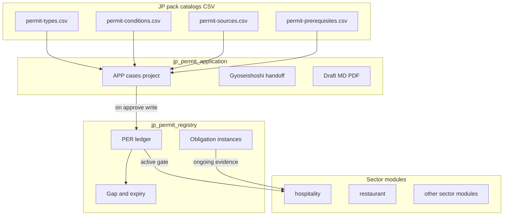

# JP 許認可取得モジュール（`jp_permit_application`）— 要件定義

**Status:** 2026-07-14 · P0–P2 コア実装済 · カタログ拡充（金商法・薬機コスメ/医薬品等）· 会社 DB 自動記入  
**Parent:** [module_contract.md](../../steward/modules/module_contract.md) · [business-capability-catalog.yaml](../../steward/jurisdiction-packs/JP/business-capability-catalog.yaml)  
**ADR:** [0011-jp-permit-application-vs-registry.md](../adr/0011-jp-permit-application-vs-registry.md) · [0012-business-vs-compliance-fulfilment.md](../adr/0012-business-vs-compliance-fulfilment.md)（業 ↔ Compliance 責務分離）  
**カタログ方針:** [jp-permit-catalog-coverage.md](./jp-permit-catalog-coverage.md)  
**既存台帳:** [jp_permit_registry](../../steward/jurisdiction-packs/JP/modules/jp_permit_registry/)

---

## 1. 背景・問題

旅館業など業モジュールを「営業できる」まで評価すると、**免許取得（プロジェクト）**と**取得後の定常運用**が混同される。

| 混同の例 | 問題 |
|---------|------|
| `hospitality` が `production_ready` でも許可が `pending` | カタログ tier と現場 readiness が乖離 |
| `jp_permit_registry` に台帳と申請案件が同居 | 行政書士連携・更新案件のオーナーが不明瞭 |
| 開業チェック A1「索引 ✅」 | 索引整備 ≠ 許可取得完了 |

**方針（案 B）:** 取得・更新・変更届を **プロジェクト型モジュール**に切り出し、保有台帳は `jp_permit_registry`、業の日次運用は業モジュールに残す。

---

## 2. ゴール / 非ゴール

### 2.1 ゴール

1. 新規取得・更新・変更届を **始まりと終わりのある案件（`APP-*`）** として管理する
2. 日本法に準拠した **許認可種別・取得条件・政府公式 URL** を CSV カタログで参照・更新できる
3. 案件承認時に **台帳 `PER-*` を唯一の書込経路**で更新し、義務インスタンス生成をトリガする
4. 行政書士等の外部専門家への **handoff を記録**できる（自動提出はしない）
5. 業モジュールは `PER-* active` を前提に定常運用し、証拠（名簿等）のみを持つ

### 2.2 非ゴール

- 行政機関 API への自動提出・電子申請代行
- 法令本文の全文転載・自動クローリングによる法令 DB 構築
- 民泊（`jp_minpaku`）・宅建（`jp_takken`）業モジュール本体の実装
- 医療機器 QMS/GVP の詳細義務（`jp_medical_device` 正本のまま）
- 法人登記手続き本体（`jp_corporate_registration`）

---

## 3. モジュール境界とデータ所有



| モジュール | 型 | 役割 | 所有データ |
|-----------|----|------|-----------|
| **`jp_permit_application`** | プロジェクト | 新規取得・更新・変更届 · 行政書士 handoff · 申請ドラフト/チェック/PDF · 提出物 outbox | テナント `data/permit-applications/` |
| **`jp_permit_registry`** | 定常台帳 | 保有許可 SSOT · 義務期限 · gap/expiry · 証跡パス | 既存 `data/permit-registry/`（`PER-*` · `obligation-instances`） |
| **業モジュール**（`hospitality` 等） | 定常運用 | 取得**後**の現場運用 · 業法義務の証拠ファイル | `operations/` · `records/` · 物件 YAML |

### 3.1 禁止の重複

| 主体 | 禁止 |
|------|------|
| 業モジュール | 許可番号・許可 status の invent / 台帳直書込 |
| 取得モジュール | 日次名簿・清掃記録・ADR/RevPAR 等の定常運用データ書込 |
| 取得モジュール以外 | `PER-*` の作成・`active` 化（完了時は取得モジュール経由のみ） |

### 3.2 カタログの置き場

法域共通マスタは **registry 側**に置く（application が参照）:

```
steward/jurisdiction-packs/JP/modules/jp_permit_registry/catalog/
  permit-types.csv
  permit-prerequisites.csv
  permit-conditions.csv
  permit-sources.csv
  permit-type-sources.csv
```

既存 YAML（`permit-types-catalog.yaml.example` · `sources.yaml.example`）は **CSV 正本へ移行後、生成物または後方互換ロード**とする（実装フェーズ）。

### 3.3 テナントデータ（取得モジュール）

| パス | 内容 |
|------|------|
| `data/permit-applications/application-registry.yaml` | `APP-*` 案件台帳 |
| `data/permit-applications/drafts/{APP-ID}.yaml` | 申請作業ドラフト |
| `data/permit-applications/checklists/{APP-ID}.yaml` | 条件チェック結果 |
| `data/permit-applications/handoffs/{APP-ID}.yaml` | 行政書士 handoff 記録 |
| `docs/permit-applications/{APP-ID}/application.md` | レビュー用 MD |
| `docs/io/outbox/submissions/{APP-ID}-application.pdf` | 提出用 PDF |

台帳側は現状どおり `data/permit-registry/`（`PER-*` · obligations · forms/field-map は registry が継続所有可）。

---

## 4. 他免許・他モジュール連携マトリクス

| 対象 | `permit_type_id` 例 | 取得モジュール | 台帳 | 業 / 専門モジュール |
|------|---------------------|----------------|------|---------------------|
| 旅館業（ホテル・旅館・簡易宿所・下宿） | `pt-ryokan-*` | 案件オーナー | `PER-*` | `hospitality`（運用・名簿証拠） |
| 消防配置証明 · 建築確認 | `pt-fire-equip` · `pt-building-confirm` | 前提案件 or マイルストーン | 同上 | 物件スコープ · hospitality ゲート入力 |
| 住宅宿泊事業（民泊） | `pt-minpaku-notification` | 案件タイプとして扱う | 同上 | `jp_minpaku`（planned · 業は未実装） |
| 飲食・酒類 | `pt-food-*` / 酒類関連 | 同上 | 同上 | `restaurant` |
| 宅建業 | `pt-takken` 等 | 同上 | 同上 | `jp_takken` / `real_estate_brokerage`（planned） |
| 建設業 | 建設カテゴリ種 | 同上 | 同上 | `construction` |
| 医療機器 | `pt-medical-device-*` | **届出/許可案件のみ** | リンク | **`jp_medical_device` が詳細義務正本** |
| 法人登記 | （許認可外） | 前提参照のみ · 所有しない | — | `jp_corporate_registration` |
| 火災保険等 | （許認可外） | チェックリストから CTR 参照 | — | Contract |
| 行政書士 | — | handoff 記録 · 提出物パス | — | `external-contacts` · EVT |

**Capability catalog 更新方針（実装時）:**

- 追加: `jp_permit_application`（`status: planned` → 実装後 `partial`）· `agent_proxy: compliance` · categories `[compliance_legal]`
- 更新: `jp_permit_registry` notes を「保有台帳 · 義務 · gap/expiry」に限定し、申請ワークフロー所有を application へ移す旨を明記

---

## 5. カタログ CSV スキーマと更新手順

### 5.1 方針

1. **正本は CSV**（行単位の差分・表計算での更新が容易）
2. 法令本文は転載しない — **法令名+条 · 要約 · 公式 URL** のみ
3. 自治体固有様式は `jurisdiction_confirm_required=true` とし、国ポータルを `role=primary` とする
4. 変更時は該当行を更新し、`catalog_version`（types）または `reviewed_on`（sources）を更新
5. CLI `operations permit catalog validate`（実装時）で: URL 形式 · 孤立 ID · 前提の閉包 · 必須列を検査

### 5.2 初期スコープ

| フェーズ | 内容 |
|---------|------|
| P0（本要件） | スキーマ確定 · サンプル行（住宿・消防建築） |
| P1 | 既存 YAML 60+ 種の機械移植 · 住宿・消防建築を人手レビュー |
| P2 | 他セクターの `review_status=unverified` 解消 · conditions 拡充 |

### 5.3 ファイル定義

#### `permit-types.csv`

| 列 | 必須 | 説明 |
|----|:---:|------|
| `permit_type_id` | ○ | 主キー（例: `pt-ryokan-shukuhaku`） |
| `name_ja` | ○ | 日本語名 |
| `name_en` | | 英語名 |
| `category` | ○ | `accommodation` · `fire_building` · …（既存 enum） |
| `legal_basis` | ○ | 法令名+条（例: `旅館業法第4条`） |
| `issuer_type` | ○ | `municipal` · `fire_department` · … |
| `issuer_label_ja` | | 発行者ラベル |
| `renewal_cycle` | | 更新周期の説明文 |
| `property_scoped` | ○ | `true` / `false` |
| `site_scoped` | | `true` / `false` |
| `binds_module` | | 連動業モジュール id（例: `hospitality`） |
| `catalog_version` | ○ | カタログ版（例: `1`） |
| `review_status` | ○ | `verified` · `unverified` · `deprecated` |
| `notes` | | 備考 |

#### `permit-prerequisites.csv`

| 列 | 必須 | 説明 |
|----|:---:|------|
| `permit_type_id` | ○ | 取得対象 |
| `prerequisite_type_id` | ○ | 前提となる種別 |
| `severity` | ○ | `required` · `recommended` |
| `notes` | | |

複合主キー: (`permit_type_id`, `prerequisite_type_id`)

#### `permit-conditions.csv`

| 列 | 必須 | 説明 |
|----|:---:|------|
| `condition_id` | ○ | 主キー（例: `COND-RYOKAN-OBTAIN-01`） |
| `permit_type_id` | ○ | 対象種別 |
| `phase` | ○ | `obtain` · `renew` · `change` |
| `title_ja` | ○ | 条件タイトル |
| `legal_basis` | ○ | 法令根拠（条レベル） |
| `severity` | ○ | `required` · `recommended` |
| `evidence_hint` | | 証跡の置き場ヒント（パスパターン可） |
| `source_id` | | `permit-sources.csv` への参照 |
| `notes` | | |

#### `permit-sources.csv`

| 列 | 必須 | 説明 |
|----|:---:|------|
| `source_id` | ○ | 主キー（例: `mhlw-ryokan`） |
| `title` | ○ | 表示名 |
| `url` | ○ | 公式 URL（https） |
| `org` | ○ | 省庁・機関（例: `厚生労働省`） |
| `type` | ○ | `law` · `guidance` · `portal` · `form` |
| `category` | | カテゴリ（types と揃える） |
| `reviewed_on` | ○ | 最終確認日 `YYYY-MM-DD` |
| `notes` | | |

#### `permit-type-sources.csv`

| 列 | 必須 | 説明 |
|----|:---:|------|
| `permit_type_id` | ○ | |
| `source_id` | ○ | |
| `role` | ○ | `primary` · `form` · `guidance` |
| `jurisdiction_confirm_required` | | `true` なら自治体最新様式の確認必須 |

### 5.4 サンプル行（住宿 · 消防建築）

**`permit-types.csv`（抜粋）**

```csv
permit_type_id,name_ja,name_en,category,legal_basis,issuer_type,issuer_label_ja,renewal_cycle,property_scoped,site_scoped,binds_module,catalog_version,review_status,notes
pt-ryokan-hotel,旅館業（ホテル業）,Hotel business,accommodation,旅館業法第4条,municipal,保健所を経由する市区町村,原則無期限（変更届出あり）,true,false,hospitality,1,verified,客室10室以上が目安
pt-ryokan-ryokan,旅館業（旅館）,,accommodation,旅館業法第4条,municipal,,,true,false,hospitality,1,verified,
pt-ryokan-shukuhaku,旅館業（簡易宿所）,,accommodation,旅館業法第4条,municipal,,,true,false,hospitality,1,verified,1棟貸し等で多用
pt-ryokan-geshuku,旅館業（下宿営業）,,accommodation,旅館業法第4条,municipal,,,true,false,hospitality,1,verified,
pt-minpaku-notification,住宅宿泊事業届出（民泊）,,accommodation,住宅宿泊事業法第5条,municipal,,,true,false,,1,verified,業モジュールは jp_minpaku planned
pt-fire-equip,消防用設備等配置証明,,fire_building,消防法第17条の3,fire_department,,,true,false,,1,verified,
pt-building-confirm,建築確認済証,,fire_building,建築基準法第6条,prefectural,,,true,false,,1,verified,
```

**`permit-prerequisites.csv`（抜粋）**

```csv
permit_type_id,prerequisite_type_id,severity,notes
pt-ryokan-hotel,pt-fire-equip,required,
pt-ryokan-hotel,pt-building-confirm,required,
pt-ryokan-ryokan,pt-fire-equip,required,
pt-ryokan-ryokan,pt-building-confirm,required,
pt-ryokan-shukuhaku,pt-fire-equip,required,建築確認は案件により recommended
pt-ryokan-shukuhaku,pt-building-confirm,recommended,INDEX/CTR 照合用
```

**`permit-conditions.csv`（抜粋 · 簡易宿所 obtain）**

```csv
condition_id,permit_type_id,phase,title_ja,legal_basis,severity,evidence_hint,source_id,notes
COND-RYOKAN-SHUKU-OBTAIN-01,pt-ryokan-shukuhaku,obtain,営業許可の申請・取得,旅館業法第4条,required,docs/company/licenses/records/ryokan/,mhlw-ryokan,営業開始前必須
COND-RYOKAN-SHUKU-OBTAIN-02,pt-ryokan-shukuhaku,obtain,許可証の掲示,旅館業法（掲示義務）,required,施設内掲示 · スキャン任意,mhlw-ryokan,pre-opening A2
COND-RYOKAN-SHUKU-OBTAIN-03,pt-ryokan-shukuhaku,obtain,宿泊者名簿様式の準備,旅館業法第6条,required,operations/templates/compliance/,mhlw-ryokan,運用開始は業モジュール
COND-RYOKAN-SHUKU-OBTAIN-04,pt-ryokan-shukuhaku,obtain,消防用設備等の適合,消防法第17条の3,required,docs/company/licenses/records/ryokan/,fdma-fire,前提 PER または並行 APP
COND-RYOKAN-SHUKU-CHANGE-01,pt-ryokan-shukuhaku,change,許可事項変更届出,旅館業法施行規則,required,,mhlw-ryokan,lead_days 目安14
COND-RYOKAN-SHUKU-RENEW-01,pt-ryokan-shukuhaku,renew,更新・再交付が必要な場合の手続,旅館業法 · 自治体条例,recommended,,mhlw-ryokan,原則無期限でも自治体手続あり
```

**`permit-sources.csv`（抜粋）**

```csv
source_id,title,url,org,type,category,reviewed_on,notes
mhlw-ryokan,旅館業法（厚生労働省）,https://www.mhlw.go.jp/stf/seisakunitsuite/bunya/0000188411.html,厚生労働省,law,accommodation,2026-07-10,
mlit-minpaku,住宅宿泊事業法（国土交通省）,https://www.mlit.go.jp/jutakukentiku/house/jutakukentiku_house_tk3_000015.html,国土交通省,law,accommodation,2026-07-10,
fdma-fire,消防庁 — 消防法関連,https://www.fdma.go.jp/,消防庁,portal,fire_building,2026-07-10,
mlit-building,国土交通省 — 建築確認,https://www.mlit.go.jp/jutakukentiku/building/,国土交通省,portal,fire_building,2026-07-10,
```

**`permit-type-sources.csv`（抜粋）**

```csv
permit_type_id,source_id,role,jurisdiction_confirm_required
pt-ryokan-shukuhaku,mhlw-ryokan,primary,true
pt-ryokan-hotel,mhlw-ryokan,primary,true
pt-minpaku-notification,mlit-minpaku,primary,true
pt-fire-equip,fdma-fire,primary,true
pt-building-confirm,mlit-building,primary,true
```

### 5.5 更新手順（運用）

1. 改正・URL 変更を検知（手動 · 定期レビュー）
2. 該当 CSV 行を編集 · `reviewed_on` / `catalog_version` 更新
3. `operations permit catalog validate` 実行
4. 必要なら `review_status=verified` へ昇格
5. 影響する open な `APP-*` のチェックリストを再生成（実装時）

---

## 6. 取得プロジェクト機能要件

### 6.1 案件ライフサイクル

既存 enum を踏襲:

`draft → preparing → submitted → under_review → approved | rejected | withdrawn`

| 状態 | 意味 |
|------|------|
| `draft` | 案件枠のみ |
| `preparing` | 条件チェック · ドラフト作成中 |
| `submitted` | 人間が行政/行政書士へ提出済（システムは提出しない） |
| `under_review` | 審査中 |
| `approved` | 許可取得 · **この遷移で `PER-*` upsert** |
| `rejected` / `withdrawn` | 終了（台帳は変更しない or draft のまま） |

`phase`: `obtain` | `renew` | `change`（同一モジュール）

### 6.2 必須機能（User Stories）

| ID | 要件 |
|----|------|
| **FR-APP-01** | 種別カタログから `permit_type_id` を選び `APP-*` を作成できる |
| **FR-APP-02** | 前提許可（`permit-prerequisites.csv`）を自動展開し、未充足を案件上に表示できる |
| **FR-APP-03** | `permit-conditions.csv` を `phase` でフィルタし、案件チェックリストを生成・更新できる |
| **FR-APP-04** | company / property から申請ドラフトを生成できる（既存 `field-map` 流用） |
| **FR-APP-05** | チェック合格後にレビュー MD · PDF を生成できる（既存 prepare/checklist/draft/export-pdf 相当） |
| **FR-APP-06** | 行政書士 handoff を記録できる（担当 contact_id · 送付日 · 返却物パス · メモ） |
| **FR-APP-07** | `approved` 時に `jp_permit_registry` へ `PER-*` を upsert（`status: active` · 許可番号・発行日）し、義務インスタンス生成をトリガできる |
| **FR-APP-08** | 更新・変更届を `phase: renew|change` の案件として同一 UI/CLI で扱える |
| **FR-APP-09** | 公式ソース URL を案件・チェックリストから参照できる（`permit-sources` / `permit-type-sources`） |

### 6.3 非機能

| ID | 要件 |
|----|------|
| **NFR-01** | 行政への自動 HTTP/SMTP 提出を行わない |
| **NFR-02** | 許可番号等 L2 をチャット・tracked 要約へ出力しない（`@file` / 担当 Agent のみ） |
| **NFR-03** | カタログ読取は決定論（CSV · テスト可能）· LLM は案件文案補助に限定可 |
| **NFR-04** | モジュール実行信頼は ADR 0008（Internal only）に従う |

---

## 7. CLI / Agent / Skill 境界

### 7.1 所有権の移行

| 現行（registry） | 移行先 |
|------------------|--------|
| `application-registry.yaml` | `jp_permit_application`（`data/permit-applications/`） |
| `operations permit application prepare\|checklist\|draft\|export-pdf` | application モジュール CLI |
| `operations permit list\|show\|gap\|obligations\|validate` | **registry に残す** |
| forms-catalog · field-map | registry カタログ側（application が参照） |

### 7.2 CLI（予定）

```bash
# 取得プロジェクト
orgos operations permit-app create --type pt-ryokan-shukuhaku --property PROP-002 --phase obtain
orgos operations permit-app checklist --application APP-… [--write]
orgos operations permit-app prepare --application APP-… [--write]
orgos operations permit-app draft --application APP-… [--write]
orgos operations permit-app export-pdf --application APP-… [--write]
orgos operations permit-app handoff --application APP-… --contact STK-… [--write]
orgos operations permit-app approve --application APP-… --permit-number "…" --issued-on YYYY-MM-DD

# 台帳（既存）
orgos operations permit list|show|gap|obligations|validate

# カタログ
orgos operations permit catalog validate
orgos operations permit catalog types [--category accommodation]
```

命名は実装時に `permit application` サブツリーへ寄せてもよいが、**registry の list/gap と衝突しない**こと。

### 7.3 Agent

| Agent | 役割 |
|-------|------|
| `jp_permit_application` | 案件推進 · チェックリスト · handoff · 承認ゲート提案（最終承認は人間） |
| `jp_permit_registry` | 台帳整合 · gap · 義務期限 |
| `hospitality` 等 | 運用証拠 · `active` 前提の現場 |
| Compliance（proxy） | classification · 横断エスカレーション |

Skill runtime: 決定論処理は **`cli` 優先**（tool-neutral-development）。

---

## 8. 業モジュールとの運用ゲート

| ゲート | 要件 |
|--------|------|
| **G-01** | 物件に必須の `permit_type_id`（例: hospitality → 旅館業いずれか）が `active` でない場合、開業チェック / Today にブロッカーを出す |
| **G-02** | 定常義務（名簿等）の **義務レコード**は registry、**証拠ファイル**は業モジュール |
| **G-03** | 取得中（`preparing` 等）は Today に「許認可案件進行中」を表示してよいが、営業開始承認とは分離する |

実装は P2。要件としての契約を先に固定する。

---

## 9. MAL 移行（現行 APP / PER）

現状（2026-07-14）:

| ID | 場所 | status |
|----|------|--------|
| `APP-KAMEZAWA-RYOKAN-001` | `data/permit-applications/application-registry.yaml` | `preparing`（移行済） |
| `PER-RYOKAN-001` 他 3 件 | `data/permit-registry/permit-registry.yaml` | `pending` |

**移行手順（実装時）:**

1. `jp_permit_application` を `modules.yaml` で有効化 · `data_root: data/permit-applications/`
2. `APP-KAMEZAWA-RYOKAN-001` を `data/permit-applications/application-registry.yaml` へ移動
3. registry 側 `application-registry.yaml` は空配列または互換シム（1 リリース）
4. `PER-*` は registry に残す（取得完了まで `pending`）
5. `operations permit validate` と（実装後）`permit-app checklist` が通ることを確認
6. `modules sync-context`

後方互換: 旧パスの application を読むフォールバックは **1 マイナー期間のみ**（要件上の上限）。

---

## 10. フェーズ

| フェーズ | 内容 | 完了条件 |
|---------|------|----------|
| **P0** | 本要件 · ADR · CSV スキーマ/サンプル | ドキュメント受入（§11） |
| **P1** | `jp_permit_application` モジュール骨格 · 申請 CLI 移管 · CSV ロード · YAML→CSV 移植 | `modules check` · MAL APP 移行 · catalog validate |
| **P2** | 行政書士 handoff UI/CLI 完成 · G-01 Today ブロッカー · conditions 拡充 | MAL 簡易宿所案件で approve → PER active までリハーサル可能 |

---

## 11. 受入基準（P0 ドキュメント）

- [x] モジュール三分（application / registry / 業）の所有データが表で定義されている
- [x] 他免許・他モジュールの兼ね合いマトリクスがある
- [x] CSV 5 ファイルの列定義と住宿・消防のサンプル行がある
- [x] 申請ライフサイクルと FR/NFR が列挙されている
- [x] MAL 移行手順が書かれている
- [x] ADR 0011 が Accepted（または Proposed→レビュー）で境界を記録している

**P1 以降の受入（参考）:** `modules check jp_permit_application` · catalog validate · APP 移行後に registry validate · 自動提出がコードパスに存在しないこと。

---

## 12. 実装状況（2026-07-14）

| 項目 | 状態 |
|------|------|
| `jp_permit_application` · `operations permit-app` | 実装済 |
| CSV catalog（62 types）· `permit catalog validate` | 実装済 |
| MAL APP → `data/permit-applications/` | 移行済 |
| form packs（旅館・消防・建築・飲食・古物・宅建・人材・医療製販/製造） | TeX ひな形追加済 |
| `export-pdf` → `writeTexAndCompile` · outbox 登録 | 実装済 |
| `handoff` · `submit-mark` · `approve`→PER | 実装済 |
| 行政自動送信 | 非実装（意図的） |

```bash
STEWARD_TENANT=mal npm run orgos -- operations permit-app prepare --application APP-KAMEZAWA-RYOKAN-001 --write
STEWARD_TENANT=mal npm run orgos -- operations permit-app export-pdf --application APP-KAMEZAWA-RYOKAN-001 --write
STEWARD_TENANT=mal npm run orgos -- operations permit catalog validate
```

---

## 13. 関連

- ADR: [0011-jp-permit-application-vs-registry.md](../adr/0011-jp-permit-application-vs-registry.md)
- 台帳: [jp_permit_registry/agent.md](../../steward/jurisdiction-packs/JP/modules/jp_permit_registry/agent.md)
- 取得: [jp_permit_application/agent.md](../../steward/jurisdiction-packs/JP/modules/jp_permit_application/agent.md)
- 業モジュール例: [hospitality](../../steward/modules/hospitality/)
- PDF: [src/lib/latex-compile.ts](../../src/lib/latex-compile.ts) (`writeTexAndCompile`)
- モジュール契約: [module_contract.md](../../steward/modules/module_contract.md)
- 実行信頼: [0008-module-runtime-trust-internal-only.md](../adr/0008-module-runtime-trust-internal-only.md)
