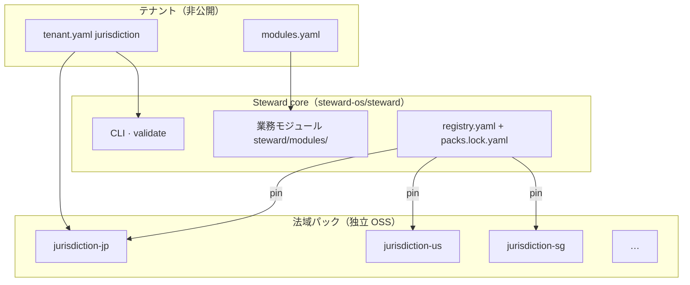

# 法域パック OSS ガバナンス

**目的:** 日本と諸外国を **独立した GitHub リポジトリ** に分離し、法域ごとにメンテナを委託する。

---

## 1. 3 層モデル



| 層 | 誰が更新 | 公開 |
|----|---------|------|
| Steward core | フレームワークチーム | OSS |
| 法域パック | **法域オーナー** | OSS（1 法域 1 repo） |
| テナント | 各社 | 非公開 |

---

## 2. リポジトリ分割方針

### 今（monorepo 内 bundled）

```
steward/jurisdiction-packs/JP/   → 将来 steward-os/jurisdiction-jp へ抽出
steward/jurisdiction-packs/US/ → steward-os/jurisdiction-us
…
```

`pack.manifest.yaml` の `repository` に **将来の正本 URL** を既に記載。core は `packs.lock.yaml` で version pin のみ。

### 将来（完全分離）

1. 法域リポジトリを GitHub で公開
2. メンテナが tag リリース（SemVer）
3. 利用者が `packs.lock.yaml` を更新、または `vendor/packs/JP/` に checkout
4. Steward core の CI は pin された pack で `jurisdiction packs check` + `validate`

---

## 3. モジュールオーナー

各 pack の `pack.manifest.yaml`:

```yaml
owner:
  org: steward-os
  maintainers:
    - steward-os/jp-maintainers
repository: https://github.com/steward-os/jurisdiction-jp
license: MIT
```

| 役割 | 責務 |
|------|------|
| **Pack owner（team）** | 規程改定 · 税 seed · 法域固有モジュール · SemVer tag |
| **Steward core** | `contract_version` 互換 · CLI · 索引 schema |
| **テナント** | `jurisdiction` 選択 · `modules.yaml` ON/OFF |

GitHub では各法域リポジトリに **CODEOWNERS** を配置:

```
# jurisdiction-jp/CODEOWNERS
* @steward-os/jp-maintainers
pack.manifest.yaml @steward-os/core-reviewers
```

`core-reviewers` は `contract_version` 変更時のみレビュー。

---

## 4. 業務モジュール vs 法域モジュール

| 種別 | 置き場所 | 例 | オーナー |
|------|---------|-----|---------|
| **業務（横断）** | `steward/modules/` | rental · travel_booking | Steward core |
| **法域固有** | `{pack}/modules/` | jp_carbon_neutral_2050 | JP pack owner |
| **将来の海外固有** | `{pack}/modules/` | us_sec_reporting（例） | US pack owner |

法域固有モジュールは **他法域テナントのカタログに出さない**（`active_context` フィルタ）。

---

## 5. 更新フロー

### 法域メンテナ（例: 日本の法令改正）

1. `jurisdiction-jp` で規程テンプレ / catalog を PR
2. `pack.manifest.yaml` の `version` を bump
3. tag `v1.1.0` をリリース
4. 利用テナント or Steward core が `packs.lock.yaml` を更新

### Steward core

1. 新法域追加 → `registry.yaml` に索引行 + bundled pack または lock 追加
2. `contract_version` を上げる場合 → 全 pack owner と合意

---

## 6. 現状と次ステップ

| 項目 | 状態 |
|------|------|
| `steward/jurisdiction-packs/{code}/` 物理分離 | ✓ |
| `pack.manifest.yaml`（owner · repository） | ✓ |
| `packs.lock.yaml` pin | ✓ bundled |
| pack 内モジュール解決 | ✓ `modules.ts` |
| GitHub 独立リポジトリ公開 | 未 — monorepo bundled |
| `jurisdiction packs pin --source github:…` | 未 — lock 手動更新 |

**次の一手:** `jurisdiction-jp` を GitHub に mirror 抽出し、JP メンテナ team を作成 → `packs.lock` の `source` を `github:…` に切替。

関連: [pack_contract.md](../../steward/jurisdiction-packs/pack_contract.md) · [jurisdiction-pack-contract.md](jurisdiction-pack-contract.md)
