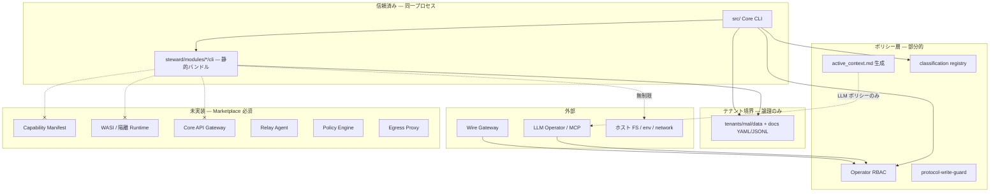

# OrgOS モジュール機構 セキュリティレビュー

**日付:** 2026-07-12  
**対象:** OpenOrgOS / OrgOS 参照実装（`steward/modules/` · `src/lib/modules.ts` · Module CLI）  
**目的:** Marketplace / 第三者モジュール公開前の現状評価と最小安全基盤への移行計画  
**関連方針:** ユーザー提示「OpenOrgOS：コミュニティ・モジュール市場・安全な実行基盤に関する方針」§6–§10

---

## 1. エグゼクティブサマリー

### 結論

| 観点 | 評価 |
|------|------|
| **現状の第三者モジュール実行** | **未実装** — ランタイム動的ロード・Marketplace インストール機構は存在しない |
| **実質的な信頼モデル** | **Phase 1（Internal）相当** — `steward/` カタログ内のコードのみが Core と同一 Node プロセスで実行される |
| **Marketplace 先行実装の可否** | **不可** — サンドボックス・Capability・Relay Agent・Policy Engine・モジュール Identity が未整備 |
| **即時対応が必要な重大問題** | **アーキテクチャ上の欠陥**（将来の第三者モジュールが同一権限で動く設計）— 現時点で外部から任意コードを投入する経路はないが、**リポジトリ merge = 本番実行** となる |

### 推奨アクション（優先順）

1. **Phase 1 をコードとドキュメントで明示固定**（本 PR の暫定ガード + ADR）
2. **脅威モデルに基づく最小安全基盤**（マニフェスト → Identity → Gateway → Relay → Policy）を §9 順で段階実装
3. **Marketplace UI・決済は安全境界完成後**（Phase 3 以降）

---

## 2. モジュール追加・読込み・実行経路

### 2.1 二層モデル

```
[カタログ層] steward/modules/{id}/  または  steward/jurisdiction-packs/{JP}/modules/{id}/
      ↓ agent.md 存在 = カタログ登録
[テナント層] tenants/{tenant}/modules.yaml — enabled / data_root / docs_root のバインドのみ
```

正本: `steward/modules/module_contract.md` · 実装: `src/lib/modules.ts`

### 2.2 実行経路一覧

| 経路 | ロード方式 | プロセス | ゲート |
|------|-----------|---------|--------|
| **Module CLI** | `src/lib/module-cli.ts` への **静的 import**（17 bundles） | Core と **同一 Node プロセス** | `isModuleEnabled()`（一部 CLI のみ） |
| **Skill CLI** | `skills/registry.yaml` → `orgos skills run` | 同一プロセス | テナント有効モジュールのみ registry マージ |
| **Agent（LLM）** | `agent.md` + `active_context.md` ポリシー | 外部 LLM（Cursor / API） | 生成 allowlist（`context-manifest.ts`）— **ランタイム強制ではない** |
| **Agent dispatch** | Work Order → shell / Cursor SDK | 子プロセス（tenant cwd 限定） | `assertDispatchCwdWithinTenant` · `checkAgentAccess` |
| **MCP / Steward Chat** | 固定 7 tools | HTTP サーバ | Operator RBAC · rate limit |
| **Operator LLM tools** | `operator-runtime/tools.ts` | LLM tool loop | `ORGOS_LLM_TOOLS_WRITE=1` + `chat:approve` で承認ツール |

**重要:** 動的 `import()` によるモジュールプラグインロードは **存在しない**。`extensibility-contract.ts` が `cli/register.ts` ↔ `MODULE_CLI_BUNDLES` の同期を検証する。

### 2.3 データアクセス

- **DB（SQL）:** なし（Prisma / PostgreSQL レイヤ未実装）
- **永続化:** テナント配下 YAML / JSONL（`module-business-data.ts` · `utils.ts`）
- **L2 秘密:** gitignore 側（`operations_secrets` 等）— モジュール CLI から **パスが分かれば直接 `readFileSync` 可能**

---

## 3. モジュールがアクセスし得るリソース

| リソース | アクセス方法 | 制限の有無 |
|----------|-------------|-----------|
| **テナント `data/` · `docs/`** | `resolveTenantPath` · `getModuleDataDir` · 直接 `fs` | 論理パス規約のみ。**Capability なし** |
| **フレームワーク `steward/` · `schemas/`** | `resolveTenantPath("steward/...")` | 読取可能（import 済みコードはフルアクセス） |
| **他テナント** | `ORGOS_TENANT` 切替のみ | 同時クロステナント API なし。env 誤設定リスクあり |
| **Core 設定** | `process.env` · `fs` 任意 | **制限なし**（同一プロセス） |
| **L2 vault / SSH 鍵** | ホスト FS + env | **制限なし**（パス・env 知識があれば読取可） |
| **監査ログ** | `docs/reports/audit-log/audit.jsonl` 等 | 書込 API 経由が慣行だが **強制されない** |
| **Protocol outbox** | 直接書込 | `protocol-write-guard` で **Core 経路のみ**（モジュール CLI は通常未使用） |
| **外部ネットワーク** | Node 標準（`fetch` 等） | **制限なし**（現行モジュール CLI は未使用） |
| **Steward / MCP** | モジュールからの直接 API **なし** | Agent dispatch / Chat 経由は別経路 |
| **シェル実行** | `child_process` | モジュール CLI 内では未検出。dispatch shell は tenant cwd + RBAC |
| **承認・振込** | `broker` CLI · `org approval` | Operator RBAC · classification（モジュールから直接は不可） |

---

## 4. 現状の信頼境界（図）



**境界の実態:** 「モジュール vs Core」のプロセス分離は **ない**。境界は (a) Git レビューによるコード信頼、(b) テナントディレクトリ論理分離、(c) Agent/Operator 向け classification・RBAC に限られる。

---

## 5. 想定攻撃経路

| ID | 攻撃経路 | 前提 | 現状の影響 |
|----|---------|------|-----------|
| A1 | 悪意ある PR を `steward/modules/` に merge | コントリビューター権限 | **Critical** — 次回デプロイで全テナントに同一権限実行 |
| A2 | `resolveTenantPath` フォールスルーによるパストラバーサル | ユーザー入力を logical path に渡す CLI | **High** — `../../` 系が workspace 外へ（`tenant.ts` L149 フォールバック） |
| A3 | モジュール CLI が L2 gitignore ファイルを直接読取 | パス推測 | **High** — `operations_secrets` 等 |
| A4 | モジュールが監査 JSONL を改ざん・削除 | 同一プロセス fs | **High** — 強制 append-only ではない |
| A5 | モジュールが `fetch` で任意 exfiltration | ネットワーク自由 | **High** — 未実装だが Node では可能 |
| A6 | LLM プロンプトインジェクション → `operator_approve` | `ORGOS_LLM_TOOLS_WRITE=1` | **Medium–High** — RBAC あるが人間承認フロー迂回リスク |
| A7 | `ORGOS_TENANT` 誤設定で他テナントデータ操作 | 運用ミス | **Medium** — `assertActiveTenant` は一部経路のみ |
| A8 | 無効モジュールの agent.md を LLM が @ 参照 | Operator ポリシー違反 | **Low–Medium** — ポリシー依存、技術強制なし |
| A9 | 将来の動的モジュールロード導入 | 設計負債 | **Critical（潜在）** — 現行静的バンドルが慣習化している |

---

## 6. 確認項目の実装状況（§6.1–§6.9）

凡例: **実装済み** / **一部実装** / **未実装** / **不明**

### 6.1 ファイルシステム

| 項目 | 状態 | 根拠 |
|------|------|------|
| 自ディレクトリ外の読み書き | **未実装**（制限なし） | Module CLI は `node:fs` 直接使用 |
| パストラバーサル・シンボリックリンク対策 | **一部実装** | `assertDispatchCwdWithinTenant`（shell のみ）。`resolveTenantPath` は不完全 |
| Core 設定ファイルの変更 | **未実装** | 同一プロセスで可能 |
| 他モジュールの変更 | **未実装** | `steward/modules/` 全体が読み書き可能 |
| SSH 鍵・クラウド認証・env 読取 | **未実装** | `process.env` フルアクセス |
| 一時ファイルの分離 | **一部実装** | shell dispatch のみ `mkdtemp`（`shell.ts`） |

### 6.2 プロセス・コマンド実行

| 項目 | 状態 | 根拠 |
|------|------|------|
| 任意シェルコマンド | **一部実装** | モジュール CLI 内では未使用。dispatch shell は可能（RBAC+cwd） |
| subprocess / eval / 動的 import 無制限 | **未実装** | Node 標準能力がそのまま利用可 |
| ホスト OS ユーザー権限の共有 | **未実装** | 分離なし |
| CLI プラグインの Core 内直接ロード | **実装済み（意図的だが不安全）** | `MODULE_CLI_BUNDLES` 静的 import |
| Core メモリ空間からの分離 | **未実装** | 同一 V8 ヒープ |

### 6.3 データベース

| 項目 | 状態 | 根拠 |
|------|------|------|
| 会社 DB 接続情報の直接付与 | **該当なし** | SQL DB 未使用 |
| 任意 SQL 実行 | **該当なし** | |
| モジュール専用ストレージ分離 | **一部実装** | `data_root` 論理分離のみ |
| tenant_id 論理分離のみ | **一部実装** | `ORGOS_TENANT` + パス規約 |
| Core API / Command Handler 経由の書込み | **未実装** | 直接 YAML 書込 |
| 権限確認・入力検証・監査 | **一部実装** | `writeTrackedFile` / classification（全モジュールパス未適用） |
| 監査ログの改ざん防止 | **一部実装** | protocol audit chain は hash 連鎖。operational audit は保護弱い |

### 6.4 ネットワーク

| 項目 | 状態 | 根拠 |
|------|------|------|
| 任意外部ホスト通信 | **未実装**（制限なし） | モジュールコードは Node ネットワーク可 |
| 許可リスト | **未実装** | |
| DNS / Webhook / リダイレクト回避対策 | **未実装** | |
| 通信監査 | **未実装** | Wire Gateway audit は org間のみ |
| localhost / メタデータ / 内部 NW | **未実装** | |
| モジュール間直接通信 | **該当なし** | |

### 6.5 権限管理

| 項目 | 状態 | 根拠 |
|------|------|------|
| モジュールごとの Identity | **未実装** | catalog id のみ |
| インストール・テナント単位 Identity | **未実装** | |
| Capability 明示付与 | **未実装** | manifest に permissions なし |
| デフォルト権限ゼロ | **未実装** | |
| read / propose / approve / execute 分離 | **一部実装** | Operator RBAC · broker（Core 側）。モジュールには未適用 |
| 短時間トークン | **未実装** | |
| 権限失効の即時反映 | **不明** | |
| 管理者明示承認 | **一部実装** | `modules activate` は人間操作。Capability 変更フローなし |

### 6.6 AI エージェント

| 項目 | 状態 | 根拠 |
|------|------|------|
| DB / CLI / 外部 API 直接アクセス | **一部実装** | LLM tool loop — 固定ツールのみ。モジュール内 AI なし |
| AI 出力だけで重要操作確定 | **一部実装** | approve は `chat:approve` 必須（opt-in write tools） |
| Tool Call 前の決定論的権限判定 | **一部実装** | RBAC on tools。Policy Engine なし |
| 自然言語のそのまま実行 | **一部実装** | shell dispatch は別経路。構造化要求への変換なし |
| プロンプトインジェクション対策 | **未実装** | |
| データ中命令文を信頼しない構造 | **未実装** | |
| 承認者と実行者の分離 | **一部実装** | approver_id / operator_id |
| 金額・件数・時間帯上限 | **未実装** | |
| 異常連続処理の停止 | **一部実装** | rate limit（HTTP/MCP） |

### 6.7 Steward との通信

| 項目 | 状態 | 根拠 |
|------|------|------|
| Steward 直接接続 | **未実装**（経路なし） | モジュール→Steward API なし |
| Relay / Gateway 必須経由 | **未実装** | Relay Agent 不存在 |
| 送信元 Identity 検証 | **未実装** | |
| スキーマ検証 | **一部実装** | Zod（データ YAML）。モジュール要求には未適用 |
| ポリシー判定 | **一部実装** | classification · RBAC |
| 機密マスキング | **一部実装** | broker redacted mode |
| レート制限 | **一部実装** | Chat/MCP/Wire |
| 承認要否判定 | **一部実装** | org approval フロー |
| 改ざん不能監査イベント | **一部実装** | protocol audit chain |

### 6.8 サプライチェーン

| 項目 | 状態 | 根拠 |
|------|------|------|
| モジュール成果物署名 | **未実装** | |
| インストール前署名検証 | **未実装** | |
| ソース・ビルド・成果物対応記録 | **未実装** | |
| SBOM | **未実装** | |
| 依存バージョン固定 | **一部実装** | npm lockfile（Core）。モジュール単位ではない |
| ロールバック攻撃防止 | **未実装** | |
| 署名鍵失効 | **一部実装** | Wire witness / gateway 鍵ローテーション手順のみ |
| 安全な過去バージョン復帰 | **未実装** | |

### 6.9 リソース制限

| 項目 | 状態 |
|------|------|
| CPU / メモリ / ディスク / プロセス数 | **未実装** |
| 同時実行数 / API 呼出 / トークン / 外部通信量 / ジョブ時間 | **一部実装**（HTTP/MCP rate limit のみ） |

---

## 7. リスク分類

| レベル | 項目 |
|--------|------|
| **Critical** | 同一プロセス実行（A1, A9）· Marketplace 先行 · 動的ロード導入時の無防備 · merge=本番 |
| **High** | ホスト FS/env/network 無制限（A3–A5）· `resolveTenantPath` トラバーサル（A2）· 監査改ざん（A4）· Capability ゼロデフォルト不在 |
| **Medium** | LLM 承認ツール（A6）· テナント env ミス（A7）· active_context のみの LLM 境界（A8）· 論理 data_root 分離のみ |
| **Low** | extensibility-contract による登録漏れ検出 · readiness tier · 既存 Wire Gateway セキュリティ |

---

## 8. Phase 1 固定と暫定遮断（§7・§8 対応）

**現状:** 第三者が Marketplace から本番モジュールを投入する機能は **存在しない**。  
**リスク:** 将来「`MODULE_CLI_BUNDLES` に追加すればよい」という慣行が **第三者実行と誤認** されうる。

### 本 PR で行う暫定措置

1. `src/lib/module-trust-policy.ts` — `third_party_execution_allowed: false` を正本化
2. `orgos validate --security` 経路で **Marketplace 前提の modules.yaml 拡張を拒否**
3. ADR-001 で Phase 1–4 段階開放を固定

**明示的に行わないこと（本フェーズ）:** Marketplace UI · 動的インストール · WASI ランタイム（別 PR 群）

---

## 9. 最小安全基盤 設計概要（§7 対応）

ユーザー提示 §7.1–§7.11 を OrgOS 既存構造にマッピング:

| コンポーネント | 新規パス（案） | 既存との関係 |
|---------------|---------------|-------------|
| **Module Manifest v2** | `schemas/modules/manifest.ts` | `moduleManifestSchema` を拡張（permissions / limits / network） |
| **Module Identity** | `src/lib/module-identity.ts` | `steward://tenant/{id}/module/{install_id}` |
| **Module Runtime** | `src/lib/module-runtime/` | CLI 静的 import を段階的に RPC 化 |
| **Core API Gateway** | `src/lib/module-gateway/` | 既存 `broker` · `classification` · `org approval` を集約 |
| **Relay Agent** | `src/lib/relay-agent/` | `secretary-relay`（書式）と protocol relay（配送）とは別物 |
| **Policy Engine** | `src/lib/policy-engine/` | `checkAgentAccess` + operator RBAC の上位インターフェース |
| **Egress Proxy** | `src/lib/egress-proxy/` | 新規 |
| **Audit** | 既存 `audit-log` · `audit-chain` 拡張 | `module_id` · `capability` フィールド追加 |
| **Emergency stop** | `data/org/module-kill-switch.yaml` | 新規 |

**原則:** マニフェストに無い権限は付与しない。DB 直接・Steward 直接・任意ネットワークは禁止。

---

## 10. 段階的移行計画

### Phase 0（現在）→ Phase 1 明示化

- [x] セキュリティレビュー（本文書）
- [x] trust policy 暫定ガード
- [ ] ADR 承認

### Phase 1 — Internal（OOO 自社モジュール）

- Manifest v2 スキーマ（permissions セクション）
- `trust_tier: internal` を全カタログモジュールに付与
- Module Gateway の read-only API プロトタイプ（`vendor.read_basic` 等）
- 監査イベントに `actor_module_id` 追加

### Phase 2 — Invited

- 署名付き成果物 + 手動審査キュー
- rootless container または WASI PoC（1 モジュール）
- `trust_tier: invited` のみテスト環境実行

### Phase 3 — Reviewed Marketplace

- 自動 SCA / マルウェアスキャン連携
- Egress Proxy デフォルト deny
- インストール時 Capability 承認 UI（OrgOS Console）
- 緊急停止

### Phase 4 — Managed

- SLA · エスクロー · Core 更新追随の契約テンプレ
- `trust_tier: managed` + 手数料 tier 連動（ビジネス層）

**既存構造を壊さない方針:**

- 既存 `MODULE_CLI_BUNDLES` は **互換 shim** として残し、内部から Gateway RPC に委譲
- `modules.yaml` の `enabled` / `data_root` バインドは維持
- `MODULE_TO_CLASSIFICATION_AGENT` は Policy Engine の入力に昇格

---

## 11. Pull Request 分割案

| PR | タイトル | 目的 | 主な変更 | テスト | 完了条件 |
|----|---------|------|---------|--------|---------|
| **PR-0** | module security review + Phase 1 guard | 調査固定・暫定遮断 | 本文書 · ADR · `module-trust-policy.ts` | `module-trust-policy.test.ts` | validate が third_party tier を拒否 |
| **PR-1** | Module manifest v2 schema | §7.1 | `schemas/modules/manifest-v2.ts` · 例 YAML | schema unit test | 未宣言 permission は parse 不可 |
| **PR-2** | Module identity model | §7 + Identity | `module-identity.ts` · install record schema | identity test | tenant+install 単位 ID 生成 |
| **PR-3** | Capability evaluator | §7.5–7.6 基礎 | `policy-engine/evaluator.ts` | table-driven tests | allow/deny/require_approval 返却 |
| **PR-4** | Core API Gateway (read) | §7.4 read | `module-gateway/read.ts` | gateway test | manifest 未許可 API は 403 |
| **PR-5** | Core API Gateway (propose) | §7.4 propose | `module-gateway/propose.ts` + audit | integration test | 監査イベント必須 |
| **PR-6** | DB 直接アクセス禁止 lint | §7.3 | モジュール `cli/` の `readYamlFile` 直叩き検出 | CI check | 新規違反で validate fail |
| **PR-7** | Relay Agent MVP | §7.5 | `relay-agent/server.ts` | relay test | 構造化 JSON のみ Steward へ |
| **PR-8** | Module audit extension | §7.10 | audit schema + `module_id` | audit test | モジュールが audit 削除不可 |
| **PR-9** | Egress proxy deny-default | §7.8 | `egress-proxy/` | egress test | 未宣言ドメイン遮断 |
| **PR-10** | Resource limits | §7.9 + manifest limits | runtime wrapper | limit test | 超過で強制停止 |
| **PR-11** | Artifact signing + SBOM | §7.8 + §6.8 | `module-supply-chain/` | verify test | 署名不一致で install 拒否 |
| **PR-12** | Marketplace catalog API | §3 ビジネス層 | Console API only | e2e | **PR-4–11 完了後のみ** merge可 |

---

## 12. 承認が必要な設計判断（ADR）

| ADR | 題材 | 状態 |
|-----|------|------|
| [ADR-001](adr/ADR-001-module-execution-trust-boundary.md) | 同一プロセス廃止・Phase 1–4 段階開放 | 提案 |
| [ADR-002](adr/ADR-002-module-capability-manifest.md) | Manifest v2 · ゼロデフォルト Capability | 提案 |

---

## 13. 参照ファイル索引

| 領域 | パス |
|------|------|
| モジュール契約 | `steward/modules/module_contract.md` |
| カタログロード | `src/lib/modules.ts` |
| CLI 静的バンドル | `src/lib/module-cli.ts` |
| テナントバインド | `schemas/modules.ts` · `tenants/*/modules.yaml` |
| データアクセス | `src/lib/module-business-data.ts` |
| テナントパス | `src/lib/tenant.ts` (`resolveTenantPath`) |
| Shell 境界 | `src/lib/org-boundary.ts` · `src/lib/operator-runtime/shell.ts` |
| Classification | `src/lib/classification.ts` |
| Operator RBAC | `src/lib/console-auth/operator-rbac.ts` |
| Protocol 書込ガード | `src/lib/protocol/protocol-write-guard.ts` |
| Active context | `src/lib/context-manifest.ts` |
| Extensibility 検証 | `src/lib/extensibility-contract.ts` |

---

*生成: OrgOS Cloud Agent セキュリティレビュー 2026-07-12*
