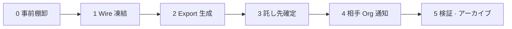

# Org 解散チェックリスト — Witness export と託し先

**Status:** Model Y 運用草案 · Steward OS v0.8  
**Parent:** [witness-hub-requirements.md](witness-hub-requirements.md) · [witness-hub-governance.md](witness-hub-governance.md) · [witness-hub-operations.md](witness-hub-operations.md)  
**テンプレ:** [`witness-custody-handoff.template.yaml`](../../steward/platform/protocol/witness-custody-handoff.template.yaml)

---

## 1. 目的

組織解散時に **Wire 正本（outbox / inbox / audit-chain）** と **Witness 証拠（receipt キャッシュ · Hub 側 digest 台帳）** を失わず、後継 Org · 取引相手 · 法定保管人（custodian）へ引き渡すための手順書。

**非目的:**

- 単一 Witness Hub への全データ集約（N-01 · N-04 違反）
- envelope 全文の Hub 再保管（digest + receipt が第三者担保の核）

---

## 2. 前提（Model Y）

| 項目 | 方針 |
|------|------|
| Witness | 分散プール · `k_of_n` quorum 推奨 |
| Hub 保管 | `envelope_digest` + attestation / receipt のみ |
| 正本 | 各 Org ローカル outbox / inbox · audit-chain |
| 解散後 | custodian が **export パッケージ** を検証可能に保持 |

---

## 3. フェーズ概要



---

## 4. Phase 0 — 事前棚卸（解散決議前）

- [ ] **peer 一覧** — `data/protocol/peers.yaml`（または peer registry）の全 `PEER-*` を列挙
- [ ] **未決 Wire** — pending notice · wire-pending / relay キューが空であることを確認
- [ ] **witness pool** — `data/protocol/witness-pool.yaml` の `enabled` · `quorum` · `hubs[]` を記録
- [ ] **自 Org が Hub 運営者か** — 運営 Org が `hub serve` している場合、Hub `data_dir` の所在を別紙に記載
- [ ] **託し先候補** — 後継 Org · 主要取引相手 · 監査法人 / 弁護士等の custodian を 1 名以上特定
- [ ] **法定保存期間** — 法域 pack（例: JP 商法 · 電帳法）に基づく保存年限を確認

---

## 5. Phase 1 — Wire 凍結（解散決議日）

- [ ] **新規 outbound を停止** — `notice draft` / `approve` の運用停止を社内通達
- [ ] **inbound 受付方針** — 解散後 N 日間のみ webhook / ingest を維持するか決定（推奨: 30 日猶予）
- [ ] **witness pending を空にする**

```bash
npm run orgos -- --tenant <id> protocol witness flush-pending
npm run orgos -- --tenant <id> protocol witness pool status
```

- [ ] **relay / deliver キュー** — `wire-pending` · relay-state が空、または意図的残件を台帳化
- [ ] **audit-chain 整合** — `protocol audit verify`（利用可能な場合）でチェーン末尾を記録

---

## 6. Phase 2 — Export 生成

### 6.1 Org 側パッケージ（必須）

以下を `exports/dissolution-<YYYY-MM-DD>/org/` にコピー（tar + sha256 マニフェスト）。

| パス | 内容 |
|------|------|
| `data/protocol/outbox/` | 署名付き outbound envelope（正本） |
| `data/protocol/inbox/` | 受信 envelope |
| `data/org/audit-chain/` | 組織監査チェーン |
| `data/protocol/witness-receipts/` | Hub 返却 receipt キャッシュ |
| `data/protocol/witness-pool.yaml` | 解散時点の pool pin |
| `data/protocol/witness-pending.yaml` | 空であることの証跡（存在すれば） |
| `data/protocol/peers.yaml` | 相手 Org 参照 |
| `docs/protocol/` | identity presented · 契約 correlation 文書 |

```bash
EXPORT=exports/dissolution-$(date +%Y-%m-%d)
mkdir -p "$EXPORT/org"
# テナント root から（例）
tar czf "$EXPORT/org-protocol.tar.gz" \
  -C tenants/<id> \
  data/protocol/outbox \
  data/protocol/inbox \
  data/protocol/witness-receipts \
  data/protocol/witness-pool.yaml \
  data/protocol/peers.yaml \
  data/org/audit-chain

shasum -a 256 "$EXPORT/org-protocol.tar.gz" > "$EXPORT/org-protocol.tar.gz.sha256"
```

**注意:** `signing-key.pem` は **別途暗号化**（custodian への安全チャネル）。export tar に平文で含めない。

### 6.2 Witness 検証スナップショット（必須）

主要 `event_id`（全 peer との mutually_confirmed 取引）について quorum 充足を記録:

```bash
# event_id は outbox / audit-chain から列挙
npm run orgos -- --tenant <id> protocol witness verify --event-id <uuid> --json \
  > "$EXPORT/witness-verify-<uuid>.json"
```

一括 reconcile（任意 · 相手 peer ごと）:

```bash
npm run orgos -- --tenant <id> protocol witness reconcile --peer PEER-001 --cross-hub --json \
  > "$EXPORT/witness-reconcile-PEER-001.json"
```

### 6.3 Hub 側 export（自 Org が Hub 運営者の場合）

Hub `data_dir` から digest 台帳のみアーカイブ（envelope 全文は含めない）:

```bash
HUB_DATA=./data/hub-openorgos-jp
tar czf "$EXPORT/hub-digest-ledger.tar.gz" \
  -C "$HUB_DATA" \
  witness-attestations.jsonl \
  witness-receipts.jsonl \
  registered-orgs.yaml \
  merkle-anchors/

# 日次 Merkle anchor（存在する日付分）
npm run orgos -- hub anchor-export --hub-id HUB-OPENORGOS-JP --data-dir "$HUB_DATA" --date 2026-06-25
npm run orgos -- hub gossip-export --hub-id HUB-OPENORGOS-JP --data-dir "$HUB_DATA" --json \
  > "$EXPORT/hub-gossip-snapshot.json"
```

### 6.4 託し先マニフェスト

[`witness-custody-handoff.template.yaml`](../../steward/platform/protocol/witness-custody-handoff.template.yaml) を複製し、`packages[]` に sha256 · 生成日 · 担当者署名を記載。

---

## 7. Phase 3 — 託し先（custodian）確定

| 託し先タイプ | 典型 | 受け取るもの |
|-------------|------|-------------|
| `successor_org` | 合併・事業承継先 | org export + witness verify JSON |
| `peer_org` | 主要取引相手 | 当該 peer 分の envelope コピー + receipt |
| `legal_custodian` | 監査法人 · 弁護士 | 全 export tar · マニフェスト |
| `self_custody` | 解散後も個人保管 | 暗号化媒体 · オフライン |

- [ ] custodian の `org_id` / 連絡先をマニフェストに記載
- [ ] **受領確認** — custodian が sha256 を検証した記録（署名またはメールログ）
- [ ] **Hub 運営移管** — 自 Org が Hub を止める場合、peer Org へ `hub_id` 変更は **相手の witness-pool 更新** が必要（強制移管なし）

---

## 8. Phase 4 — 相手 Org 通知

各 `PEER-*` へ解散通知 envelope（可能なら解散前に approve）:

- [ ] `org.dissolution.notice` 相当の transaction（adapter 利用可能時）
- [ ] 最低限: 公式文書 + **witness 済み event_id 一覧** + custodian 連絡先（本文に機微情報を載せない）
- [ ] 相手側が `protocol witness verify` で独自検証できるよう `event_id` + `envelope_digest` を添付

---

## 9. Phase 5 — 検証 · アーカイブ · 停止

- [ ] custodian 保管媒体の **二地点以上**（オンサイト + クラウド WORM 等）
- [ ] Hub ノード停止（自 Org 運営分）— `registered-orgs.yaml` から当該 org を削除するか、Hub を read-only で一定期間維持するか方針決定
- [ ] `trusted-hubs` レジストリから自 Hub エントリを **retire**（[witness-hub-governance.md](witness-hub-governance.md) §4）
- [ ] テナント runtime 停止 · 鍵破棄手順（`signing-key.pem` は custodian 引渡後に HSM / シャレッド）

**受領側（custodian）検証コマンド例:**

```bash
# パッケージ整合
shasum -a 256 -c org-protocol.tar.gz.sha256

# 展開後 · 代表 event
npm run orgos -- --tenant <id> protocol witness verify --event-id <uuid>

# リモート Hub が存続する場合
npm run orgos -- hub anchor-verify --hub-url https://hub.oorgos.org --hub-id HUB-OPENORGOS-JP --date 2026-06-25
```

---

## 10. OpenOrgOS 運営 Org が解散する場合

運営 Org も通常の Org として本チェックリストを適用する。

| 分離するもの | 備考 |
|-------------|------|
| **プロトコル正本** | Steward core · スキーマ · CLI — 寄付 / OSS 継続 |
| **Community** | openorgos.net — 別運用主体 |
| **Witness Hub ノード** | プールの 1 台 — 他 Hub が quorum を継続 |
| **trusted-hubs レジストリ** | oorgos.org — 後継 maintainer が PR 更新 |

運営 Org の Hub を止めても **他 operator の Hub + 各 Org の receipt キャッシュ** で証拠链は維持可能（Model Y）。

---

## 11. 関連 CLI 早見表

| 目的 | コマンド |
|------|---------|
| pending 再送 | `protocol witness flush-pending` |
| quorum 確認 | `protocol witness verify --event-id <uuid>` |
| Hub 間 drift | `protocol witness reconcile --peer PEER-* --cross-hub` |
| pool 健康 | `protocol witness pool status` |
| Hub Merkle | `hub anchor-export` / `hub anchor-verify` |
| Hub 読取 export | `hub gossip-export` |
| trusted から pool | `protocol witness pool init-trusted --jurisdiction JP` |

---

## 12. 変更履歴

| 日付 | 内容 |
|------|------|
| 2026-06-25 | 初版 — Model Y · witness export · custodian テンプレ |
