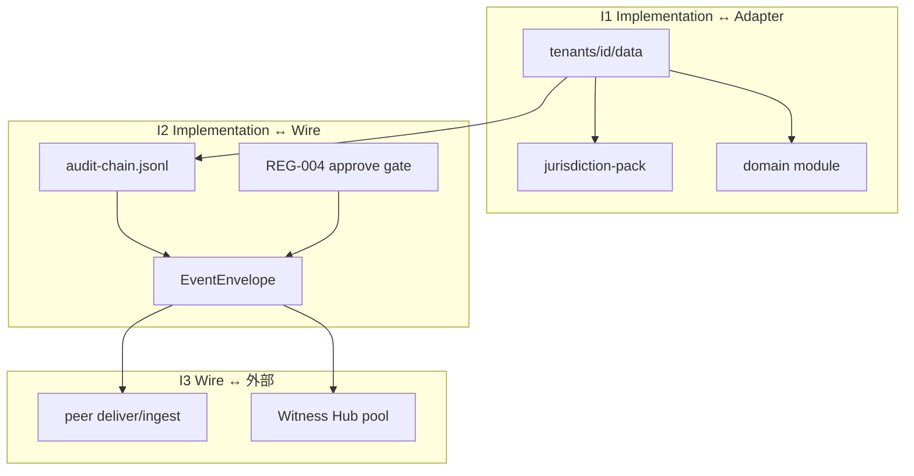
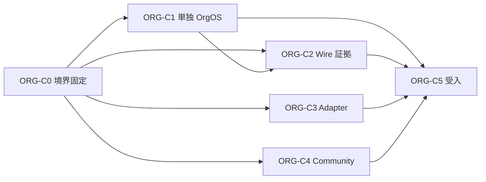

# OrgOS 完成度向上計画

**Status:** 2026-06 策定 · 実行正本  
**Parent:** [openorgos-core-philosophy.md](openorgos-core-philosophy.md) · [layer-mapping-steward-os.md](layer-mapping-steward-os.md)  
**評価:** [framework-assessment.md](../framework-assessment.md) · **チケット:** [framework-backlog.md](../framework-backlog.md) Phase ORG-C  
**関連:** [witness-hub-requirements.md](witness-hub-requirements.md) · [inter-org-operator-model.md](inter-org-operator-model.md)

---

## 1. 完成の定義

OrgOS を「OS として完成」とみなす条件は **3 つ** 同時に満たすこと。

| # | 条件 | 意味 |
|---|------|------|
| **C1** | **単独 OrgOS として閉じる** | 1 テナント · peer なし · witness 無効でも REG · module · audit · validate が通る |
| **C2** | **インターフェースが 3 面で固定** | Implementation ↔ Adapter ↔ Wire の入出力が文書化され、実装が逸脱しない |
| **C3** | **通信データ形式が一本化** | 内部記録と組織間 wire が **同じ EventEnvelope + audit-chain + classification** を共有する |

**設計原則（不変）:**

> 組織間通信は、内部イベントの signed export に過ぎない。  
> Wire 用に別データモデルを増やさない。

OpenOrgOS Core は四要素（Org Event Model · identity · authority · auditability）のまま膨らませない。完成度は **Implementation の統合** と **Wire ギャップ解消** で上げる。

---

## 2. 現状スナップショット（2026-06）

| 次元 | 完成度 | 根拠 |
|------|--------|------|
| 製品フレームワーク | **99/100** | [framework-assessment.md](../framework-assessment.md) §9 |
| 会社 OS composite | **93/100** | `steward status --os-99` |
| TJS-11 法域 pack | **11/11** | pack_ready |
| 業務 module（production_ready） | **89%**（24/27） | `jp_corporate_registration` 昇格 · IF 85% 閾値達成 |
| Inter-org wire | **高** | 2-org デモ · notice · deliver · **mesh** · deliver-pull |
| Witness Hub | **v1 実装済** | fan-out · quorum · Hub ノード · §14 ギャップ残 |
| 内部 ↔ wire 形式統一 | **低** | 内部 YAML 中心 · `org.witness.*` emit 未 |
| Community ガバナンス | **部分** | 申請 API あり · 委任承認 · 本番 SLA 不足 |

**体感完成度** = 三軸最小値（現 **89%** — 業務 module 軸）— wire/mesh · witness · 単独 OrgOS 統合は別軸。

---

## 3. 目標アーキテクチャ — 3 インターフェース

| 境界 | 正本ドキュメント（計画） | 主要 artifact |
|------|--------------------------|---------------|
| **I1** | `orgos-interface-spec.md` §Adapter | `pack.manifest.yaml` · `module.manifest.yaml` · REG bind |
| **I2** | `orgos-interface-spec.md` §Wire | `schemas/protocol/*` · `audit-chain` · approve CLI |
| **I3** | [witness-hub-requirements.md](witness-hub-requirements.md) | peers.yaml · witness-pool.yaml · Hub HTTP v1 |

---

## 4. フェーズ計画

### 概要

| Phase | 名称 | 主目的 | C1 | C2 | C3 | 期間目安 |
|-------|------|--------|:--:|:--:|:--:|----------|
| **ORG-C0** | 境界固定 | interface spec · 採点基準 | ○ | ● | ○ | 2 週 |
| **ORG-C1** | 単独 OrgOS 閉ループ | peer なし validate · 内部 envelope | ● | ○ | ○ | 4 週 |
| **ORG-C2** | Wire 証拠完成 | witness emit · reconcile · remote verify | ○ | ○ | ● | 4 週 |
| **ORG-C3** | Adapter 契約 | Core drift 解消 · module 76→90% | ● | ● | ○ | 6 週 |
| **ORG-C4** | Community 整合 | 委任承認 · 語彙統一 · SLA | ○ | ● | ○ | 4 週 |
| **ORG-C5** | 受入 · デモ | 単独 + 2-org E2E · 運用 Runbook | ● | ● | ● | 2 週 |

● = 主担当 · ○ = 副次

---

### ORG-C0 — 境界固定（Week 1–2）

**ゴール:** 以降の PR が「どの層か」を迷わない。

| ID | タスク | 成果物 | DoD |
|----|--------|--------|-----|
| C0-1 | **OrgOS Interface Spec** 初版 | `docs/org-os/orgos-interface-spec.md` | I1/I2/I3 · パス · CLI 面 · 禁止事項 |
| C0-2 | 完成度採点式の OrgOS 軸追加 | `framework-assessment.md` §13 新設 | C1–C3 を 0–100 で測れる |
| C0-3 | バックログ Phase ORG-C 登録 | `framework-backlog.md` | 本計画と ID 対応 |

**ゲート:** Core 追加 PR は interface spec の層ラベル必須（レビュー checklist）。

---

### ORG-C1 — 単独 OrgOS 閉ループ（Week 3–6）

**ゴール:** `mal` 単体で「OS として一日回る」デモ脚本 + validate green。

| ID | タスク | 成果物 | DoD |
|----|--------|--------|-----|
| C1-1 | **単独 validate モード** | `protocol validate --standalone` | peers 空 · witness off で exit 0 |
| C1-2 | 内部決裁 → audit envelope | REG-004 approve · 契約状態変更 | signed event が audit-chain に append |
| C1-3 | 内部 event 型 registry 整理 | `schemas/protocol/org-event.ts` | 内部/wire 共用型に `@scope internal\|wire` メタ |
| C1-4 | **単独 Org デモ脚本** | `npm run demo:standalone-org` | REG · module op · audit verify · validate |
| C1-5 | idempotent ingest / delegation basis_ref 修正 | 既知 P0 ギャップ | 再 ingest 冪等 · mal の JP basis_ref |

**受入:** 新規テナント seed 1 本 · peer 設定なし · `npm test` green。

---

### ORG-C2 — Wire 証拠完成（Week 7–10）

**ゴール:** Layer 2 Witness + Layer 3 Reconcile が要件書 §14 ギャップを閉じる。

| ID | タスク | 成果物 | DoD |
|----|--------|--------|-----|
| C2-1 | **`org.witness.*` emit** | `witness-hook.ts` 拡張 | attestation/receipt が audit-chain に載る |
| C2-2 | **`protocol witness reconcile`** | `witness-reconcile.ts` + CLI | local · peer · Hub 横断レポート |
| C2-3 | **`hub verify --hub-url`** | `hub.ts` CLI | リモート GET receipt + 署名検証 |
| C2-4 | validate × witness 連動 | `protocol validate` | quorum 未達 warning（設定で error 可） |
| C2-5 | 要件書 §14 更新 | `witness-hub-requirements.md` v1.2 | 実装済み FR を ✓ |

**受入:** `npm run demo:inter-org` + reconcile CLI が同一 event_id で ok。

**Core RFC（Community）:** `org.witness.*` payload フィールド — 実装前に 1 週間 RFC 窓（任意）。

---

### ORG-C3 — Adapter 契約（Week 11–16）

**ゴール:** 業務 module 軸 89% → **≥90%** · Core drift 解消。

| ID | タスク | 成果物 | DoD |
|----|--------|--------|-----|
| C3-1 | Core drift 6 件解消 | [layer-mapping §Known drift](layer-mapping-steward-os.md) | tax_filing_prep 等を adapter へ |
| C3-2 | `pack.manifest` / `module.manifest` 検証 CLI | `jurisdiction packs check` 拡張 | I1 必須フィールド enforce |
| C3-3 | production_ready 残 6 module | MOD-BC チケット | `modules check --all` · tier 更新 |
| C3-4 | JP 参照テナント mal 再採点 | `steward-assessment.md` | 単独 + wire シナリオ記載 |

**優先 module（例）:** 残 tier skeleton → activation_ready の BC チケット正本に従う。

---

### ORG-C4 — Community 整合（Week 11–14 · C3 と並行可）

**ゴール:** Steward 以外の Implementation が同じ語彙・ガバナンスで載る。

| リポ | ID | タスク | DoD |
|------|-----|--------|-----|
| OS_Community | C4-1 | 申請ライフサイクル UX | マイページ PENDING 一覧 · API error code |
| OS_Community | C4-2 | **委員会 CHAIR 承認** | `/api/committees/.../role-requests` · Admin は override |
| OS_Community | C4-3 | 語彙対応表 | `docs/steward-community-vocabulary.md` | ModuleRoleType ↔ Community UI |
| OS_Community | C4-4 | 本番 SLA | migrate baseline · CI deploy · Playwright 1 本 |
| RFC | C4-5 | `trusted_hub` テンプレ | jurisdiction committee 草案 · Implementation は pin のみ |

**原則:** Wire Core RFC と Community UI は **2 トラック** — 全部を 1 フォーラムで議論しない。

---

### ORG-C5 — 受入 · デモ（Week 17–18）

**ゴール:** 対外説明可能な「完成デモ」2 本。

| デモ | コマンド | 証明すること |
|------|----------|--------------|
| **単独 OrgOS** | `npm run demo:standalone-org` | C1 — peer なしで OS 完結 |
| **Inter-org + Witness** | `npm run demo:inter-org` + reconcile | C2 — wire + 第三者証拠 |

| ID | タスク | DoD |
|----|--------|-----|
| C5-1 | Runbook 統合 | `docs/runbook-orgos.md` — 障害表 · validate 手順 |
| C5-2 | assessment 更新 | §13 OrgOS 完成度 ≥ **85%**（C1–C3 加重） |
| C5-3 | 0-README 導線 | 本計画 · interface spec リンク |

---

## 5. 完成度採点式（ORG-C0 で framework-assessment §13 に追加）

**OrgOS 完成度** = 次の加重平均（0–100）。

| 軸 | 重み | 測定 |
|----|------|------|
| **単独閉ループ（C1）** | 35% | standalone validate · demo 脚本 · 内部 envelope 覆盖率 |
| **形式統一（C3）** | 25% | wire イベントが audit 由来の比率 · witness emit |
| **インターフェース（C2）** | 15% | interface spec カバー率 · manifest check green |
| **Wire 証拠（C2）** | 15% | §14 ギャップクローズ数 / 総数 |
| **エコシステム（C4）** | 10% | Community SLA checklist · 語彙表 |

**v1 目標:** **≥85%**（現推定 **~55%** — 単独統合と witness emit が主な欠損）

---

## 6. 依存関係

- **C2 は C1 の audit envelope に依存**（witness emit の入力）
- **C3 · C4 は並行可能**（人員分離）
- **C5 は全 Phase の統合ゲート**

---

## 7. スコープ外（本計画ではやらない）

| 項目 | 理由 |
|------|------|
| Hub 間リアルタイムレプリケーション | N-06 · 運用委任 |
| Merkle 公開アンカー | N-07 · v2 候補 |
| store-and-forward relay | N-05 · 別レイヤー |
| 249 法域すべて pack_ready | TJS-11 が製品分母 |
| SaaS マルチテナント hosting | Implementation 各社 |

---

## 8. 最初の 2 スプリント（推奨着手順）

| Sprint | 内容 | 担当リポ |
|--------|------|----------|
| **S1（2 週）** | C0-1 interface spec · C1-1 standalone validate · C1-5 P0 修正 | OS_Steward |
| **S2（2 週）** | C1-2 内部 envelope · C1-4 demo 脚本 · C4-1 申請 UX | Steward + Community |

---

## 9. 改定履歴

| 日付 | 版 | 内容 |
|------|-----|------|
| 2026-06 | v1.0 | 初版 — C1–C3 完成定義 · ORG-C0–C5 · 採点式 |
