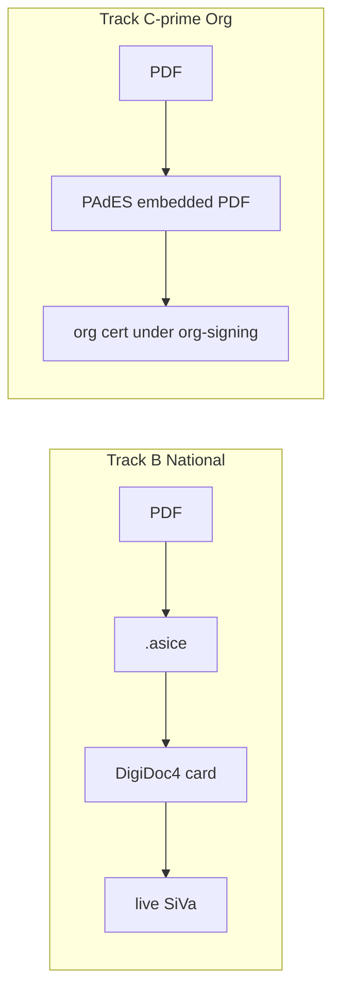

# PDF 埋め込み署名 + DigiDoc 系統 B 本番完了 — 実装計画

**Status:** Accepted · 2026-07-14  
**目的:**  
1. **系統 B**（`pdf_esign` / DigiDoc）を **カード + live SiVa で本番完了**できる状態にする  
2. **PDF 本体に見える署名**が必要な場合の経路を、ADR と矛盾なく設計・実装する  

### 承認済み決定（2026-07-14）

| # | 決定 | 内容 |
|---|------|------|
| 1 | Track B 先行 | **Yes** — BP0–BP5 を先に閉じる |
| 2 | Track C′（組織 PAdES） | **Yes** — B の後（または BP1 以降並行準備可、着工は ADR 後） |
| 3 | SiVa ホスト | **MAL Mac**（当面）· 2026-07-14 確定 |
| 4 | 実カード署名者 | MAL **代表取締役 段** · **e-Residency / digi-ID カード保有あり**（2026-07-14 確定） |

**関連正本:**  
[ADR 0013](../adr/0013-document-attestation-vs-pdf-esign.md) · [0014](../adr/0014-pdf-esign-national-eid.md) · [0018](../adr/0018-org-pdf-sign-channel.md) ·  
[pdf-esign-digidoc-plan.md](./pdf-esign-digidoc-plan.md) · [pdf-esign-production-acceptance.md](./pdf-esign-production-acceptance.md) ·  
[org-pdf-sign-requirements.md](./org-pdf-sign-requirements.md) · [pdf-esign-pades-runbook.md](./pdf-esign-pades-runbook.md)（legacy 文言の整理対象）

---

## 0. 用語の整理（重要）

ユーザーが言う「PDF 本体への埋め込み署名」と、系統 B の DigiDoc は **同じものではない**。

| 呼び名 | 成果物 | 信頼の根 | 現状 ADR |
|--------|--------|----------|----------|
| **B · DigiDoc** | `.asice`（PDF を **容器に同梱**。PDF ファイル自体を書き換えないことが多い） | 国家 eID + SiVa | 0014 · **本番完了が本計画の Track B** |
| **C · detached** | `.orgsign.json` + 素の PDF | OOO 組織 Ed25519 | 0018 · **デモ済み** |
| **C′ · Org PAdES** | **PDF バイト内に署名辞書を埋め込み**（Adobe 等で見える） | OOO 組織証明書（国家ではない） | 0018 は現状禁止 → **Track C′ で ADR 改定が前提** |

```text
誤: 「DigiDoc 本番 = PDF に線が入った署名」  
正: 「DigiDoc 本番 = カード署名の .asice + live SiVa TOTAL-PASSED + ES-* completed」
```

**推奨順序:** Track B（国家経路の本番）を先に閉じる → Track C′（組織 PAdES）を明示 ADR 後に着工。  
混在させると「Adobe で見えたから国家級」と誤認されやすい。

---

## 1. 現状ギャップ

### 1.1 系統 B（DigiDoc）

| 領域 | 状態 | 本番残 |
|------|------|--------|
| D0–D3 思想・コード | 概ね完了（digidoc · SiVa client · sidecar · mock 非完了） | — |
| Acceptance §A（機械） | テストはあるがチェックリスト未クローズ | 緑証明・CI 任意ジョブ |
| Acceptance §B（SiVa 自前） | ドキュメントのみ | JAR/HTTPS/OCSP · MAL 運用 runbook |
| Acceptance §C（実カード） | **未実施** | DigiDoc4 + カード E2E 証跡 |
| D4 収束 | readiness=`skeleton` · legacy 文言残 | `activation_ready` / `production_ready` 判定 |
| doctor / ready | 一部あり | prod で mock 拒否の最終確認 |

### 1.2 PDF 埋め込み（見える署名）

| 経路 | 状態 |
|------|------|
| DigiDoc ASiC | prepare / attach / verify あり · **カード本番なし** |
| Org PAdES | `pades_local` **削除済** · ADR 0018 は非埋め込み · 旧 [pades runbook](./pdf-esign-pades-runbook.md) は DigiDoc へ誘導済み |

---

## 2. Track B — DigiDoc 本番完了（Must）

**Done の定義:** [pdf-esign-production-acceptance.md](./pdf-esign-production-acceptance.md) の §A · §B · §C がすべて ✓ で、MAL（または指定テナント）で `ES-*` が `status=completed` · `nationally_verified=true` · `siva_mode=live` を満たす。

### BP0 — 受入ゲート固定（0.5d）

- Acceptance チェックリストを本計画の DoD に昇格（未チェック項目をチケット化）
- `pdf-esign-digidoc-plan.md` D4 を「本番受入完了」に再定義
- doctor: `ORGOS_SIVA_MODE=mock` を prod で ERROR（既存強化の確認）

**DoD:** §A/B/C の担当（実装者 / インフラ / 署名者）が一名ずつ決まっている。

### BP1 — 機械側クローズ §A（1d）

| 作業 | 内容 |
|------|------|
| Vitest | `tests/pdf-esign.test.ts` を acceptance 行と 1:1 でコメント突合 · 欠は追加 |
| Sidecar smoke | `docker compose -f services/docker-compose.digidoc.yml` の CI optional job または `scripts/smoke-digidoc-sidecar.sh` |
| ready CLI | `operations esign ready --json` が token 非露出 · URL/mode を表示 |
| Checklist | §A を全部 `[x]` にする（または意図的スキップを文書化） |

**DoD:** §A 全項目緑。カード不要。

### BP2 — SiVa 本番ホスト §B（1–2d + 運用セットアップ）

| 作業 | 内容 |
|------|------|
| デプロイ正本 | runbook に **非 test-compose** 手順を固定（systemd / jar / reverse proxy） |
| テナント設定 | mal: `data/pdf-esign/digidoc.yaml` · `ORGOS_SIVA_BASE_URL=https://…` · `ORGOS_SIVA_MODE=live` |
| 疎通 | loopback HTTP 拒否 · HTTPS validate 1 回成功を記録（indication のみ L1） |
| 監視最小 | 5xx / latency の確認欄を runbook に |

**DoD:** §B 全項目 ✓。秘密は L2 · チャット非記載。

### BP3 — 実カード E2E §C（0.5d 実装 + 署名者 1 セッション）

コード側（薄く）:

| 項目 | 内容 |
|------|------|
| `accept-live` UX | 失敗理由（SiVa / ASiC / digest mismatch）を人間可读に |
| 証跡出力 | `--json` に acceptance 表の必須フィールドを固定 |
| リハ脚本 | `operations esign rehearsal --card-guided`（手順印字のみ可。PIN 入力は人間） |

署名者セッション（必須・自動化不可）:

1. sidecar up · SiVa live  
2. `create` → `prepare --skeleton` → `send`（APR）  
3. DigiDoc4 でカード署名 → `.asice`  
4. `accept-live` → completed  

**DoD:** §C 合否表をすべて満たす 1 件の ES-* が mal（または検証テナント）に残る。  
**PIN / カード番号は記録しない。**

### BP4 — D4 収束 + readiness（0.5–1d）

- readiness: `skeleton` → **`activation_ready`**（カード E2E 1 件後）→ 運用定着後に `production_ready`
- 旧 ESP / pades 文書・seed 残骸の最終掃除
- CLI help / agent 文言の一本化（National eID only）
- demo 脚本: B は引き続き mock disclaimer（本番完了後もデモはカードを要求しない）

**DoD:** `orgos modules check` と acceptance が矛盾しない。

### BP5 — 運用ランブック統合（0.5d）

- `pdf-esign-digidoc-runbook.md` に「本番日次」1 ページ追加  
- MAL active_context / skill に本番コマンド列を追記  
- 失敗モード表（OCSP・カードリーダー・digest mismatch）

---

## 3. Track C′ — 組織 PAdES 埋め込み（Should · 別信頼モデル）

**Done の定義:** 指定 PDF に組織証明書で PAdES（または同等の埋め込み）を行い、Adobe / PDF ビューアで署名が可視・検証可能。主張は **organizational seal** のみ（国家 eID ではない）。

### 前提決定（着工前に必須）

| 決定 | 案 |
|------|-----|
| ADR | **0018 改定** または **0019**（Channel C′: `org_pdf_sign` に `seal_format: detached \| pades`） |
| 証明書 | 組織自己署名 **または** 将来 OrgOS CA（0014 Future）— **DigiDoc カード鍵は使わない** |
| ライブラリ | Node 可なら `node-signpdf` / `@signpdf/*` · 足りなければ小さな sidecar（Java PDFBox） |
| Wire | 禁止維持（0018） |
| 系統 B との混同 | CLI・manifest に `trust_model: org_managed_pades` を必須表示 |



### CP0 — ADR + 要件（0.5d）

- ADR 0019（推奨）: C′ を C の拡張として定義  
- 非ゴール再掲: eIDAS QES ・SiVa TOTAL-PASSED と同じ主張をしない  
- 要件: `org-pdf-sign-requirements.md` に `sign --format pades` を追加

### CP1 — 鍵・証明書ライフサイクル（1d）

- `org-sign init-key` を拡張、または `org-sign init-pades-cert`  
- L2: `data/org-signing/pades-cert.pem` · `pades-key.pem`（gitignore）  
- 公開証明書メタのみ L1 台帳へ

### CP2 — 埋め込み実装（2–3d）

| 項目 | 内容 |
|------|------|
| API | `signOrgPdfPades({ id })` → 出力パス `*.signed.pdf` |
| digest | 署名前 PDF の digest を case に凍結 · 署名後は別 digest を記録 |
| CLI | `org-sign sign --format pades --id OS-… --out …` |
| verify | 埋め込み署名検証（ライブラリ or `pdfsig` / sidecar） |
| tests | create → pades sign → verify · 改ざん fail |

### CP3 — 運用・誤認防止（0.5d）

- Today / agent: 「国家 eID ではない」disclaimer  
- B 完了案件との併記ルール（同じ件名で A/B/C′ を混在させないガイド）

### CP4 — 受入（0.5d）

- Adobe Reader / Preview での目視確認手順（人手）  
- Vitest 緑 · mal で 1 件デモ PDF

**見積 Track C′:** 約 **4.5–6 person-days**（ADR 合意後）。

---

## 4. 依存関係とスケジュール感

```text
BP0 → BP1 ─┬→ BP2 → BP3（カード必須）→ BP4 → BP5     【Track B 本番】
            │
            └→（並行可）デモ脚本は mock のまま維持

CP0（ADR）→ CP1 → CP2 → CP3 → CP4                 【Track C′ · BP3 後推奨】
```

| バンド | 内容 | 目安 |
|--------|------|------|
| **Must** | Track B BP0–BP5 | **3.5–5.5d** + 署名者セッション 1 回 |
| **Should** | Track C′ | **4.5–6d**（ADR 後） |
| **Won't（当面）** | 商用 ESP · Wire で `.asice`/`signed.pdf` 託送 · サーバ PIN · JP JPKI（別 ADR） |

---

## 5. ファイル影響（予見）

### Track B

| 領域 | 変更 |
|------|------|
| `src/lib/pdf-esign/*` | accept-live UX · ready · doctor |
| `services/digidoc-sidecar/` · compose | smoke script |
| `tenants/mal/data/pdf-esign/` | digidoc.yaml · national-eid（秘密は env） |
| Docs | acceptance 全 `[x]` · digidoc-plan D4 closed · runbook 本番節 |
| Readiness | `pdf_esign` tier 更新 |

### Track C′

| 領域 | 変更 |
|------|------|
| ADR 0019 + 0018 追記 | seal_format |
| `src/lib/org-pdf-sign/` | pades sign/verify |
| Schema `org-pdf-sign.ts` | format · signed_pdf_path |
| CLI `org-sign` | `--format` |
| `.gitignore` | pades key/cert |
| Tests | `tests/org-pdf-sign-pades.test.ts` |

---

## 6. リスク

| リスク | 緩和 |
|--------|------|
| B と C′ の見た目混同 | CLI / 台帳 / disclaimer で `trust_model` 必須 |
| SiVa test compose の誤用 | BP2 で禁止を doctor 化 |
| カードセッション遅延 | BP1–BP2 まで先にクローズ · §C だけ待つ状態を明示 |
| PAdES ライブラリ品質 | CP2 でライブラリスパイク 0.5d · だめなら PDFBox sidecar |
| 法務が「埋め込み = 電子署名法」と誤読 | ADR と要件に **主張しない**を太字 |

---

## 7. 「SiVa ホスト先」「実カード署名者」の意味（非エンジニア向け）

### 7.1 SiVa ホスト先とは

系統 B では、署名済み `.asice` が改ざんされていないかを **国の検証ソフト（SiVa）** で確認します。  
OrgOS 自体は検証エンジンではなく、**SiVa をどこかのマシンで動かして HTTPS で叩く**必要があります。

| 選択肢（例） | 意味 | 向き |
|--------------|------|------|
| **A. MAL の Mac 上** | 検証用サーバを Mac で常時（またはデモ時だけ）起動 | 小規模・最初の本番受入 |
| **B. 別マシン / VPS** | 24h 動かせる箱に SiVa を置く | 本格運用 |
| **C. 当面モックのみ** | デモ向け。**国家完了には使えない** | Track B 本番未達のまま |

「ホスト先」＝ **SiVa という検証プログラムをどのコンピュータで動かするか**、という質問です。  
未定なら実装は **BP0–BP1（カード不要）から進め**、BP2 で A（MAL Mac）を既定案にしてよい。

### 7.2 実カード署名者とは

「誰が会社としてサインするか」（段さん）と、  
「**エストニアの DigiDoc が読める国家 ID カード**を持っているか」は別です。

| レイヤ | 質問 | MAL の予定 |
|--------|------|------------|
| 組織の決裁者 | 誰の名義で進めるか | **代表取締役 段** |
| 国家 eID | DigiDoc4 に差し込む **e-Residency / digi-ID カード**の保持者は誰か | **要確認**（段さんがカードを持っているか） |

カードが無い場合:

- Track B の **§C 実カード E2E は完了できない**（機械側 BP1 までは進められる）  
- Track C′（組織 PAdES）や系統 C detached は **カード不要**で「MAL の組織シール」は可能  
- カード取得（e-Residency 等）は別オペレーション

---

## 8. 実装開始時の PR 分割案

1. **PR-B1:** BP0–BP1（機械 acceptance クローズ）  
2. **PR-B2:** BP2 runbook + mal 設定テンプレ（秘密なし）· 既定ホスト案 = MAL Mac  
3. **PR-B3:** BP3 UX + BP4 readiness（カード証跡は運用メモ・L1 indication のみ）  
4. **PR-C1:** ADR 0019 + schema（C′）  
5. **PR-C2:** PAdES 実装 + tests  

---

## 9. 進捗

| Phase | 状態 | メモ |
|-------|------|------|
| BP0 | ✅ | 決定反映（SiVa=MAL Mac · 署名者=段 · カード有） |
| BP1 | ✅ | §A Vitest + ready 秘匿 + oversize + `smoke:digidoc-sidecar` |
| BP2 | 🔶 手順・スクリプト・mal 設定済み · **ホストで JAR 起動/probe 待ち** | [pdf-esign-siva-mal-mac.md](./pdf-esign-siva-mal-mac.md) |
| BP3 | ⏳ | 段カード DigiDoc4 E2E · acceptance §C |
| BP4–BP5 | ⏳ | readiness · 運用ランブック定着 |
| CP0+ | ⏳ | ADR 0019 → 組織 PAdES（B の BP1 以降で着工可） |

### 次アクション

1. **MAL Mac で実行（BP2 クローズ）:**

```bash
bash scripts/setup-siva-mal-mac.sh install-deps
bash scripts/setup-siva-mal-mac.sh build          # 初回は数分〜十数分
bash scripts/setup-siva-mal-mac.sh start
eval "$(bash scripts/setup-siva-mal-mac.sh env)"
npm run siva:mal-mac:probe
```

2. **BP3:** 段さんカードで `accept-live` 1 件  
3. 並行: **CP0** ADR 0019（組織 PAdES）ドラフト