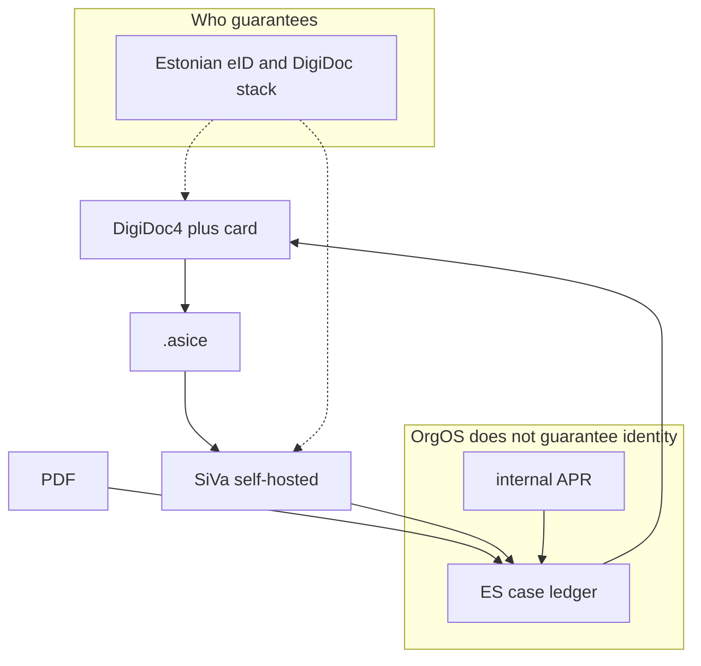

# 国家 eID / DigiDoc を pdf_esign 正経路にする実装計画

**Status:** Active · D1–D3 厳格化済 · **BP1 §A クローズ 2026-07-14** · **BP2 SiVa MAL Mac クローズ 2026-07-15** · BP3 カード（段）待ち  
**本番計画:** [pdf-embed-and-digidoc-production-plan.md](./pdf-embed-and-digidoc-production-plan.md) · [acceptance](./pdf-esign-production-acceptance.md)  

**親:** [pdf-esign-requirements.md](./pdf-esign-requirements.md) · [ADR 0014](../adr/0014-pdf-esign-national-eid.md) · **Acceptance:** [pdf-esign-production-acceptance.md](./pdf-esign-production-acceptance.md)

---

## 0. 思想（OpenOrgOS）

**対外の真正性の保証は、民間 ESP（CloudSign 等）ではなく、国家が発行する ID と国家が公開する署名インフラに置く。**

| 経路 | 誰が身元・署名の枠組みを保証するか | OrgOS の役割 |
|------|-----------------------------------|--------------|
| **系統 A** `document_attestation` | 双方 OrgOS テナントの protocol 鍵（組織ピア合意） | digest · Wire · 台帳 |
| **系統 B** `pdf_esign` | **国家 eID エコシステム**（第一実装: エストニア DigiDoc / eIDAS） | ケース管理 · 承認 · 容器取込 · **国 OSS による検証の呼び出し** |
| 商用 ESP | 民間事業者の約款・監査 | **組み込まない**（思想外） |

「CloudSign を OOO に入れた場合、誰が保証するのか？」への答え:

- **保証の根は CloudSign 社**であり、OpenOrgOS でも国家でもない。  
- OOO が仲介・台帳化しても、**真正性の根拠を民間 SaaS に外包する**ことになり、国・組織の自律という設計と違う。  
- よって **有料 ESP Adapter はスコープ外・削除対象**。残すのは国家ルートと、やむを得ない紙等の `manual` のみ。

第一実装は **エストニアが標準とする open-eid（DigiDoc · SiVa · digidoc4j）**。  
他法域（例: 日本 JPKI）は **同じ思想の別 Adapter（Jurisdiction pack）** として後日載せる。民間 ESP で「代用」しない。

---

## 1. 背景・動機

- 相互 OOO: 系統 A（Wire 証跡）  
- 非 OOO / 対外で国家級の署名が要る: 系統 B で **その国の eID + 国公開 OSS**  
- 課金・ベンダーロック・「OOO が民間署名を背負う」曖昧さを避ける  

| 層 | 第一実装（EE） | ライセンス |
|----|----------------|------------|
| 人が署名 | DigiDoc4 + カード（e-Residency / digi-ID） | 国クライアント |
| ライブラリ | digidoc4j / libdigidocpp | LGPL |
| 形式 | **ASiC-E（`.asice`）** | ETSI / DigiDoc |
| 検証 | **SiVa 自前ホスト** | EUPL |

OrgOS は **保証者にならない**。保証は eID 発行体と DigiDoc/SiVa 検証結果。OrgOS は「いつ・どの容器・検証結果どうだったか」を組織台帳に残す。

Wire 禁止は ADR 0013 のとおり維持（人間＋国家クライアント経路 ≠ peer EventEnvelope）。

---

## 2. 方針（確定）

| 項目 | 決定 |
|------|------|
| 信頼モデル | **National eID first**（民間 ESP 禁止） |
| 第一 Provider | `digidoc`（default） |
| 署名成果物 | `.asice` |
| 署名操作 | DigiDoc4 + カード（サーバに PIN / 鍵を置かない） |
| 検証 | SiVa（国と同じ OSS 検証スタックを自組織で動かす） |
| 容器骨組み | digidoc4j サイドカー（D3） |
| `manual` | 紙・スキャン等の **非電子**フォールバックのみ |
| `pades_local` | **廃止候補**（国ルート外の独自署名。D4 で削除または dev-only） |
| **`cloudsign` 他 ESP** | **禁止 · コードから削除**（非推奨猶予なし） |
| 他国 eID | 別 Provider / ADR（思想は同じ · 実装は後続） |



---

## 3. 成果物（ドキュメント）

| ファイル | 内容 |
|----------|------|
| [docs/adr/0014-pdf-esign-national-eid.md](../adr/0014-pdf-esign-national-eid.md) | National eID 正経路 · **商用 ESP 禁止** |
| 本ファイル | 実装ロードマップ正本 |
| [pdf-esign-requirements.md](./pdf-esign-requirements.md) | ESP 削除 · DigiDoc / SiVa 中心に改訂 |
| [pdf-esign-digidoc-runbook.md](./pdf-esign-digidoc-runbook.md) | DigiDoc4 · `.asice` · SiVa |
| ADR 0013 追記 | 系統 B = 国家 eID（ESP ではない） |

---

## 4. データ・スキーマ変更

```ts
pdfEsignProviderIdSchema = z.enum([
  "digidoc", // National EE — only production path in this plan
  "manual",  // non-electronic fallback
]);
default_provider: "digidoc"
```

- **`cloudsign` · `pades_local` はスキーマから削除**（または migration 1 回で拒否）  
- ケース: `container_path` · `container_digest` · `siva_indication` · `siva_validated_at`  
- バイナリは L2。台帳は digest / indication のみ（L1）

---

## 5. フェーズと DoD

### Phase D0 — 思想・設計固定

- ADR 0014（National eID · ESP 禁止の理由と「誰が保証するか」を明記）  
- 要件・0013 追記 · DigiDoc runbook  
- 既存 `cloudsign` / `pades_local` を計画上「削除対象」と確定  

**DoD:** 「OOO は国家検証結果の記録者であり、民間 ESP の保証者ではない」が文書で一意。

### Phase D1 — `digidoc` + ESP コード削除

- `adapters/digidoc.ts` · CLI: `prepare` · `attach-container` · `verify-digidoc`（軽量）  
- **`adapters/cloudsign.ts` 削除** · registry / schema / tests / seed から除去  
- `manual` は紙フォールバックのみ残す  
- テスト: DigiDoc 経路 +「cloudsign が存在しない」回帰  

**DoD D1:**

- [ ] `.asice` 取込〜完了が商用キーなしで通る  
- [ ] リポジトリに cloudsign Adapter が残っていない  
- [ ] Wire 非呼び出し  

### Phase D2 — SiVa（国家検証スタックの自前運用）✅ 厳格化

- `src/lib/pdf-esign/siva-client.ts` · Zod schema · timeout · HTTPS/allowlist  
- `TOTAL-PASSED`（全署名）のみ成功 · `siva_response_digest` を台帳に記録  
- mock は明示のみ · **`status=completed` にしない**（nationally_verified は live のみ）  

**DoD D2:** live SiVa TOTAL-PASSED でのみ completed · 改ざん・schema・URL ポリシー違反で FAILED。

### Phase D3 — digidoc4j サイドカー ✅ 厳格化

- `services/digidoc-sidecar/` — Bearer · size/PDF gates · `/ready` · compose hardening  
- prepare は出力 ASiC を検査し atomic write · digest をケースに記録  

**DoD D3:** prepare → DigiDoc4 署名 → live SiVa まで一連（カード操作は受入チェックリスト）。

### Phase D4 — 収束

- `pades_local` 削除（または明示的 dev-only フラグで隔離）  
- default=`digidoc` · routing / readiness を National eID 文言に  
- 将来 JP: `jp_jpki` 等は **別 ADR · 別 Adapter**（ESP ではない）  

---

## 6. 依存関係

```text
D0（思想・ADR）→ D1（digidoc + ESP 削除）→ D2（SiVa）→ D3（sidecar）→ D4（legacy 掃除）
```

D1 完了で「国家クライアントで署名し、OOO が台帳化する」運用が可能。

---

## 7. 非ゴール（明確な拒否を含む）

| 拒否 | 理由 |
|------|------|
| CloudSign / GMO サイン / DocuSign 等の製品 Adapter | 保証主体が民間 · 思想不一致 |
| 「とりあえず ESP で繋いで後で国に差し替え」 | 信頼モデルが一時的に民間依存になる |
| OOO が署名の法的効力を保証する表現 | 保証は eID / DigiDoc 検証側 |
| Wire で `.asice` 託送 | チャネル分離 |
| サーバ保持 PIN | 鍵はカード側 |

許容（スコープ内）: DigiDoc / SiVa / digidoc4j · `manual` 紙 · 後日の他国 **国家 eID** Adapter。

---

## 8. リスクと対策

| リスク | 対策 |
|--------|------|
| 相手が国家 eID を持たない | 前提を runbook に明記 · `manual` または契約延期 · **ESP で埋めて思想を汚さない** |
| SiVa 自前運用 | D1 は軽量検証 · D2 で Docker |
| 「無料の計算＝常に無料の TSP」誤解 | DigiDoc/SiVa の OCSP・TSP は国インフラ側 · OrgOS は再実装しない |
| 効力度の過大主張 | CLI: `national_eid=EE digidoc` · SiVa indication を転記のみ |

---

## 9. 実装パス

| 種別 | パス |
|------|------|
| Adapter | `src/lib/pdf-esign/adapters/digidoc.ts` |
| 削除 | `src/lib/pdf-esign/adapters/cloudsign.ts` |
| SiVa | `src/lib/pdf-esign/siva-client.ts` |
| Schema | `schemas/pdf-esign.ts`（ESP id 除去） |
| Sidecar | `services/digidoc-sidecar/` |
| Tests | `tests/pdf-esign-digidoc.test.ts` |

---

## 10. 次アクション

承認後 **D0（ADR 0014 + 要件・0013 改訂）→ D1（digidoc 実装と cloudsign 削除）** の順で着手する。
