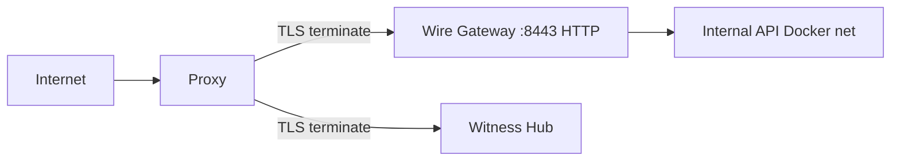

# Production TLS Runbook — Wire Gateway & Witness Hub

**Audience:** Operators deploying Internet-facing Wire / Hub endpoints.  
**Dev-only:** `orgos wire-gateway tls-init` / `hub tls-init` + `docker-compose.tls.yaml` (self-signed). Do not use for production.

## Recommended topology



### Mode A — Reverse proxy (preferred)

1. Terminate TLS at Caddy / nginx / cloud LB (ACME or operator CA).
2. Proxy to Gateway/Hub over private network **HTTP** (or mTLS to origin).
3. Set Gateway `--public-base-url https://wire.example.com` so well-known URLs are public HTTPS.
4. Do **not** mount `deploy/*/tls/` into production images.

Example Caddy snippet:

```
wire.example.com {
  reverse_proxy 10.0.0.5:8443
}
```

### Mode B — Process-native TLS

```bash
# Wire Gateway
orgos wire-gateway serve --tenant demo \
  --tls-cert /run/secrets/wire.crt \
  --tls-key /run/secrets/wire.key \
  --public-base-url https://wire.example.com

# Witness Hub
orgos hub serve --hub-id HUB-A --data-dir ./data/hub-a \
  --tls-cert /run/secrets/hub.crt \
  --tls-key /run/secrets/hub.key \
  --tls-ca /run/secrets/clients-ca.crt \
  --mtls-required
```

Or set `listen.tls_cert` / `tls_key` in tenant `wire-gateway.yaml`.

### Secrets

| Path | Guidance |
|------|----------|
| Docker secrets / K8s secrets | Preferred |
| `deploy/wire-gateway/tls/` · `deploy/witness-hub/tls/` | **gitignored · dev only** |
| ACME (Let's Encrypt, etc.) | Operator-managed; not shipping an ACME client in this repo |

### Rotation

Follow: `orgos protocol tls rotate` checklist (Proposal 3 / protocol API material).  
Hub/Gateway: replace PEM files → restart process → `trusted-hubs-sync-keys` / `trust-registry sync-keys` if public key rotated with cert (signing key is separate Ed25519).

### Validation warnings

If `PUBLIC_BASE_URL` / well-known is `https://` but `listen.tls_*` is unset (Mode A via proxy is OK):

- Default: warning `https_without_local_tls`
- `ORGOS_STRICT_TLS=1`: treat as error unless `WIRE_GATEWAY_TLS_TERMINATED_EXTERNALLY=1`

Related: [witness-hub-operations.md](witness-hub-operations.md) · [deploy/wire-gateway/README.md](../../deploy/wire-gateway/README.md)
