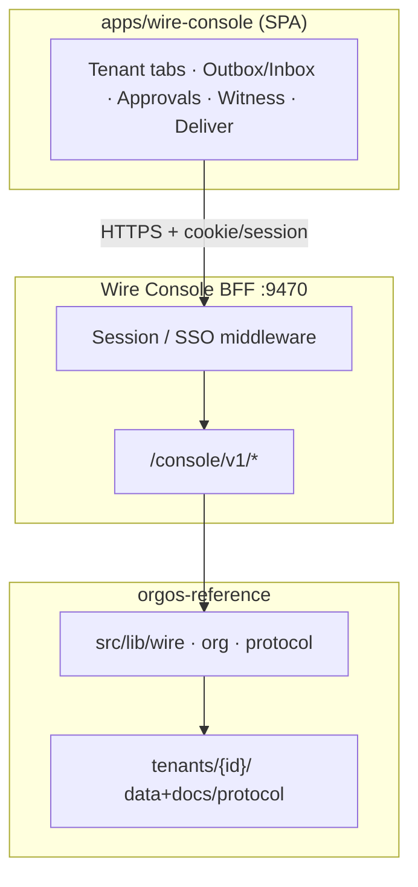
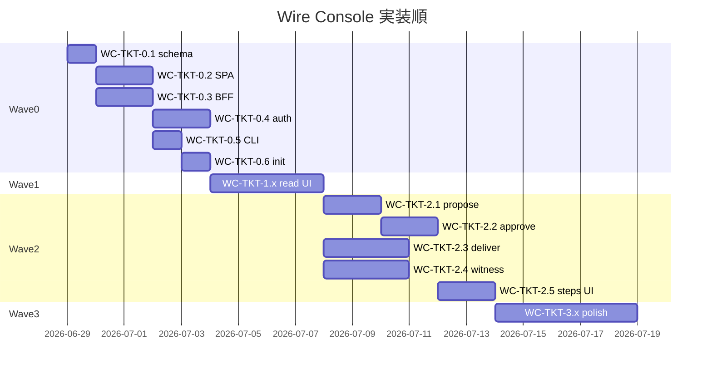

# Wire Console — 実装計画 · チケット

**Status:** 2026-06-28 策定 · 擦り合わせ済み  
**Parent:** [orgos-interface-spec.md](orgos-interface-spec.md) · [inter-org-operator-model.md](inter-org-operator-model.md) · [orgos-completion-plan.md](orgos-completion-plan.md)

---

## 1. 決定事項（固定）

| 項目 | 決定 |
|------|------|
| 目的 | **日常運用** — Wire notice propose/approve · deliver · witness 確認 |
| UI | **SPA**（React · Vite）+ **localhost BFF** |
| 配置 | **`apps/wire-console/`**（npm workspace） |
| BFF | **`src/lib/wire-console/`** — OrgOS `src/lib/*` のみ経由で read/write |
| テナント表示 | **タブ切替**（1 org ずつ） |
| init 起動 | **`tenant.yaml` → `wire_console: true` のときのみ**（未指定 = **false**） |
| 認証 | **本番同等（C）** — dev: パスキード/ローカル IdP スタブ · prod: SSO/パスキード |
| 優先 | **P1:** notice propose → approve · **並行:** witness pool/receipt · deliver/flush-pending |
| 非目標 | envelope 直編集 · provenance bypass · `io inbox/outbox`（PDF）との混同 |

---

## 2. アーキテクチャ



**既存 Protocol API（`protocol api-serve`）との関係**

| サービス | 向き | 用途 |
|----------|------|------|
| Protocol API `:9476` | **Peer 向け** pull · mTLS | 本番 P2P · FR-EM-07 |
| Wire Console `:9470` | **人間オペレータ向け** | approve · deliver · 可視化 |

---

## 3. ディレクトリ（新規）

```
apps/wire-console/          # Vite + React SPA
  src/
    pages/                  # TenantShell · Outbox · Inbox · Approvals · Witness · Deliver
    api/                    # fetch client · types
    auth/                   # login · session
src/lib/wire-console/
  server.ts                 # HTTP BFF
  routes/                   # handlers
  auth/                     # session · dev passkey · prod SSO adapter
  tenant-registry.ts        # wire_console テナント一覧
  watch.ts                  # optional: chokidar → SSE
.orgos/wire-console.json    # runtime: url · pid · port（gitignore）
schemas/org/tenant-wire-console.ts  # wire_console flag（tenant.yaml 拡張）
```

---

## 4. BFF API（概要）

**認証:** 除く `/console/v1/auth/*` · `/health` 以外は session 必須。

| Method | Path | 用途 | ライブラリ |
|--------|------|------|------------|
| GET | `/health` | 生存確認 | — |
| POST | `/console/v1/auth/login` | dev passkey / prod SSO callback | `wire-console/auth` |
| POST | `/console/v1/auth/logout` | セッション破棄 | — |
| GET | `/console/v1/auth/me` | 操作者 identity（→ attestation 用） | `authorized-approvers` |
| GET | `/console/v1/tenants` | `wire_console: true` 一覧 | tenant registry |
| GET | `/console/v1/tenants/:id/snapshot` | validate summary · metrics | `validateProtocolState` · metrics |
| GET | `/console/v1/tenants/:id/outbox` | outbox entries | `exportOutboxEntries` |
| GET | `/console/v1/tenants/:id/inbox` | inbox entries | `exportInboxEntries` |
| GET | `/console/v1/tenants/:id/ledger` | transactions | `loadTransactionsRegistry` |
| GET | `/console/v1/tenants/:id/approvals` | wire approvals | `listOrgApprovals` |
| GET | `/console/v1/tenants/:id/peers` | peers.yaml | `loadPeersRegistry` |
| GET | `/console/v1/tenants/:id/witness` | pool · receipts · pending | witness client |
| GET | `/console/v1/tenants/:id/delivery` | wire-pending · wire-delivered · relay | wire-queue |
| GET | `/console/v1/tenants/:id/events/:eventId` | envelope + provenance + audit link | compose |
| POST | `/console/v1/tenants/:id/notices/propose` | wire notice 起案 | `proposeInterOrgNotice` 等 |
| POST | `/console/v1/tenants/:id/notices/:id/approve` | 承認 | `approveInterOrgNotice` |
| POST | `/console/v1/tenants/:id/notices/:id/reject` | 却下 | `rejectInterOrgNotice` |
| POST | `/console/v1/tenants/:id/deliver` | peer + event_id | `deliverProtocolEnvelopeWithRelay` |
| POST | `/console/v1/tenants/:id/delivery/flush-pending` | pending 再送 | `flushWirePending` |
| GET | `/console/v1/events/stream` | SSE 更新（optional P1.5） | watch |

**L2 マスク:** snapshot / envelope API は `classification-registry` に従い payload フィールドを redact。

---

## 5. CLI · init 連動

```bash
# 手動
npm run orgos -- wire console start [--port 9470]
npm run orgos -- wire console stop
npm run orgos -- wire console status

# tenant init --wire-console  → tenant.yaml に wire_console: true を書き、起動試行
npm run orgos -- tenant init aiac --name AIAC --wire-console
```

**`.orgos/wire-console.json`（例）**

```json
{
  "url": "http://127.0.0.1:9470",
  "port": 9470,
  "pid": 12345,
  "started_at": "2026-06-28T12:00:00.000Z"
}
```

**起動条件:** いずれかのテナントが `wire_console: true` **かつ** `wire console start` / init フック。ポート使用中は status に WARN · 二重 fork しない。

---

## 6. チケット一覧

### Wave 0 — 基盤（ブロッカー）

| ID | タイトル | 内容 | DoD | 依存 |
|----|----------|------|-----|------|
| **WC-TKT-0.1** | tenant `wire_console` フラグ | `tenant.yaml` スキーマ · validate · 3 社デモ tenant に `true` | `validate` 通過 · doc 1 行 | — |
| **WC-TKT-0.2** | monorepo + SPA scaffold | `apps/wire-console` Vite React TS · root workspaces · `npm run wire-console:dev` | dev server 起動 · placeholder UI | — |
| **WC-TKT-0.3** | BFF skeleton | `startWireConsoleServer` · `/health` · static SPA serve（prod build） | vitest: health 200 | 0.2 |
| **WC-TKT-0.4** | 認証 C（dev スタブ） | session cookie · `POST /auth/login`（dev passkey）· `GET /auth/me` · middleware | 未認証 401 · 認証後 200 | 0.3 |
| **WC-TKT-0.5** | CLI start/stop/status | `wire console *` · PID ファイル · `.orgos/wire-console.json` | start → status OK → stop | 0.3 |
| **WC-TKT-0.6** | init フック | `tenant init --wire-console` · 該当 tenant で start 試行 | init ログに Console URL | 0.1 · 0.5 |

**Wave 0 ゲート:** `npm test -- tests/wire-console-server.test.ts`

---

### Wave 1 — Read-only 可視化（P0）

| ID | タイトル | 内容 | DoD | 依存 |
|----|----------|------|-----|------|
| **WC-TKT-1.1** | Outbox / Inbox API + UI | BFF GET + SPA テーブル · event type · recorded_at · digest 短縮 | 3-org デモ後に一覧表示 | 0.4 |
| **WC-TKT-1.2** | Ledger · Peers · Validate | snapshot API + ヘッダ badges（OK/WARN） | validate issues 表示 | 0.4 |
| **WC-TKT-1.3** | Event 詳細パネル | event_id クリック → envelope · provenance 有無 · tx link | inter-org + mesh event 確認 | 1.1 |
| **WC-TKT-1.4** | Approvals 読取 | pending/completed wire approvals 一覧 | southwood NOTICE 履歴表示 | 0.4 |
| **WC-TKT-1.5** | Tenant タブ | `/console/v1/tenants` · mal / southwood / aiac 切替 | タブごとに独立 snapshot | 0.1 · 1.1 |

**Wave 1 ゲート:** デモ実行後 Console alone で outbox/inbox/ledger が追える（CLI 不要） — **完了**（`tests/wire-console-server.test.ts` 6 件 · `npm run wire-console:build`）

---

### Wave 2 — 運用 Write（P1 + 並行）

| ID | タイトル | 内容 | DoD | 依存 |
|----|----------|------|-----|------|
| **WC-TKT-2.1** | Notice **propose** | UI フォーム（peer · contract · message · type）→ BFF → `proposeInterOrg*` | pending に載る · audit 整合 | 1.4 · 0.4 |
| **WC-TKT-2.2** | Notice **approve / reject** | 承認者 = session user · `assertApproverAuthorized` | outbox + provenance · pre-deliver OK | 2.1 |
| **WC-TKT-2.3** | **Deliver + flush-pending**（並行） | peer/event 指定 deliver · flush ボタン · delivery 状態パネル | demo:inter-org 相当を UI のみ | 1.1 · 2.2 |
| **WC-TKT-2.4** | **Witness**（並行） | pool status · receipt by event_id · witness-pending | mutually_confirmed 表示 | 1.3 |
| **WC-TKT-2.5** | 承認→配送→witness ステップ UI | 1 event の Approval / Outbox / Delivery / Witness タブ | 3-org E2E を Console 上で追跡 | 2.2 · 2.3 · 2.4 |

**Wave 2 ゲート:** `demo:three-org-wire` **without** CLI で Phase1 approve + Phase2 確認が可能（Phase2 mesh は当面 CLI/demo 併用可） — **完了**（Console propose/approve · deliver/witness · workflow UI · `tests/wire-console-server.test.ts` 9 件）

---

### Wave 3 — 認証本番 · 仕上げ

| ID | タイトル | 内容 | DoD | 依存 |
|----|----------|------|-----|------|
| **WC-TKT-3.1** | 認証 prod アダプタ | SSO/OIDC or WebAuthn 本番パス · env `WIRE_CONSOLE_AUTH=prod` | prod profile で dev login 不可 | 0.4 |
| **WC-TKT-3.2** | SSE / ポーリング | outbox/inbox/approval 変更通知 | デモ中ライブ更新 | 1.1 |
| **WC-TKT-3.3** | runbook + demo doc | `docs/runbook-orgos.md` § · `inter-org-three-org-demo.md` | Console URL · 操作手順 | 2.5 |
| **WC-TKT-3.4** | E2E テスト | vitest: BFF approve flow · optional Playwright SPA smoke | CI green | 2.2 |

**Wave 3 ゲート:** prod 認証切替 · SSE ライブ更新 · runbook §18 · vitest E2E — **完了**（`tests/wire-console-server.test.ts` · [inter-org-three-org-demo.md](inter-org-three-org-demo.md)）

---

## 7. 実装順（推奨スプリント）



**並行の取り方（Wave 2）**

- 開発者 A: **2.1 → 2.2 → 2.5**（承認フロー）
- 開発者 B: **2.3 + 2.4**（配送 · witness）— BFF route のみ先行可能（Wave 1 完了後）

---

## 8. テナント設定（WC-TKT-0.1）

```yaml
# tenants/southwood/tenant.yaml（例）
id: southwood
lifecycle: skeleton
wire_console: true   # 未指定 = false
```

| テナント | `wire_console` 推奨 | 理由 |
|----------|----------------------|------|
| mal | **false**（必要時のみ true） | default · 本番相当 |
| southwood | **true** | 2-org / 3-org デモ |
| aiac | **true** | mesh 受け口デモ |

---

## 9. リスク · 緩和

| リスク | 緩和 |
|--------|------|
| BFF が lib を bypass してファイル直書き | レビュー rule: write は `src/lib/wire|org|protocol` の exported 関数のみ |
| 認証 C で Wave 1 遅延 | dev passkey を Wave 0 で必須 · prod adapter は Wave 3 |
| localhost L2 露出 | classification redact · Console は 127.0.0.1 bind デフォルト |
| ポート 9470 競合 | port 0 フォールバック + json に実 port 記録 |
| SPA と Protocol API 混同 | runbook でポート表を固定（9470 Console · 9476 Protocol API） |

---

## 10. 完了定義（Epic Done）

- [x] `wire_console: true` の tenant で init/start 後 `http://127.0.0.1:9470` が開く
- [x] ログイン後、テナントタブで **outbox · inbox · ledger · approvals · witness · delivery** が読める
- [x] **propose → approve** が UI のみで完結し outbox provenance 付き envelope が出る
- [x] **deliver / flush-pending** · **witness pool/receipt** が UI から操作/確認できる
- [x] `npm test` に wire-console BFF テストが含まれ CI green
- [x] runbook §18 に Operator 手順が載る

---

**版:** v0.1 · 2026-06-28
