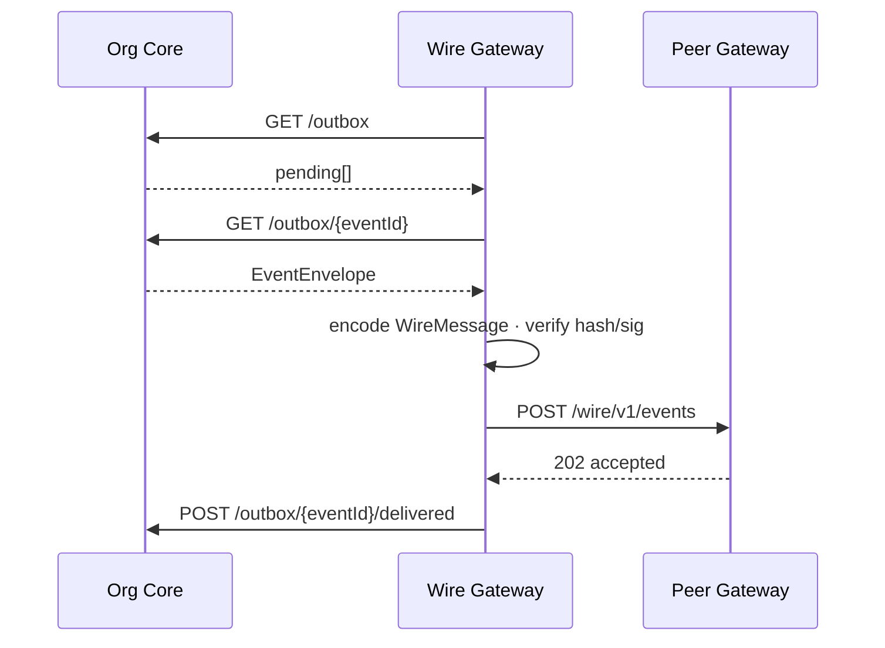
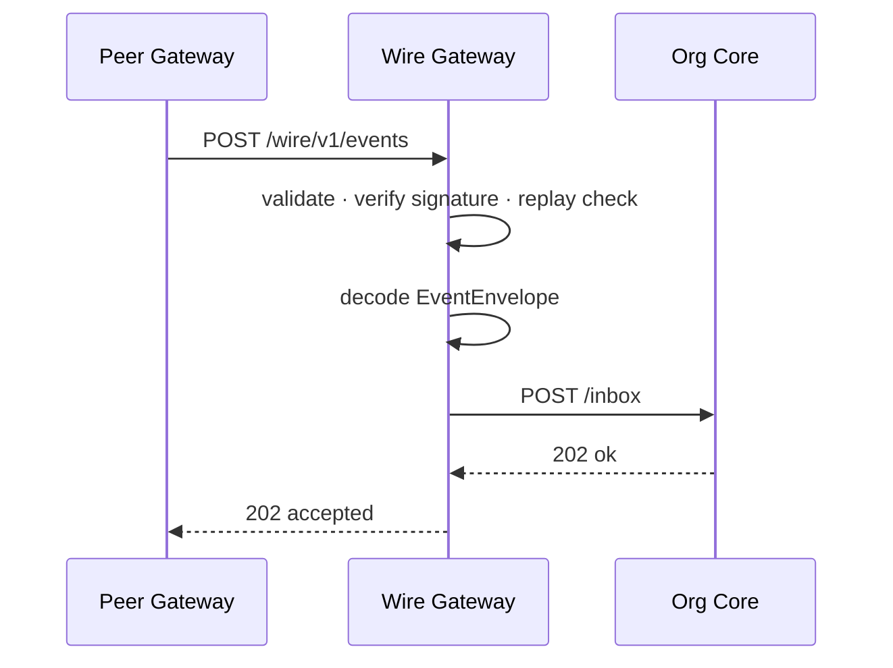
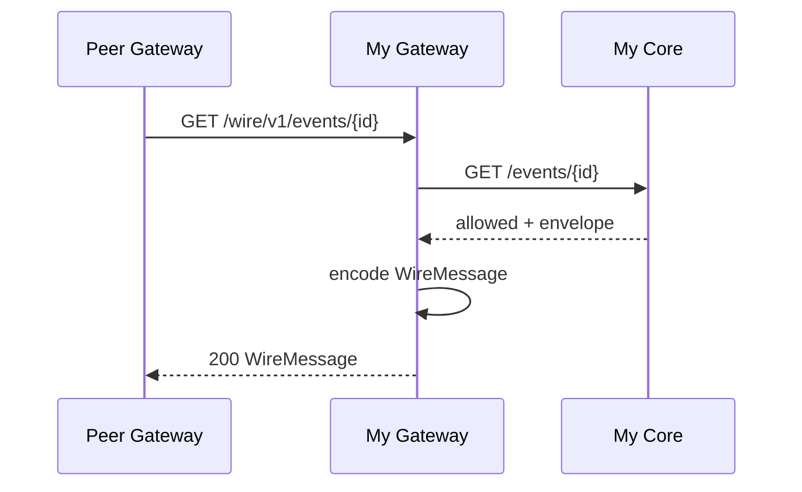

# Wire Gateway — Internal API 契約（Org Core 側）

**Status:** WG-0 正本 · 2026-07-07  
**Parent:** [wire-gateway-requirements.md](wire-gateway-requirements.md)  
**Wire 外部:** [wire-gateway-wire-protocol.md](wire-gateway-wire-protocol.md)  
**Schema:** [`schemas/protocol/wire-gateway-internal.ts`](../../schemas/protocol/wire-gateway-internal.ts)

---

## 1. 目的

**Wire Gateway**（I3-a）と **OpenOrgOS 本体**（I2）の境界。Gateway は本 API **のみ** で Core と通信する。

| 原則 | 内容 |
|------|------|
| ネットワーク | `localhost` または Docker internal network **のみ** |
| 認証 | Bearer token または mTLS（§2） |
| 正本 | リクエスト/レスポンスの envelope は **`EventEnvelope`** |
| Core 責務 | 業務処理 · Event Store · approve 状態 · pull 許可判断 |
| Gateway 責務 | Wire JSON 変換 · 外部 TLS · 署名検証 · audit |

```
┌─────────────┐     Internal API      ┌──────────────┐
│ Wire Gateway│ ◄──────────────────► │  Org Core    │
│  (I3-a)     │   EventEnvelope      │  (I2)        │
└─────────────┘                       │  api/worker  │
       │                               └──────────────┘
       │ HTTPS WireMessage
       ▼
  相手 Gateway
```

---

## 2. 接続と認証

### 2.1 Base URL

```
http://org-core:8080/internal/v1/wire
```

開発: `http://127.0.0.1:8080/internal/v1/wire`

### 2.2 認証

| 方式 | Header | 用途 |
|------|--------|------|
| **Bearer**（WG-0 既定） | `Authorization: Bearer {token}` | gateway → core |
| mTLS（WG-1+） | クライアント証明書 CN=`wire-gateway` | 本番推奨 |

Token 正本: `data/protocol/wire-gateway-internal.token`（gitignore）· seed: [wire-gateway.yaml.example](../../steward/platform/protocol/seed/wire-gateway.yaml.example)

### 2.3 共通ヘッダ

| Header | 値 |
|--------|-----|
| `Content-Type` | `application/json` |
| `X-OrgOS-Tenant` | tenant id（multi-tenant 時） |
| `X-Wire-Gateway-Id` | Gateway インスタンス ID（audit） |

### 2.4 エラー形式

```json
{ "ok": false, "error": "human readable", "code": "MACHINE_CODE" }
```

| HTTP | code 例 |
|------|---------|
| 400 | `schema_invalid` |
| 401 | `unauthorized` |
| 404 | `not_found` |
| 409 | `idempotent` |
| 503 | `core_unavailable` |

---

## 3. エンドポイント一覧

| Method | Path | 呼び出し元 | 説明 |
|--------|------|-----------|------|
| GET | `/node` | Gateway | 自 Node  identity |
| GET | `/peers` | Gateway | 配送先 peer 一覧 |
| GET | `/outbox` | Gateway | 配送待ち event 一覧（メタのみ） |
| GET | `/outbox/{eventId}` | Gateway | 配送用 `EventEnvelope` 取得 |
| POST | `/outbox/{eventId}/delivered` | Gateway | 配送結果報告 |
| POST | `/inbox` | Gateway | 検証済み inbound envelope 投入 |
| GET | `/events/{eventId}` | Gateway | Pull 許可確認 + envelope |

---

## 4. エンドポイント詳細

### 4.1 GET `/node`

自組織の Wire Node 情報。Gateway が `/.well-known/wire-node.json` を生成する際に使用。

**Response 200:**

```json
{
  "ok": true,
  "node": {
    "node_id": "org.example.co.jp",
    "node_uri": "steward://tenant/demo",
    "display_name": "Example Corp",
    "protocol_public_key": "base64-spki…",
    "wire_version": "0.1"
  }
}
```

### 4.2 GET `/peers`

**Response 200:**

```json
{
  "ok": true,
  "peers": [
    {
      "peer_node_id": "org.partner.example",
      "peer_node_uri": "steward://tenant/partner",
      "display_name": "Partner Inc",
      "protocol_public_key": "base64…",
      "wire_endpoint": "https://wire.partner.example/wire/v1/events",
      "transport": "wire_v1"
    }
  ]
}
```

| `transport` | 意味 |
|-------------|------|
| `wire_v1` | POST `/wire/v1/events`（本書） |
| `legacy_webhook` | 移行期 · 参照実装 webhook URL |

### 4.3 GET `/outbox`

approve 済み · 未配送の event。**本文なし**（Gateway は digest のみで重複確認可）。

**Response 200:**

```json
{
  "ok": true,
  "pending": [
    {
      "event_id": "550e8400-e29b-41d4-a716-446655440000",
      "receiver_node_id": "org.partner.example",
      "enqueued_at": "2026-07-07T09:00:00.000Z",
      "envelope_digest": "64hex…"
    }
  ]
}
```

**Gateway ポーリング:** 既定 5s（設定可能）· または Core が Webhook で Gateway に notify（WG-2 任意）

### 4.4 GET `/outbox/{eventId}`

配送直前に **署名済み EventEnvelope** を取得。

**Response 200:**

```json
{
  "ok": true,
  "envelope": { "protocol_version": "1", "event_id": "…", … }
}
```

**Response 404:** 未 approve · 既配送 · 不存在

**Core 不変条件:** 返却 envelope は outbox 正本と **バイト同一**（Gateway が改変不可）

### 4.5 POST `/outbox/{eventId}/delivered`

外部配送結果を Core に報告。Core は `wire-delivered` 相当を更新 · witness fan-out トリガ（既存 hook）。

**Request:**

```json
{
  "event_id": "550e8400-e29b-41d4-a716-446655440000",
  "delivered": true,
  "peer_node_id": "org.partner.example",
  "http_status": 202,
  "detail": "accepted",
  "delivered_at": "2026-07-07T09:00:05.000Z"
}
```

**Response 200:** `{ "ok": true }`

**失敗時:** `delivered: false` → Core は wire-pending に載せる（既存 `wire-queue` 相当）

### 4.6 POST `/inbox`

Gateway が **署名・replay 検証済み** の envelope を Core に渡す。**Gateway は payload を解釈しない。**

**Request:**

```json
{
  "envelope": { "protocol_version": "1", "event_id": "…", … },
  "gateway_receipt": {
    "received_at": "2026-07-07T09:00:05.000Z",
    "peer_node_id": "org.partner.example",
    "wire_nonce": "f7c3b2a1e9d84f6c"
  }
}
```

**Response 202:**

```json
{
  "ok": true,
  "event_id": "550e8400-e29b-41d4-a716-446655440000",
  "idempotent": false
}
```

**Response 409（冪等）:**

```json
{
  "ok": true,
  "event_id": "…",
  "idempotent": true
}
```

**Core 処理（WG-2 で実装）:**

1. inbox へ mirror  
2. `org.transaction.recorded` 等 → transaction registry  
3. audit-chain append  
4. witness fan-out（`witness_mode: orgos_hub`）  
5. **Gateway レスポンス前に業務失敗しても** — 202 後は async worker 可（at-least-once）

### 4.7 GET `/events/{eventId}`

相手 Gateway からの **Pull** に対し、送信元 Core が許可判断。

**Response 200（許可）:**

```json
{
  "ok": true,
  "allowed": true,
  "envelope": { … }
}
```

**Response 200（拒否）:**

```json
{
  "ok": true,
  "allowed": false,
  "reason": "not_exportable"
}
```

Pull ポリシー正本: [wire-gateway-export-policy.md](wire-gateway-export-policy.md) · `data/protocol/wire-export-policy.yaml`（WG-2 実装）

---

## 5. シーケンス

### 5.1 Outbound（Push）



### 5.2 Inbound（Push）



### 5.3 Pull



---

## 6. 参照実装マッピング（移行）

| Internal API | 現行 OS_Steward | WG フェーズ |
|--------------|-----------------|------------|
| GET `/outbox` | outbox dir listing · wire-pending | WG-2 |
| GET `/outbox/{id}` | outbox file read | WG-2 |
| POST `/inbox` | `ingestWebhook` 分割 | WG-2 |
| POST `/delivered` | `markWireDelivered` | WG-2 |
| GET `/peers` | `peers.yaml` | WG-1 |
| GET `/node` | `identity.ts` + signing key | WG-1 |

**WG-0:** 契約とスキーマのみ確定。HTTP サーバ実装は WG-2（Core 側）· WG-1（Gateway 側）。

---

## 7. 設定ファイル

**Gateway 側:** `data/protocol/wire-gateway.yaml`

```yaml
wire_version: "0.1"
node_id: org.example.co.jp
listen:
  host: 0.0.0.0
  port: 8443
  tls_cert: /run/secrets/wire-tls.crt
  tls_key: /run/secrets/wire-tls.key
internal_api:
  base_url: http://org-core:8080/internal/v1/wire
  bearer_token_file: /run/secrets/wire-internal.token
security:
  timestamp_skew_sec: 300
  nonce_ttl_sec: 604800
  rate_limit_per_min: 120
audit:
  path: data/protocol/wire-gateway-audit.jsonl
```

**Seed:** [wire-gateway.yaml.example](../../steward/platform/protocol/seed/wire-gateway.yaml.example)

---

## 8. 変更履歴

| 版 | 日付 | 内容 |
|----|------|------|
| 0.1 | 2026-07-07 | WG-0 — 7 endpoints · auth · sequences · 移行表 |
| 0.1.1 | 2026-07-08 | export policy リンク |
