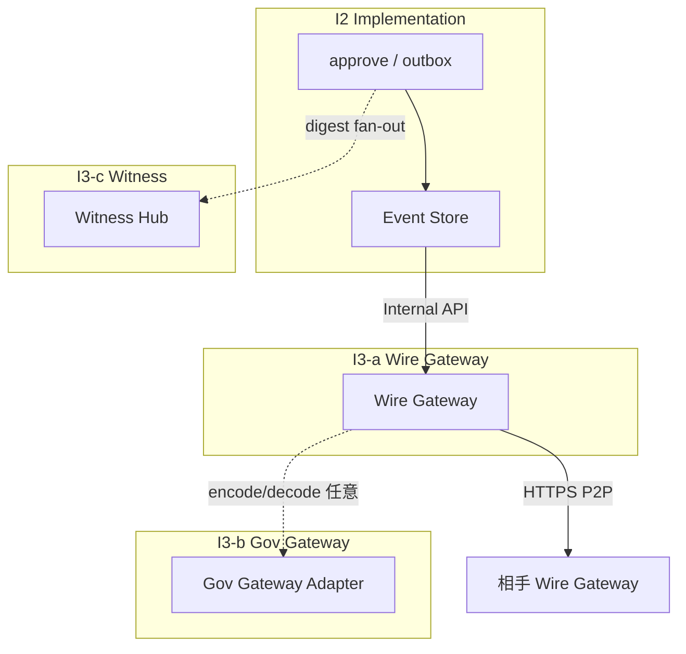

# OpenOrgOS Wire Gateway — 要件定義

**Version:** 0.5（mal 本番パイロット参照）  
**Status:** WG-0〜4 正本 · mal 本番準備 · 2026-07-09  
**Parent:** [orgos-interface-spec.md](orgos-interface-spec.md) · [openorgos-protocol-requirements.md](../spec/openorgos-protocol-requirements.md)  
**Related:** [wire-gateway-wire-protocol.md](wire-gateway-wire-protocol.md) · [wire-gateway-internal-api.md](wire-gateway-internal-api.md) · [wire-gateway-export-policy.md](wire-gateway-export-policy.md) · [wire-trust-registry.md](wire-trust-registry.md) · [wire-legacy-webhook-deprecation.md](wire-legacy-webhook-deprecation.md) · [witness-hub-requirements.md](witness-hub-requirements.md) · [gov-gateway-adapters.md](gov-gateway-adapters.md)

> Wire Gateway は **組織間配送の唯一の外部公開コンポーネント**。Witness Hub · Gov Gateway（国家規格）とは別レイヤ。

---

## 1. 目的

OpenOrgOS（OOO）は、各組織が自社内に保持するデータを管理しながら、他組織の OpenOrgOS と安全に通信できることを目的とする。

**Wire Gateway** は、そのための **唯一の外部公開コンポーネント** である。

### 1.1 設計方針（3 点）

| # | 方針 |
|---|------|
| 1 | 各組織のデータは各組織が所有する |
| 2 | 組織間通信は **Wire Protocol** のみを利用する |
| 3 | 内部 DB は外部へ公開しない |

### 1.2 非目的

| ID | 非目的 | 所在 |
|----|--------|------|
| NG-01 | 業務ロジック（契約 · 稟議 · 会計） | OpenOrgOS 本体（Implementation） |
| NG-02 | Event 本文の長期保管 | Org Event Store（内部） |
| NG-03 | 第三者証明（digest witness） | [Witness Hub](witness-hub-requirements.md) |
| NG-04 | 国家行政ゲートウェイラップ | [Gov Gateway](gov-gateway-adapters.md) |

---

## 2. 全体構成

```
                     Internet
           OpenOrg Wire Protocol
                    HTTPS
           ┌────────────────────┐
           │    Wire Gateway     │  ← 唯一の外部公開
           └────────────────────┘
                    │
        Internal API / localhost
                    │
──────────────────────────────────────
Docker Network（組織内）
──────────────────────────────────────
 Next.js UI（任意）
 REST API（OpenOrgOS 本体）
 Event Engine
 PostgreSQL（または Org 正本ストア）
 Local LLM（Optional）
 MCP Server（Optional）
 Worker
 Object Storage（Optional）
```

**原則:** Gateway のみがインターネットへ公開される。その他コンポーネントは Docker Network 内のみで通信する。

### 2.1 OpenOrgOS 層での位置づけ



| レイヤ | コンポーネント | 本書 |
|--------|---------------|------|
| **I3-a** | Wire Gateway（P2P 配送） | **本書** |
| **I3-b** | Gov Gateway（国家規格ラップ） | 別仕様 |
| **I3-c** | Witness Hub（第三者証明） | 別仕様 |

---

## 3. Gateway の責務

Wire Gateway は **以下のみ** を担当する。

| 責務 | 説明 |
|------|------|
| Wire 通信受付 | inbound HTTPS |
| 認証 | 相互認証（§8） |
| 認可 | peer / trust ポリシー |
| 署名検証 | Wire envelope 署名 |
| 暗号化通信 | TLS 必須 |
| Event 転送 | Internal API へ渡す · payload **非解釈** |
| Rate Limit | 入口での流量制御 |
| Audit Log | 配送メタのみ（§15） |

### 3.1 Gateway がやらないこと

- 業務ロジックを持たない  
- DB へ直接アクセスしない  
- Internal API を呼び出すだけとする  

---

## 4. Gateway の責任範囲 — 保持する情報

### 4.1 保持する

| データ | 用途 |
|--------|------|
| **Node ID** | Wire 上の組織識別（§7） |
| **公開鍵 / 秘密鍵** | envelope 署名 · mTLS |
| **接続先 Node 一覧** | peer 設定 |
| **Trust 設定** | 許可 peer · 鍵 pin |
| **通信ログ** | 送受信 · 拒否 · 認証/署名失敗（§15） |

### 4.2 保持しない

| データ | 理由 |
|--------|------|
| 契約書 · 稟議 · 人事 · 会計 | 業務データ |
| ユーザデータ | Implementation 層 |
| **Event 本文** | Org Event Store が正本 · Gateway は配送のみ |

> **Witness Hub** も envelope 全文を保持しない（digest のみ）。Wire Gateway と Hub は **別プロセス** だが、データ最小化の思想は共通。

---

## 5. Wire Protocol

通信は **JSON** を基本とする。Gateway は **payload を解釈しない**。

**正本:** [wire-gateway-wire-protocol.md](wire-gateway-wire-protocol.md) · 型 [`WireMessage`](../../schemas/protocol/wire-message.ts)

### 5.1 WireMessage（外部 P2P · v0.1）

```json
{
  "wireVersion": "0.1",
  "protocolVersion": "1",
  "eventId": "550e8400-e29b-41d4-a716-446655440000",
  "eventType": "org.transaction.recorded",
  "sender": "org.example.co.jp",
  "receiver": "org.partner.example",
  "timestamp": "2026-07-07T09:00:00.000Z",
  "nonce": "f7c3b2a1e9d84f6c",
  "hash": "a1b2c3…64hex…",
  "signature": "base64-ed25519…",
  "payload": { },
  "identity": { "org_ref": { "org_id": "org.example.co.jp" } }
}
```

| フィールド | 必須 | 説明 |
|-----------|:----:|------|
| `wireVersion` | ✓ | `"0.1"` |
| `protocolVersion` | ✓ | `"1"` · EventEnvelope 互換 |
| `eventId` | ✓ | UUID · 冪等キー |
| `eventType` | ✓ | イベント種別 |
| `sender` / `receiver` | ✓ | Node ID（§7） |
| `timestamp` | ✓ | ISO 8601 |
| `nonce` | ✓ | replay 台帳用 |
| `hash` | ✓ | `envelopeDigest` 互換 · 64 hex |
| `signature` | ✓ | Ed25519 |
| `payload` | ✓ | Gateway は中身を解釈しない |
| `identity` | ✓ | 署名 lossless 透過 |

### 5.2 OpenOrgOS 正本 `EventEnvelope` とのマッピング

**Schema 正本:** [`schemas/protocol/org-event.ts`](../../schemas/protocol/org-event.ts)

| Wire Gateway v0.1 | EventEnvelope | 変換 |
|-------------------|---------------|------|
| `eventId` | `event_id` | 1:1 |
| `eventType` | `event.type` | 1:1 |
| `sender` | `origin.org_id` または `origin.org_uri` | Node ID 規約（§7） |
| `receiver` | `destination.org_id` または `destination.org_uri` | 同上 |
| `timestamp` | `occurred_at` | 1:1 |
| `hash` | `envelopeDigest(envelope)` | 計算 · envelope 内フィールドではない |
| `signature` | `signature` | 1:1 |
| `payload` | `event.payload` | 1:1 |
| — | `protocol_version` | `protocolVersion` 固定 `"1"` |
| `identity` | `identity` | 1:1 透過 |
| `delegation` | `delegation` | 1:1 透過 |
| — | `correlation_id` / `causation_id` | `correlationId` / `causationId` |

**Canonical digest:** [`src/lib/protocol/canonical.ts`](../../src/lib/protocol/canonical.ts) — `signature` 除外 · キーソート JSON → SHA-256。

**Gateway 境界での推奨:**

- **外部（Wire JSON）:** §5.1 フラット形式 — ルータ/SMTP 的に単純  
- **内部（Internal API）:** `EventEnvelope` 正本 — OpenOrgOS Core 統一  
- **変換:** Gateway の encode/decode のみ · Implementation は EventEnvelope のみ扱う  

### 5.3 Push イベント例（論理名 → Core type）

| ビジネスイベント（例） | `eventType`（Core） | 備考 |
|------------------------|---------------------|------|
| ContractSigned | `org.transaction.recorded` | `payload.transaction_type` |
| InvoiceIssued | `org.transaction.recorded` | 同上 |
| MeetingScheduled | 拡張 type 可 | registry 登録 |
| OrganizationJoined | `org.identity.presented` | identity exchange |
| MemberInvited | 拡張 type 可 | Community 連携 |

---

## 6. 通信方式

| 方式 | v0.1 | 備考 |
|------|:----:|------|
| HTTPS | **必須** | TLS 1.2+ |
| REST | **必須** | POST 受信 · GET pull |
| HTTP/2 | 将来 | |
| WebSocket | 必要に応じて | |
| gRPC | 将来 | |

---

## 7. Node Identity

各 Wire Gateway は一意の **Node ID** を持つ。

| 形式 | 例 |
|------|-----|
| DNS 風 | `org.example.co.jp` |
| DID（将来） | `did:ooo:xxxxxxxx` |

Node ID は Wire 上で一意とする。

### 7.1 現行参照実装との対応

| 概念 | 参照実装（OS_Steward） | v0.1 移行 |
|------|-------------------------|-----------|
| Node ID | `org_id` + `org_uri`（`steward://tenant/{id}`） | DNS/DID + **`did:ooo:org:*`**（WG-4） |
| Peer 参照 | `PEER-xxx` in `peers.yaml` | Node ID 解決テーブル |
| Hub ID | `HUB-xx`（Wire Gateway とは別） | 変更なし |

---

## 8. 認証

Gateway 同士は **相互認証** を行う。

| 方式 | v0.1 | 優先 |
|------|:----:|------|
| mTLS | 対応 | P0 |
|  envelope 署名（Ed25519） | 対応 | P0 |
| OAuth2 Client Credential | 将来 | |
| OIDC | 将来 | |
| JWT | 将来 | |

複数方式への拡張を許容する。

---

## 9. Event 送信フロー

```
内部システム
    ↓
Internal API（EventEnvelope）
    ↓
Wire Gateway
    ↓
署名（未署名なら Gateway または Internal API で完了済みを受け取る）
    ↓
HTTPS（Wire JSON）
    ↓
相手 Wire Gateway
    ↓
検証
    ↓
Internal API
    ↓
Event Store
```

**不変条件:** Gateway は Event 本文を書き換えない。

---

## 10. Event 受信フロー

```
Wire Gateway（inbound）
    ↓
認証
    ↓
署名検証
    ↓
Schema Validation（Wire JSON / EventEnvelope）
    ↓
Internal API（POST · 非同期可）
    ↓
Event Store
```

---

## 11. Data Ownership

| 原則 | 内容 |
|------|------|
| 所有権 | データ所有権は **送信元組織** が保持 |
| Gateway 役割 | **配送のみ** |
| 保管 | Gateway はデータ保管サービスではない |

---

## 12. Pull 型通信

受信組織は必要に応じて取得要求を送れる。

```
GET /wire/events/{eventId}
```

取得可否は **送信元組織** が判断する（Internal API 経由）。

### 12.1 参照実装との対応

| v0.1 | 現行 | 差分 |
|------|------|------|
| `GET /wire/events/{id}` | `GET /protocol/v1/outbox/{uuid}` | パス · 認証モデル統一が必要 |

---

## 13. Push 型通信

通知イベントを能動送信する。イベント種別は §5.3 参照。

---

## 14. セキュリティ

経路ごとに実装水準が異なる。正経路は **Wire Gateway 入口**。

| 項目 | v0.1 | Gateway 入口 (`wire_v1`) | legacy webhook |
|------|:----:|-------------------------|----------------|
| TLS | **必須** | 設定可（compose TLS overlay · 本番は Runbook） | ホスト依存 · Gateway 強制なし |
| 署名 | **必須** | Ed25519 ✓ | EventEnvelope 署名（経路次第） |
| Replay Attack 対策 | **必須** | **nonce 台帳**（sender+nonce · TTL）✓ | event_id 冪等のみ |
| Timestamp 検証 | **必須** | ±300s（設定可）✓ | **未** |
| Nonce | **必須** | 受信側 7 日台帳 ✓ | **未** |
| Rate Limit | **必須** | 既定 120 req/min/IP ✓ | ホスト依存 |
| IP Filter | 任意 | `security.ip_allowlist` ✓ | **未** |

legacy 縮退方針: [wire-legacy-webhook-deprecation.md](wire-legacy-webhook-deprecation.md)

---

## 15. Audit Log

Gateway は以下 **のみ** を記録する。

| イベント | 記録内容 |
|----------|----------|
| 送信 | eventId · sender · receiver · timestamp · hash · HTTP  status |
| 受信 | 同上 |
| 拒否 | reason code |
| 認証失敗 | peer · reason |
| 署名失敗 | eventId · reason |

**業務データ · Event 本文は保持しない。**

---

## 16. Docker 構成（目標）

| サービス | 公開 |
|----------|:----:|
| **gateway** | ✓（唯一） |
| api | 内部のみ |
| frontend | 内部のみ |
| postgres | 内部のみ |
| redis | 内部のみ |
| worker | 内部のみ |
| ollama（optional） | 内部のみ |
| mcp（optional） | 内部のみ |

Gateway は **独立コンテナ** とする。

---

## 17. 外部公開

| 公開 | URL 例 |
|------|--------|
| Wire Gateway のみ | `https://wire.company-a.com` |
| API · DB · LLM · MCP · Redis | **非公開** |

---

## 18. 将来対応

| 項目 | 参照実装での先行度 |
|------|-------------------|
| Gateway Federation | **v2 catalog + gossip** · `wire-gateway federation list|gossip` · well-known sync |
| Store & Forward | `wire-pending` · relay · **exponential backoff + max attempts** |
| Offline Queue | 同上 |
| Message Retry | relay-worker · **next_retry_at backoff** |
| Peer Discovery | **`wire-gateway discover`** · `protocol peer discover` · trust-registry |
| Trust Registry | **wire-trust-registry.yaml** + **trusted-hubs.yaml** · CLI validate/sync · 鍵 pin 運用中 |
| OpenOrg DNS | **`wire-gateway dns resolve`** · SRV `_openorgos-wire._tcp` · TXT `wire-url=` · well-known fallback |
| OpenOrg DID | **`did:ooo:org:*` 実装済（WG-4）** · well-known / Internal API · **organization_certificate_spki_sha256** |
| Organization Certificate | **SPKI SHA-256 in well-known**（protocol signing key fingerprint） |

---

## 19. 設計思想

Wire Gateway は **「組織間通信装置」** であり、**「アプリケーションサーバ」ではない**。

TCP/IP ルータや SMTP サーバに近い役割を担う。業務ロジックは OpenOrgOS 本体が担当し、Gateway は Wire Protocol の送受信に専念する。

---

## 20. 基本原則

1. データは各組織が所有する。  
2. Gateway は配送のみを担当する。  
3. 外部公開は Gateway だけとする。  
4. 内部システムは Docker Network 内で完結する。  
5. Wire Protocol を実装すれば、Mac mini · VPS · オンプレ · クラウドのいずれでも相互接続できる。  
6. OpenOrgOS は中央集権型クラウドではなく、各組織が自律的に運用する **分散型組織 OS** を目指す。  

---

## 21. 参照実装ギャップ（OS_Steward · 2026-07-09）

**mal テナント本番パイロット参照実装完了**（Mode A TLS · 鍵 pin · STRICT ゲート · Gov mock/live 手順 · committed `tenants/mal/data/protocol/*`）。

| 領域 | v0.1 要求 | 現状（2026-07-09） | ギャップ |
|------|-----------|-------------------|----------|
| **プロセス** | 単一 Wire Gateway | `wire-gateway serve` + Internal API · **deploy/wire-gateway compose** | — |
| **境界** | Internal API 経由のみ | Internal API 7 endpoints + E2E テスト | — |
| **TLS** | 全経路必須 | Mode A runbook · `ORGOS_STRICT_TLS` · mal `wire.mal.example` | オペレータ ACME/CA 適用 |
| **mal 設定** | wire-gateway.yaml 等 | **committed** · `orgos wire-gateway init` · `init-tenant-wire-pilot.sh` | — |
| **Hub スタック** | witness pool + relay | JP HUB-A/B pin · `wire-hub-stack-smoke.sh` · relay systemd | 法域別 Hub 本番鍵 |
| **Node ID** | DNS/DID | **`did:ooo:org:*`** · Trust Registry pin 済 | oorgos.org 配信は operator |
| **Gov Gateway** | Wire 下流 | P0 `production` · mal pilot config · live Playground Phase 4 | 実 SS token は operator |

**Witness Hub:** v0.1 スコープ外。digest 証明は [witness-hub-requirements.md](witness-hub-requirements.md) を正とする。

**Gov Gateway:** Wire Gateway の **下流輸送**（I3-b）。[gov-gateway-adapter-spec.md](gov-gateway-adapter-spec.md)

---

## 22. 実装ロードマップ

| Phase | 内容 | Status |
|-------|------|--------|
| **WG-0** | 仕様確定 · Wire JSON · Internal API · codec · schema | **✓ 2026-07-08** |
| **WG-1** | `wire-gateway` 独立プロセス · TLS · 署名検証 · audit log | **✓ 2026-07-08** |
| **WG-2** | Internal API サーバ（Core 側）· ingest/approve 分離 | **✓ 2026-07-08**（bridge） |
| **WG-3** | replay/nonce/rate limit · Docker compose | **✓ 2026-07-08** |
| **WG-4** | Node ID / DID · Trust Registry 統合 | **✓ 2026-07-08** |

### WG-0〜4 成果物（正本）

| 文書 / コード | 内容 |
|---------------|------|
| [wire-gateway-wire-protocol.md](wire-gateway-wire-protocol.md) | 外部 `WireMessage` · HTTP · 署名 · Node ID |
| [wire-gateway-internal-api.md](wire-gateway-internal-api.md) | Core ↔ Gateway · 7 endpoints · シーケンス |
| [wire-gateway-export-policy.md](wire-gateway-export-policy.md) | Pull 許可ポリシー |
| [wire-trust-registry.md](wire-trust-registry.md) | DID · Trust Registry (WG-4) |
| [`wire-trust-registry.yaml`](../../steward/platform/protocol/wire-trust-registry.yaml) | Platform node registry |
| [`src/lib/wire-gateway/`](../../src/lib/wire-gateway/) | server · codec · poller · security · Internal API |
| [`tests/wire-gateway-server.test.ts`](../../tests/wire-gateway-server.test.ts) | health · inbound · replay |
| [deploy/wire-gateway/](../../deploy/wire-gateway/) | Docker compose スタック |

### 完了条件（チェックリスト）

- [x] 外部 `WireMessage` スキーマ確定（`wireVersion` · `nonce` · `identity` 含む）
- [x] `EventEnvelope` ↔ `WireMessage` codec + round-trip テスト
- [x] Internal API 7 endpoints 契約 + シーケンス図
- [x] Gateway 設定 · audit · export policy の Zod 正本
- [x] 署名/hash 算法 = 既存 `envelopeDigest` 互換
- [x] セキュリティ既定値（timestamp ±300s · nonce 7日 · rate 120/min）
- [x] HTTP サーバ実装（WG-1 Gateway · WG-2 Core Internal API）
- [x] Docker compose（`deploy/wire-gateway`）
- [x] peer `transport: wire_v1` · legacy 明示 · deliver 経路統合
- [x] OpenOrg DID (`did:ooo:org:*`) · wire-trust-registry · well-known DID フィールド

---

## 23. 変更履歴

| 版 | 日付 | 内容 |
|----|------|------|
| 0.1 | 2026-07-07 | 初版 — ユーザー要件 v0.1 正本化 · EventEnvelope マッピング · ギャップ §21 |
| 0.2 | 2026-07-07 | **WG-0 完了** — Wire Protocol · Internal API · codec · schema |
| 0.2.1 | 2026-07-08 | WG-0 詰め — config/audit/export Zod · validate · export policy |
| 0.3 | 2026-07-08 | **WG-1〜3 実装反映** — Gateway/Internal API · nonce/rate · compose · wire_v1 経路 |
| 0.4 | 2026-07-08 | **WG-4** — `did:ooo:org:*` · wire-trust-registry · well-known DID |
| 0.5 | 2026-07-09 | **mal 本番パイロット** — Mode A TLS · 鍵 pin · STRICT ゲート · Gov P0 production |
