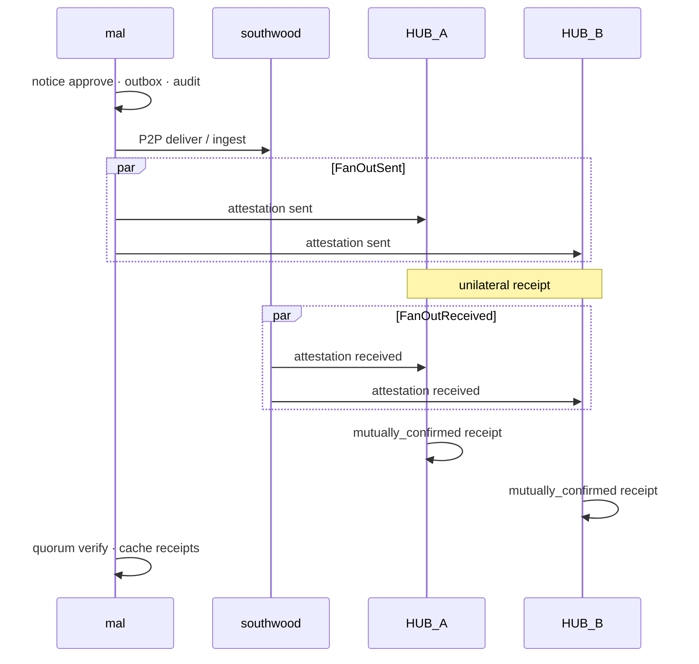

# Witness Hub — 要件定義（実装準拠 v1.2）

**Status:** Steward OS v0.8 · v1 + v2 参照実装  
**Parent:** [inter-org-operator-model.md](inter-org-operator-model.md) · [openorgos-core-philosophy.md](openorgos-core-philosophy.md)  
**関連:** [inter-org-two-org-demo.md](inter-org-two-org-demo.md) · [layer-mapping-steward-os.md](layer-mapping-steward-os.md)

---

## 1. 概要

### 1.1 目的

組織間 **Wire**（P2P 署名付き envelope 配送）に加え、**第三者 Witness Hub ノード**が `envelope_digest` 単位で「いつ・誰と誰の間で・どの内容（digest）の通信があったか」を **当事者 Org とは独立に** 記録・署名する。

裁判・仲裁・監査で必要な **中立ミラー** を、単一中央 Hub ではなく **分散 Witness プール** で担保する。

### 1.2 非目的（本要件のスコープ外）

| ID | 非目的 | 理由 |
|----|--------|------|
| N-01 | **単一中央 Hub 必須** | Federation 原則 · 可用性 |
| N-02 | Wire 配送の正本化 | P2P + 各 Org ローカル台帳が正本 |
| N-03 | 承認権限の Hub 委譲 | wire-governance approve は Org 内のみ |
| N-04 | envelope 全文の Hub 保管 | L2 リスク |
| N-05 | store-and-forward relay | 参照実装済（`wire-pending` · `deliver-flush-pending`）· 本番 relay worker は別 |
| N-06 | Hub 間リアルタイムレプリケーション | gossip による eventual sync · CRDT なし |
| N-07 | Merkle 公開アンカー（第三者配布） | Hub 署名付き日次 anchor 実装済 · 外部公開 CDN は運用委任 |
| N-08 | 法域別 trusted_hub 事業者レジストリ | national committee 管轄 |

### 1.3 OpenOrgOS 層での位置づけ

| 層 | 内容 |
|----|------|
| **Core（形式）** | `WitnessAttestation` · `WitnessReceipt` · quorum 検証 · core event 型 `org.witness.*` |
| **Implementation** | `steward hub serve` · Org 側 fan-out クライアント |
| **Organization** | `data/protocol/witness-pool.yaml` · receipt キャッシュ · pending キュー |

---

## 2. 背景と設計原則

### 2.1 問題

二者間 P2P のみでは、各 Org の `audit-chain` / outbox / inbox は **自組織の主張** に留まり、相手が否認した場合 **中立第三者の担保** がない。

### 2.2 解決方針

```
Layer 1 Wire     : Org ↔ Org P2P · ローカル audit / outbox / inbox（正本）
Layer 2 Witness  : N Hub へ fan-out attestation · quorum で第三者担保
Layer 3 Reconcile: ローカル台帳 · Hub receipt 照合（部分実装）
```

### 2.3 不変条件

1. **Wire 完了**は Hub 成功に依存しない（approve / ingest は Witness 失敗でもロールバックしない）。
2. **Hub は editor ではない** — append-only · 冪等 · digest 不一致は拒否。
3. **各 Hub ノードは独立 SoT** — 中央集約 DB なし · 他 Hub 状態を参照しない。
4. **証拠力の核** — 同一 `event_id` + `envelope_digest` に対し `sent` と `received` が揃った Hub が `mutually_confirmed` receipt を発行。

---

## 3. 用語

| 用語 | 定義 |
|------|------|
| **Wire** | `notice approve` 後の outbound envelope 配送 · 相手 `webhook ingest` |
| **Attestation** | Org が Hub へ POST する署名付き申告（`side`: `sent` \| `received`） |
| **witness_receipt** | Hub が発行する Ed25519 署名レシート |
| **witness_pool** | テナント `witness-pool.yaml` に列挙された信頼 Hub 集合 |
| **quorum** | 複数 Hub receipt の充足判定（`any_of_n` / `k_of_n` / `all_of_n`） |
| **unilateral** | sent または received の片方のみ登録された Hub 側状態 |
| **mutually_confirmed** | sent + received が同一 digest で当該 Hub に存在 |

---

## 4. 機能要件

### 4.1 Wire 連携（Org 側）

| ID | 要件 | 実装 | 備考 |
|----|------|------|------|
| FR-W01 | outbound approve 成功後、設定に応じ `sent` attestation を fan-out | ✓ | `runProtocolNoticeApprove` → `maybeRegisterWitnessAfterWire` |
| FR-W02 | inbound ingest 成功後、設定に応じ `received` attestation を fan-out | ✓ | `ingestWebhook` · fire-and-forget |
| FR-W03 | Witness 失敗は Wire をロールバックしない | ✓ | try/catch · 非 await（ingest） |
| FR-W04 | `register_on` で自動登録タイミングを制御 | ✓ | `approve` / `ingest` / `both` |

### 4.2 Witness プール（Org 側）

| ID | 要件 | 実装 | 備考 |
|----|------|------|------|
| FR-P01 | `witness-pool.yaml` で複数 Hub を `hub_id` + `hub_public_key` pin | ✓ | [`witness-pool.ts`](../../schemas/protocol/witness-pool.ts) |
| FR-P02 | 全 Hub へ並列 POST（`Promise.allSettled`） | ✓ | `registerWitnessAttestationFanOut` |
| FR-P03 | 失敗 Hub のみ `witness-pending.yaml` に enqueue | ✓ | キー: `hub_id` + `event_id` + `side` |
| FR-P04 | `flush-pending` で到達可能 Hub のみ再送 | ✓ | health check 後 · outbox/inbox から envelope 再構築 |
| FR-P05 | receipt を `witness-receipts/{event_id}/{hub_id}.json` にキャッシュ | ✓ | |
| FR-P06 | `verify` でキャッシュ + Hub GET · 署名 + quorum 判定 | ✓ | `protocol witness verify` |
| FR-P07 | `pool status` で各 Hub health 表示 | ✓ | GET `/hub/v1/health` |
| FR-P08 | 手動 `register --event-id --side` | ✓ | envelope は outbox/inbox から解決 |
| FR-P09 | **`protocol witness reconcile --peer`** | ✓ | local · peer · `--cross-hub` |
| FR-P10 | **`protocol witness pool init-trusted`** | ✓ | `trusted-hubs.yaml` → pool 生成 · 公開鍵 pin |

### 4.3 Hub ノード

| ID | 要件 | 実装 | 備考 |
|----|------|------|------|
| FR-H01 | テナント非依存 · `--hub-id` + `--data-dir` で独立起動 | ✓ | `steward hub serve` |
| FR-H02 | attestation 署名検証（Org Ed25519） | ✓ | canonical JSON digest |
| FR-H03 | `sent` → `org_ref` = `origin` · `received` → `org_ref` = `destination` | ✓ | Hub 側検証 |
| FR-H04 | 初回 attestation で Org 公開鍵を `registered-orgs.yaml` に自動登録 | ✓ | 以降 pin · 不一致は拒否 |
| FR-H05 | 冪等: 同一 `(event_id, side, org_id)` · digest 一致は再受理 | ✓ | digest 不一致はエラー |
| FR-H06 | sent + received digest 一致で `mutually_confirmed` receipt 発行 | ✓ | 各 POST で receipt 再生成 · jsonl append |
| FR-H07 | receipt に Hub Ed25519 署名 | ✓ | `hub_signature` |
| FR-H08 | REST v1 API（下表） | ✓ | [`hub-server.ts`](../../src/lib/hub-server.ts) |

### 4.4 クォーラム

| mode | 必要数（実装） | カウント対象 |
|------|----------------|--------------|
| `any_of_n` | **1** | `status === mutually_confirmed` かつ digest/event_id 一致の receipt 数 |
| `k_of_n` | **`quorum.k`**（未指定時 1） | 同上 |
| `all_of_n` | **`hubs.length`** | 同上 |

**注意:** quorum は **Org 側**が複数 Hub の receipt を集めて判定する。Hub ノードは quorum を知らない。

**注意:** `sent` のみの時点では receipt は `unilateral` — **quorum 未充足**（正常）。`received` 登録後に `mutually_confirmed` となり quorum 充足。

---

## 5. データ要件

### 5.1 スキーマ（Core）

| 型 | 正本 | 主要フィールド |
|----|------|----------------|
| `WitnessAttestation` | [`schemas/protocol/witness-attestation.ts`](../../schemas/protocol/witness-attestation.ts) | `event_id`, `envelope_digest`, `side`, `origin`, `destination`, `transaction_type`, `org_ref`, `org_public_key`, `org_signature` |
| `WitnessReceipt` | [`schemas/protocol/witness-receipt.ts`](../../schemas/protocol/witness-receipt.ts) | `receipt_id`, `event_id`, `envelope_digest`, `status`, `attestations[]`, `hub_id`, `hub_signature` |
| `WitnessPoolConfig` | [`schemas/protocol/witness-pool.ts`](../../schemas/protocol/witness-pool.ts) | `enabled`, `quorum`, `hubs[]`, `register_on` |
| `WitnessQuorumResult` | [`schemas/protocol/witness-quorum.ts`](../../schemas/protocol/witness-quorum.ts) | `satisfied`, `required`, `matched`, `mode` |
| `WitnessPendingEntry` | [`schemas/protocol/witness-pending.ts`](../../schemas/protocol/witness-pending.ts) | `hub_id`, `event_id`, `side`, `envelope_digest`, `attempts` |

Core event 型（registry 登録済み）:

- `org.witness.attestation.registered`
- `org.witness.receipt.issued`

（`witness-client.ts` から fan-out 成功時に **audit-chain + outbox** へ emit）

### 5.2 永続化パス

| 主体 | パス | Git |
|------|------|-----|
| Org · プール設定 | `tenants/{id}/data/protocol/witness-pool.yaml` | 可（公開鍵 pin · URL のみ） |
| Org · pending | `data/protocol/witness-pending.yaml` | 通常 ignore 対象外 |
| Org · receipt キャッシュ | `data/protocol/witness-receipts/{event_id}/{hub_id}.json` | デモ生成物 |
| Org · 署名鍵 | `data/protocol/signing-key.pem` | **gitignore** |
| Hub · 署名鍵 | `{data_dir}/signing-key.pem` | **gitignore** |
| Hub · attestations | `{data_dir}/witness-attestations.jsonl` | **gitignore** |
| Hub · receipts | `{data_dir}/witness-receipts.jsonl` | **gitignore** |
| Hub · registered orgs | `{data_dir}/registered-orgs.yaml` | ローカル |

| Hub · federation | `{data_dir}/hub-federation.yaml` | **gitignore** 推奨 |
| Hub · gossip cursor | `{data_dir}/gossip-cursor/{peer_id}.json` | **gitignore** |

### 5.3 データ分類（L0–L3）

| 保存先 | 載せる | 載せない |
|--------|--------|----------|
| Hub | digest · org_id / org_uri · transaction_type · side · timestamps | 契約本文 · 口座 · 個人連絡先（L2） |
| Org receipt キャッシュ | Hub 返却 receipt 全文（digest のみの実質 L1） | envelope 本文の複製は outbox/inbox が正本 |

---

## 6. 信頼・署名

### 6.1 Org attestation 署名

- アルゴリズム: **Ed25519**
- 鍵: `data/protocol/signing-key.pem`（既存 protocol 鍵と共用）
- 署名対象: `org_signature` を除く attestation フィールドの **canonical JSON SHA-256**
- 実装: [`witness-attestation-crypto.ts`](../../src/lib/protocol/witness-attestation-crypto.ts)

### 6.2 Hub receipt 署名

- アルゴリズム: **Ed25519**
- 鍵: `{data_dir}/signing-key.pem`（Hub 独立）
- 署名対象: `hub_signature` を除く receipt フィールドの canonical JSON SHA-256
- 実装: [`src/lib/hub/signing.ts`](../../src/lib/hub/signing.ts)

### 6.3 信頼 pin

- Org は `witness-pool.yaml` の `hub_public_key` で Hub receipt を検証
- Hub は初回 attestation の `org_public_key` を `registered-orgs.yaml` に記録し以降 pin

---

## 7. Hub HTTP API（v1 · 実装）

ベース URL: `{hub_url}`（末尾スラッシュ任意）

| Method | Path | 成功 | レスポンス |
|--------|------|------|------------|
| GET | `/hub/v1/health` | 200 | `{ ok: true, hub_id }` |
| GET | `/hub/v1/public-key` | 200 | `{ hub_id, public_key }` |
| POST | `/hub/v1/attestations` | 201 | `{ ok, attestation_id, receipt? }` |
| POST | `/hub/v1/attestations` | 422 | `{ ok: false, issues[] }` |
| GET | `/hub/v1/attestations/{event_id}` | 200 | `{ ok, event_id, sent?, received?, digest_match }` |
| GET | `/hub/v1/receipts/{event_id}` | 200 | `{ ok, receipt }` |
| GET | `/hub/v1/receipts/{event_id}` | 404 | `{ ok: false, error }` |
| GET | `/hub/v1/gossip/attestations?since=&cursor=&limit=` | 200 | attestation ページ export |
| POST | `/hub/v1/gossip/attestations/import` | 200 | batch import · 自 Hub receipt 再生成 |
| GET | `/hub/v1/gossip/anchors?since=` | 200 | signed Merkle anchor メタ |
| GET | `/hub/v1/anchor?date=` | 200 | `{ ok, anchor }`（Hub 署名付き） |
| GET | `/hub/v1/gossip/snapshot` | 200 | **deprecated** — receipt export |

POST ボディ: `WitnessAttestation` JSON（Content-Type: `application/json`）

---

## 8. CLI（実装）

### 8.1 Hub ノード

```bash
npm run orgos -- hub serve --hub-id HUB-A --port 9474 --data-dir ./data/hub-a [--gossip-interval 300]
npm run orgos -- hub export-public-key --hub-id HUB-A --data-dir ./data/hub-a
npm run orgos -- hub verify --hub-id HUB-A --data-dir ./data/hub-a --event-id <uuid>
npm run orgos -- hub verify --hub-url http://127.0.0.1:9474 --event-id <uuid>
npm run orgos -- hub federation show --hub-id HUB-A --data-dir ./data/hub-a
npm run orgos -- hub gossip sync-all --hub-id HUB-B --data-dir ./data/hub-b
npm run orgos -- hub anchor-verify --hub-url http://127.0.0.1:9474 --date 2026-06-26
```

### 8.2 Org · Witness プール

```bash
npm run orgos -- --tenant mal protocol witness register --event-id <uuid> --side sent
npm run orgos -- --tenant mal protocol witness flush-pending
npm run orgos -- --tenant mal protocol witness verify --event-id <uuid>
npm run orgos -- --tenant mal protocol witness pool status
npm run orgos -- --tenant mal protocol witness reconcile --peer PEER-001 --cross-hub
npm run orgos -- --tenant mal protocol witness pool init-trusted --jurisdiction JP
```

### 8.3 設定例

正本: [`steward/platform/protocol/seed/witness-pool.yaml.example`](../../steward/platform/protocol/seed/witness-pool.yaml.example)

```yaml
enabled: true
quorum:
  mode: any_of_n
register_on: both
hubs:
  - hub_id: HUB-A
    hub_url: http://127.0.0.1:9474
    hub_public_key: <base64 SPKI>
    priority: 1
  - hub_id: HUB-B
    hub_url: http://127.0.0.1:9475
    hub_public_key: <base64 SPKI>
    priority: 2
```

---

## 9. 処理フロー（実装）

### 9.1 正常系 — execution notice（mal ↔ southwood デモ）



デモ: `npm run demo:inter-org` — HUB-A/B をプロセス内起動 · gossip partition recovery · 両テナント `witness-pool.yaml`。

### 9.2 自動フック条件

| イベント | `register_on` | 動作 |
|----------|---------------|------|
| `notice approve` | `approve` または `both` | `side: sent` fan-out |
| `webhook ingest` | `ingest` または `both` | `side: received` fan-out |
| プール `enabled: false` または `hubs: []` | — | スキップ |

---

## 10. 障害・フェイルセーフ

| 障害 | Wire | Witness（実装動作） |
|------|------|---------------------|
| 1 Hub 停止 | 継続 | 他 Hub 成功 · 失敗分 pending · **any_of_n** なら mutually_confirmed 1 件で quorum 可 |
| 全 Hub 停止 | 継続 | pending 滞留 · `flush-pending` で復旧後 backfill |
| Hub 422（署名/digest/org_ref 不正） | 継続 | 当該 Hub failed · pending に記録 |
| 相手が received 未登録 | 継続 | sent のみ → **unilateral** · quorum 未達（警告） |
| approve 中 Witness 例外 | 継続 | `maybeRegisterWitnessAfterWire` が null 返却 · CLI に witness 行なし |

**Wire 完了の定義（変更なし）:** P2P 配送 + 相手 verify + 自 `transactions-registry` / inbox。

---

## 11. 証拠レベル

| レベル | 構成 | 実装での到達 |
|--------|------|--------------|
| L0 | 単方 Org ローカル台帳 | 常時 |
| L1 | 署名 envelope + 自 audit-chain | `protocol audit verify` |
| L2 | Hub **unilateral** receipt | sent または received のみ |
| L3 | Hub **mutually_confirmed** + Org 検証 | `protocol witness verify` · quorum satisfied |
| L4 | 複数 Hub で quorum（`k_of_n` / `all_of_n`） | 設定依存 |

---

## 12. 紛争解決

1. **正本:** 署名付き envelope · `envelopeDigest()`（[`canonical.ts`](../../src/lib/protocol/canonical.ts)）
2. **第三者証拠:** `witness_receipt` + Hub 公開鍵 pin 検証
3. Hub は内容を編集しない — 矛盾は **quorum 未達** または envelope 開示による署名検証で解決
4. Hub 間で receipt 状態が異なっても各ノードは独立正しい — Org 側 quorum が集約判断

---

## 13. テスト・受入

| テスト | 内容 |
|--------|------|
| `tests/hub-registry.test.ts` | 冪等 · mutually_confirmed · unilateral |
| `tests/hub-server.test.ts` | HTTP health · POST attestation |
| `tests/hub-gossip-sync.test.ts` | cursor · syncFromPeer |
| `tests/hub-merkle-signed.test.ts` | signed anchor · verify |
| `tests/protocol-cross-hub-reconcile.test.ts` | cross-hub drift |
| `npm run demo:inter-org` | mal/southwood · 2 Hub · gossip backfill |

**受入基準（v1 達成）:**

- [x] 分散 Witness プール · fan-out · pending · flush
- [x] `any_of_n` / `k_of_n` / `all_of_n` quorum  evaluator
- [x] approve / ingest 非ブロッキングフック
- [x] 2 Hub デモ · mutually_confirmed
- [x] 366 tests green（2026-06 時点）

**受入基準（v2 達成）:**

- [x] attestation gossip で peer Hub が backfill 可能（`demo:inter-org` partition recovery）
- [x] import 先 receipt の `hub_id` = import 先 Hub
- [x] signed Merkle anchor を第三者が verify 可能（`hub anchor-verify`）
- [x] `protocol witness reconcile --cross-hub` が drift を検出
- [x] Docker Compose · systemd 例 · [witness-hub-operations.md](witness-hub-operations.md)
- [x] 本番 mTLS overlay · Prometheus `/metrics` · `orgos hub ga-check`（公開 bind は TLS 材が必要）

---

## 14. 既知ギャップ（v2 以降）

| 項目 | 状態 | 備考 |
|------|------|------|
| 法域別 trusted_hub 事業者レジストリ | 未 | committee 管轄 · `trusted-hubs.yaml` はテンプレ |
| peer outbox リモート export API | **実装済** | `protocol-api-server` · `GET /protocol/v1/outbox` · deliver-pull E2E |
| wire-governance `warn_only: false` 本番運用 | **Steward 実装済** | `validate.ts` — `warn_only: false` 時 `witness-receipt-missing` を **issue** 化 · runbook: [runbook-orgos.md](../runbook-orgos.md) §3 |
| trusted_hub テンプレ pin | **手順化** | `steward/platform/protocol/seed/witness-pool.yaml.example` · テナント `witness-pool.yaml` で `hub_public_key` を固定 |
| gossip import `skipped` | **説明済** | 再同期分は `skipped` に含まれる · 終状態（receipt 存在）は正 · [runbook-orgos.md](../runbook-orgos.md) §4 |
| Hub 鍵ローテーション自動化 | 未 | ops 手順のみ · [witness-hub-operations.md](witness-hub-operations.md) |
| 本番 webhook / relay 常駐 | **手順化** | `orgos hub ga-check` · `docker-compose.tls.yaml` · `docker-compose.mtls.yaml` · `GET /metrics` |

---

## 15. 将来拡張（要件候補）

1. **Reconcile CLI** — peer outbox export API + Hub GET + quorum アラート一覧
2. **Witness envelope** — `org.witness.receipt.issued` を audit-chain と連鎖
3. **k_of_n デフォルト引上** — 高セキュリティテナント向けポリシー
4. **Read-only Witness 事業者パック** — 法域 committee が `trusted_hubs` テンプレ提供
5. **公開アンカー** — 日次 Merkle root · 長期保管

---

## 16. 改定履歴

| 日付 | 版 | 内容 |
|------|-----|------|
| 2026-06 | v1.0-draft | 分散モデル · API 概要 |
| 2026-06 | **v1.2-impl** | **v2 分散 Hub** — gossip · signed anchor · cross-hub reconcile · ops ガイド · ALS runtime |
