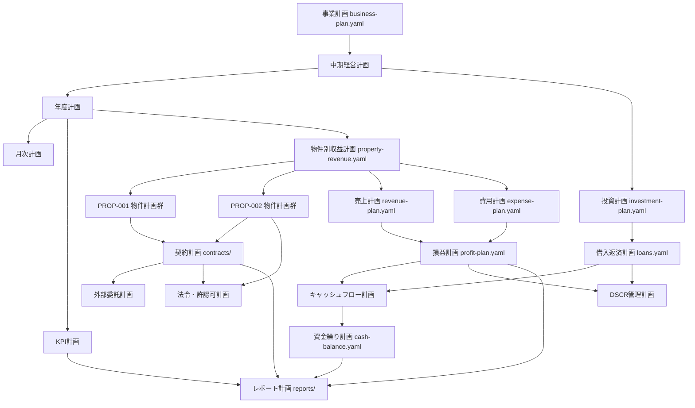

# Step 4 — 計画間依存関係

**機械可読版:** `cursor/data/dependency-graph.yaml` · CLI: `npm run steward -- deps graph`

---

## 1. トップダウン（戦略 → 実行）



---

## 2. 横断依存（モジュール間）

### 不動産賃貸モジュール

```
賃料設定計画 → 収益計画 → 売上計画
入居者獲得計画 → 空室率管理計画 → KPI計画
賃貸借契約管理計画 → 契約計画（CTR-011）
修繕対応計画 → 修繕計画 → 費用計画
NOI改善計画 → 物件別損益計画 → 全社損益計画
```

### 旅館業モジュール

```
許認可取得・維持計画 → 旅館業運用計画 → 収益計画
宿泊単価計画 × 稼働率計画 → RevPAR改善計画 → 売上計画
OTA運用計画 → 変動費計画（手数料15.5%）
清掃運用計画 → 清掃委託契約計画（CTR-012）→ 変動費計画
消防・保健所対応計画 → 法令・許認可計画
```

### 財務 ↔ 契約

```
保険契約計画（CTR-013/014）→ リスク管理計画 → 物件リスク対応計画
借入計画（CTR-008/009）→ 融資返済計画 → DSCR管理計画
税務計画 → 税金支払計画 → 資金繰り計画
```

---

## 3. 物件別分岐

| 上流 | PROP-001（賃貸） | PROP-002（旅館） |
|------|-----------------|-----------------|
| 物件基本計画 | `PROP-001.yaml` | `PROP-002.yaml` |
| 運用計画 | 賃貸運用 + 賃貸モジュール 9 計画 | 旅館運用 + 旅館モジュール 10 計画 |
| 収益ドライバー | monthly_rent × (1-vacancy) | ADR × occupancy × days |
| 主要契約 | CTR-008,011,013 | CTR-009,012,014 |
| 融資 | LOAN-001 | LOAN-002 |

---

## 4. レポート依存（下流集約）

```
月次計画 + 予実(yojitsu) → 月次経営レポート
物件別収益 + KPI → 物件別レポート
contracts/*.yaml → 契約期限レポート
修繕計画 + 実績 → 修繕レポート
cash-balance + CF → 資金繰りレポート
PROP-002.hotel.* → 旅館業稼働率レポート
リスク管理計画 → リスクレポート
年度計画 + yojitsu → 年次計画差異レポート
```

---

## 5. 更新トリガー（dependency-graph 連動）

| 変更ファイル | 要確認下流計画 |
|-------------|---------------|
| `PROP-002.hotel.occupancy_rate` | 収益・RevPAR・売上・CF・KPI |
| `PROP-001.rental.monthly_rent` | 収益・NOI・売上 |
| `CTR-013/014` executed 化 | 保険計画・リスク・物件リスク |
| `cash-balance.yaml` | 資金繰り・DSCR・ランウェイレポート |
| `loans.yaml` 返済条件 | 借入返済・DSCR・CF |
| `expense-plan.yaml` | 費用・損益・CF |

CLI: `npm run steward -- deps check --file <path>`
