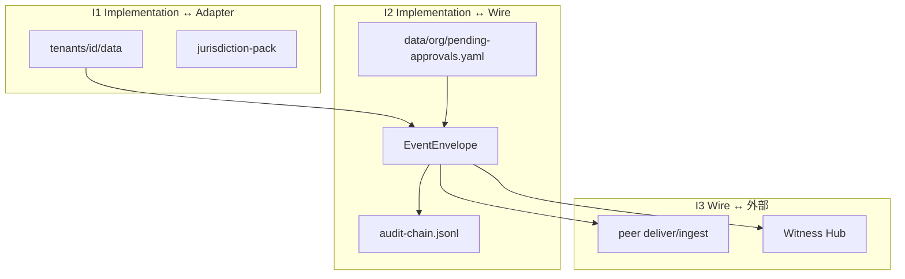

# OpenOrgOS Protocol — 要件定義書

**版:** 1.0 · **日付:** 2026-06-27  
**ステータス:** 参照実装 v1（Steward OS · ORG-C5 受入済み）  
**教義正本:** [docs/org-os/openorgos-core-philosophy.md](../org-os/openorgos-core-philosophy.md)  
**境界仕様:** [docs/org-os/orgos-interface-spec.md](../org-os/orgos-interface-spec.md) · [docs/org-os/org-approval-schema.md](../org-os/org-approval-schema.md)  
**運用:** [docs/runbook-orgos.md](../runbook-orgos.md)  
**スキーマ:** [schemas/protocol/](../../schemas/protocol/) · [schemas/org/](../../schemas/org/)  
**実装:** [src/lib/protocol/](../../src/lib/protocol/) · [src/lib/org/](../../src/lib/org/) · [src/lib/wire/](../../src/lib/wire/) · [src/lib/hub/](../../src/lib/hub/)

---

## 1. 背景・目的

OpenOrgOS Core は **組織間（inter-org）通信のグローバルプロトコル** である。単一組織の内部 ERP（経理 · 契約 · P0 等）ではなく、**ピア組織が検証可能な形でイベントを交換する**ための wire 意味論を定義する。

| 原則 | 内容 |
|------|------|
| Core は 4 要素のみ | Org Event Model · Identity exchange · Authority delegation · Auditability |
| Wire = 内部イベントの signed export | 別データモデルを増やさない（C3 形式統一） |
| Agent は送らない | 人間承認（Operator + CEO 等）後にのみ outbound |
| 法域・業務ロジックは adapter | REG-004 閾値 · 契約業務 · 登記等は Core 外 |

**Steward OS の位置づけ:** OpenOrgOS Core の **参照 Implementation + Wire 実装**。詳細: [layer-mapping-steward-os.md](../org-os/layer-mapping-steward-os.md)

---

## 2. スコープ

### 2.1 OpenOrgOS Core（4 アーティファクト · 本書の主対象）

| Core | 要件 ID プレフィックス | Steward 正本 |
|------|------------------------|--------------|
| Org Event Model | FR-EM-* | `schemas/protocol/org-event.ts` · `EventEnvelope` |
| Identity exchange | FR-ID-* | `identity-exchange.ts` · `protocol identity *` |
| Authority delegation | FR-AD-* | `authority-delegation.ts` · `protocol delegation *` |
| Auditability | FR-AU-* | `audit-record.ts` · `audit-chain.jsonl` · verify CLI |

### 2.2 Wire 拡張（Core 付帯 · 実装済み）

| 領域 | 要件 ID | 備考 |
|------|---------|------|
| P2P 配送 · multipath · relay | FR-WT-* | `transport.ts` · `wire-pending.yaml` |
| Witness Hub · quorum | FR-WH-* | [witness-hub-requirements.md](../org-os/witness-hub-requirements.md) |
| **Wire Gateway（組織エッジ）** | FR-WG-* | [wire-gateway-requirements.md](../org-os/wire-gateway-requirements.md) v0.2 · WG-0 完了 |
| Org 承認根幹（internal + wire） | FR-AP-* | `data/org/pending-approvals.yaml` |
| Resilience R1–R4 · Org C trust PKI | FR-RS-* | relay worker · witness-trust · SLA |
| Protocol API（HTTPS/mTLS pull） | FR-API-* | `protocol-api-server.ts` |

### 2.3 Out of scope（Core 要件に含めない）

| 項目 | 所在 |
|------|------|
| 会社イベント記録（events/artifacts） | [company-events-requirements.md](company-events-requirements.md) |
| 法域 pack · 業務 module | jurisdiction-packs · steward/modules |
| Community ガバナンス · SaaS hosting | OS_Community · 各社 Implementation |
| Hub 間リアルタイムレplication · Merkle 公開アンカー本番 | v2 backlog |

---

## 3. アーキテクチャ — 3 境界（I1–I3）

| 境界 | 不変条件 |
|------|----------|
| **I2** | approve 前に outbox へ載せない · Witness 失敗で Wire をロールバックしない |
| **I3** | inbound 署名 strict verify · peer `protocol_public_key` pin |
| **承認 SoT** | `data/org/pending-approvals.yaml`（wire は adapter 投影のみ） |

---

## 4. 機能要件 — Core 四要素

### 4.1 FR-EM — Org Event Model

| ID | 要件 | 受入 |
|----|------|------|
| FR-EM-01 | `EventEnvelope` protocol v1 · UUID · origin/destination · correlation | ✓ |
| FR-EM-02 | 6 core event types（platform registry 正本） | ✓ |
| FR-EM-03 | committee 拡張 event type 許容（registry 外も envelope として受理可） | ✓ |
| FR-EM-04 | canonical JSON digest · Ed25519 署名 | ✓ |
| FR-EM-05 | 内部 queue → org event マップ（`map-internal`） | ✓ |
| FR-EM-06 | outbox/inbox JSON 永続化 | ✓ |
| FR-EM-07 | outbox pull · federation mesh | ✓ **`protocol deliver-pull`** · **`protocol mesh deliver`** · 2-hop E2E |

**Core event types（`steward/platform/protocol/registry.yaml`）**

| type | scope |
|------|-------|
| `org.identity.presented` | both |
| `org.authority.delegated` | internal |
| `org.transaction.recorded` | wire |
| `org.audit.attested` | both |
| `org.witness.attestation.registered` | wire |
| `org.witness.receipt.issued` | wire |

---

### 4.2 FR-ID — Identity exchange

| ID | 要件 | 受入 |
|----|------|------|
| FR-ID-01 | `protocol identity export` → signed envelope | ✓ |
| FR-ID-02 | `protocol identity validate`（document / envelope） | ✓ |
| FR-ID-03 | `peers.yaml` 登録 · `protocol_public_key` pin | ✓ |
| FR-ID-04 | inbound ingest 時 origin 署名検証 | ✓ |
| FR-ID-05 | peer 登録時 identity ファイルから公開鍵取込 | ✓ |
| FR-ID-06 | 自動 peer discovery · 鍵ローテーション | ✓ `protocol peer discover` · `protocol signing rotate` |

---

### 4.3 FR-AD — Authority delegation

| ID | 要件 | 受入 |
|----|------|------|
| FR-AD-01 | `protocol delegation export` → DelegationProof envelope | ✓ |
| FR-AD-02 | `protocol delegation validate` · `verify delegation --file` | ✓ |
| FR-AD-03 | agent delegation scopes（platform YAML） | ✓ |
| FR-AD-04 | wire 送信は operator attestation + tier gate 必須 | ✓ |
| FR-AD-05 | tier 閾値は National adapter（REG-004 等） | ✓ |
| FR-AD-06 | outbound `transaction record` は approve 経由のみ | ✓ |

---

### 4.4 FR-AU — Auditability

| ID | 要件 | 受入 |
|----|------|------|
| FR-AU-01 | append-only `data/protocol/audit-chain.jsonl` | ✓ |
| FR-AU-02 | `protocol audit verify` · hash chain 整合 | ✓ |
| FR-AU-03 | `protocol verify audit-chain`（第三者 · envelope digest 照合） | ✓ |
| FR-AU-04 | wire approve → `org.audit.attested`（scope: wire） | ✓ |
| FR-AU-05 | internal approve → `org.audit.attested`（scope: internal） | ✓ |
| FR-AU-06 | `org.witness.*` emit → audit chain 統合 | ✓ |
| FR-AU-07 | operational `audit.jsonl` → chain bridge（`audit-bridge.yaml`） | ✓ 部分 |
| FR-AU-08 | Merkle 公開アンカー本番運用 | △ CLI のみ |

---

## 5. 機能要件 — Wire · 承認 · Witness

### 5.1 FR-AP — Org 承認（Operator モデル）

| ID | 要件 | CLI |
|----|------|-----|
| FR-AP-01 | Secretary `notice draft` / `propose`（送信しない） | `protocol notice draft` · `propose` |
| FR-AP-02 | CEO 等 `approve` で初めて outbox + deliver | `protocol notice approve` |
| FR-AP-03 | `reject` で pending 終了 | `protocol notice reject` |
| FR-AP-04 | internal 決裁（wire なし） | `org approval propose/approve` |
| FR-AP-05 | executed 契約必須（execution notice） | validate at propose |

**transaction_type（outbound wire）:** `contract.execution.notice` · `obligation.acknowledged` · `invoice.issued` · `payment.instructed`

---

### 5.2 FR-WT — Transport · Delivery

| ID | 要件 | 受入 |
|----|------|------|
| FR-WT-01 | HTTP POST webhook 配送 | ✓ |
| FR-WT-02 | 失敗時 `wire-pending.yaml` キュー | ✓ |
| FR-WT-03 | `deliver-flush-pending` 再送 | ✓ |
| FR-WT-04 | multipath endpoints（push · relay · pull） | ✓ |
| FR-WT-05 | store-and-forward relay キュー | ✓ |
| FR-WT-06 | HTTPS + mTLS（protocol API） | ✓ |
| FR-WT-07 | peer outbox リモート export API | ✓ | `GET /protocol/v1/outbox` · `{eventId}` · deliver-pull |

---

### 5.3 FR-WH — Witness Hub

| ID | 要件 | 受入 |
|----|------|------|
| FR-WH-01 | approve/ingest 後 fan-out attestation | ✓ |
| FR-WH-02 | Witness 失敗でも Wire 非ロールバック | ✓ |
| FR-WH-03 | `witness-pool.yaml` · k_of_n / any_of_n quorum | ✓ |
| FR-WH-04 | receipt キャッシュ · `witness verify` | ✓ |
| FR-WH-05 | `witness reconcile` · `--cross-hub` | ✓ |
| FR-WH-06 | Hub 独立起動 `hub serve` | ✓ |
| FR-WH-07 | Hub federation · gossip sync | ✓ |
| FR-WH-08 | 法域別 trusted_hub committee レジストリ | △ テンプレのみ |

---

### 5.4 FR-RS — Resilience · Trust（拡張）

| ID | 要件 | 受入 |
|----|------|------|
| FR-RS-01 | contract `protocol.resilience_sla` tier（bronze/silver/gold） | ✓ |
| FR-RS-02 | approve 時 contract から witness pool 自動 bind | ✓ |
| FR-RS-03 | Org C witness trust authority · publish bundle | ✓ |
| FR-RS-04 | `protocol relay run` daemon | ✓ |
| FR-RS-05 | `protocol validate` × warn_only strict | ✓ |

---

## 6. 検証・完成度

### 6.1 `protocol validate`

| モード | 条件 |
|--------|------|
| `--standalone` | peers 空 · witness 無効 → exit 0 |
| full | peer/witness/tx/audit 整合 · quorum 警告/エラー |

**主要 issue / warning コード**

| code | 種別 | 意味 |
|------|------|------|
| `standalone-peers-configured` | issue | standalone なのに peer あり |
| `standalone-witness-enabled` | issue | standalone なのに witness 有効 |
| `audit-chain` | issue | hash chain 破損 |
| `witness-receipt-missing` | warn/issue | outbound に receipt なし |
| `witness-quorum-pending` | warn/issue | quorum 未達 |
| `audit-bridge-failed` | warning | operational → chain bridge 失敗 |
| `peer-stakeholder-orphan` | issue | peer が未知 STK 参照 |

### 6.2 完成度スコア（参考）

**正本:** [orgos-scoring-methodology.md](../org-os/orgos-scoring-methodology.md) · `steward status --orgos`

| 指標 | チェックリスト | 厳格（対外） |
|------|:--:|:--:|
| OrgOS 加重 | **99/100** | **~91/100** |
| OpenOrgOS Core 四要素 | **100/100** | **92/100** |
| 全体 `npm test` | **480+ green** | （採点未連動） |

> 2026-06-27 以前の **82/100 · Core ~88%** は obsolete（静的 baseline 時代）。改定履歴 1.4 参照。

---

## 7. 非機能要件

| ID | 要件 | 実装 |
|----|------|------|
| NFR-01 | Ed25519 · canonical JSON | `signing.ts` · `canonical.ts` |
| NFR-02 | L2 を envelope payload に載せない | classification registry |
| NFR-03 | テナント分離 `--tenant` | Steward tenant context |
| NFR-04 | ingest 冪等（同一 event_id） | webhook ingest |
| NFR-05 | Hub attestation 冪等（digest 一致） | hub-server |
| NFR-06 | Core 概念は英語正本 | [language-policy.md](../org-os/language-policy.md) |

---

## 8. 受入デモ

| デモ | コマンド | 証明 |
|------|----------|------|
| 単独 OrgOS（C1） | `npm run demo:standalone-org` | peer/witness なし · validate · internal/wire envelope |
| Inter-org + Witness（C2） | `npm run demo:inter-org` | 2 tenant · execution notice + ack · witness chain |
| Outbox pull · mesh（FR-EM-07） | `npm run demo:deliver-pull` · `npm run demo:mesh-deliver` | pull + 2-hop via chain |
| mal standalone | `npm run demo:mal-standalone` | 運用テナント · standalone validate |

---

## 9. 正常系 — 実装・テスト状況

**テスト正本:** `tests/protocol-*.ts` · `tests/org-*.ts` · `tests/hub-*.ts` · `tests/standalone-org-demo.test.ts`  
**関連 115+ tests green（2026-06-27 · mesh v1 · gap-closure --suggest）**

### 9.1 Core 四要素

| # | シナリオ | 実装 | テスト |
|---|---------|:----:|:------:|
| N-EM-01 | EventEnvelope round-trip · digest | ✓ | ✓ `protocol-org-event` |
| N-EM-02 | platform registry 6 types | ✓ | ✓ |
| N-EM-03 | queue → org event map | ✓ | ✓ |
| N-EM-04 | transaction → envelope + outbox + audit | ✓ | ✓ `protocol-transaction` |
| N-ID-01 | identity export · L1 document | ✓ | ✓ `protocol-org-event` · `org-identity-profile` |
| N-ID-02 | peer register · ingest by org_uri | ✓ | ✓ `protocol-webhook-ingest` |
| N-AD-01 | delegation export · validate | ✓ | ✓ `protocol-transaction` · `protocol-external-verify` |
| N-AD-02 | propose → approve wire + attestation | ✓ | ✓ `protocol-notice-workflow` |
| N-AD-03 | internal propose → approve | ✓ | ✓ `org-approval` |
| N-AU-01 | audit chain hash link | ✓ | ✓ `protocol-audit` |
| N-AU-02 | wire approve → approval.granted on chain | ✓ | ✓ `protocol-internal-envelope` |
| N-AU-03 | witness emit on chain | ✓ | ✓ `protocol-witness-envelope-emit` |
| N-AU-04 | operational bridge → chain | ✓ | ✓ `org-audit-bridge` · `org-audit-bridge-p5` |
| N-AU-05 | external verify audit-chain + delegation | ✓ | ✓ `protocol-external-verify` |

### 9.2 Wire · Witness · Hub

| # | シナリオ | 実装 | テスト |
|---|---------|:----:|:------:|
| N-WT-01 | webhook POST ingest | ✓ | ✓ `protocol-webhook-server` |
| N-WT-02 | deliver 失敗 → wire-pending | ✓ | ✓ `protocol-wire-relay` |
| N-WT-03 | multipath fallback | ✓ | ✓ `protocol-multipath` |
| N-WT-04 | duplicate ingest idempotent | ✓ | ✓ `protocol-webhook-ingest` |
| N-WH-01 | fan-out 2 hubs · partial failure OK | ✓ | ✓ `protocol-witness-pool` |
| N-WH-02 | sent + received → mutually_confirmed | ✓ | ✓ `protocol-witness-integration` |
| N-WH-03 | witness reconcile outbound | ✓ | ✓ `protocol-witness-reconcile` |
| N-WH-04 | cross-hub reconcile | ✓ | ✓ `protocol-cross-hub-reconcile` |
| N-WH-05 | hub health + attestation POST | ✓ | ✓ `hub-server` |
| N-WH-06 | hub verify remote | ✓ | ✓ `hub-verify-remote` |
| N-RS-01 | trust bundle certify/verify | ✓ | ✓ `protocol-witness-trust` |
| N-RS-02 | approve pool bind from contract | ✓ | ✓ `protocol-approve-pool-bind` |
| N-RS-03 | relay worker cycle | ✓ | ✓ `protocol-relay-worker` |
| N-AP-01 | tier gate via jurisdiction | ✓ | ✓ `wire-approval-gate` · `approver-registry-mal` |
| N-AP-02 | ack notice correlation | ✓ | ✓ `protocol-notice-workflow` |
| N-VL-01 | standalone validate pass | ✓ | ✓ `protocol-validate-standalone` |
| N-VL-02 | full demo scripts exit 0 | ✓ | ✓ `standalone-org-demo` |
| N-SG-01 | Ed25519 sign/verify | ✓ | ✓ `protocol-signing` |

### 9.3 テストファイル一覧（protocol 28 + org/hub 14）

| ファイル | 件数 | 主眼 |
|---------|:----:|------|
| `protocol-deliver-pull.test.ts` | 1 | 2-tenant outbox pull E2E |
| `protocol-mesh-deliver.test.ts` | 1 | 2-hop mesh route E2E |
| `protocol-gap-closure.test.ts` | 6 | P3–P5 CLI · discover --suggest |
| `protocol-validate-abnormal.test.ts` | 9 | validate issue fixtures（P1–P2） |
| `protocol-org-event.test.ts` | 6 | EventEnvelope · identity |
| `protocol-notice-workflow.test.ts` | 5 | Operator approve フロー |
| `protocol-transaction.test.ts` | 5 | tx ledger |
| `protocol-webhook*.test.ts` | 5 | ingest |
| `protocol-external-verify.test.ts` | 4 | 第三者 verify |
| `protocol-witness-pool.test.ts` | 4 | fan-out · quorum |
| `protocol-witness-policy.test.ts` | 3 | warn_only |
| `protocol-api-tls.test.ts` | 3 | mTLS |
| 他 protocol-* | 34 | witness · relay · SLA · validate 等 |
| `org-approval.test.ts` | 2 | internal approve |
| `org-audit-bridge*.test.ts` | 7 | bridge |
| `standalone-org-demo.test.ts` | 2 | C1 デモ |
| `hub-*.test.ts` | 複数 | Hub ノード |

---

## 10. 異常系 — 実装・テスト状況

| # | シナリオ | 実装 | テスト |
|---|---------|:----:|:------:|
| E-EM-01 | envelope schema 不正 | ✓ validate reject | ✓ `protocol-validate-abnormal` |
| E-EM-02 | registry 破損 | ✓ `registry-invalid` | ✓ `protocol-validate-abnormal` |
| E-ID-01 | inbound 署名不一致 | ✓ ingest 拒否 | △ webhook tests 一部 |
| E-ID-02 | peer stakeholder orphan | ✓ validate issue | ✓ `protocol-validate-abnormal` |
| E-AD-01 | attestation なし outbound | ✓ throw | ✓ `protocol-notice-workflow` |
| E-AD-02 | executed 前 propose | ✓ throw | ✓ `protocol-notice-workflow` |
| E-AD-03 | pending reject | ✓ | ✓ `protocol-notice-workflow` · `org-approval` |
| E-AD-04 | strict delegation verify 拒否 | ✓ | ✓ `protocol-external-verify` |
| E-AU-01 | audit chain 改ざん | ✓ verify fail | ✓ `protocol-validate-abnormal` |
| E-AU-02 | bridge 失敗記録 | ✓ warnings | ✓ `org-audit-bridge-p5` |
| E-WT-01 | 全 endpoint 失敗 → queue | ✓ | ✓ `protocol-wire-relay` |
| E-WT-02 | peers-invalid · transactions-invalid YAML | ✓ issue | ✓ `protocol-validate-abnormal` |
| E-WH-01 | witness receipt 欠落 | ✓ warn/issue | ✓ `protocol-validate-witness` |
| E-WH-02 | quorum 未達 tier B | ✓ warn | ✓ `protocol-witness-policy` |
| E-WH-03 | trust bundle 改ざん | ✓ reject | ✓ `protocol-witness-trust` |
| E-WH-04 | witness pool disabled reconcile | ✓ warning | ✓ `protocol-cross-hub-reconcile` |
| E-VL-01 | standalone + peers 設定 | ✓ issue | ✓ `protocol-validate-standalone` |
| E-VL-02 | standalone + witness 有効 | ✓ issue | ✓ `protocol-validate-abnormal` |
| E-VL-03 | duplicate event_id in tx registry | ✓ issue | ✓ `protocol-validate-abnormal` |
| E-API-01 | mTLS なし relay 拒否 | ✓ 403 | ✓ `protocol-api-tls` |

### 10.1 異常系カバレッジ評価

| 区分 | 評価 |
|------|------|
| Operator / 承認ゲート | **良好** — propose/approve/reject · attestation 必須 |
| Witness / validate warnings | **良好** — warn_only · quorum · receipt missing |
| Transport 失敗 | **中** — queue 化はテスト済 · TLS 一部 |
| 台帳破損 · orphan 検出 | **中** — peers/tx invalid · orphan fixture 追加（P1） |
| audit chain 改ざん | **中** — prev/digest tamper fixture 追加（P1） |

---

## 11. ギャップ · バックログ

| 優先 | 項目 | 層 |
|:----:|------|-----|
| ~~P1~~ | validate issue コードの異常系 fixture テスト | Core · **9 tests 追加済** |
| ~~P2~~ | platform registry-invalid · envelope validate | Core · **追加済** |
| ~~P3~~ | peer discovery · 鍵ローテーション | Identity · **CLI 追加済** |
| ~~P4~~ | federation mesh · peer remote outbox API | Event Model · **`protocol deliver-pull`** |
| ~~P5~~ | trusted_hub committee レジストリ | Witness · **validate 統合 · platform keys** |
| — | Community エコシステム（C4） | 外 |

---

## 12. 関連文書

| 文書 | 内容 |
|------|------|
| [company-events-requirements.md](company-events-requirements.md) | 組織**内部**イベント（Core 外） |
| [orgos-completion-plan.md](../org-os/orgos-completion-plan.md) | C1–C5 完成定義 |
| [inter-org-operator-model.md](../org-os/inter-org-operator-model.md) | Operator モデル |
| [witness-hub-requirements.md](../org-os/witness-hub-requirements.md) | Witness FR 一覧 |
| [framework-assessment.md](../framework-assessment.md) §12–13 | 完成度評価 |

---

## 13. 改定履歴

| 版 | 日付 | 内容 |
|----|------|------|
| 1.0 | 2026-06-27 | 初版 — Core 四要素 · I1–I3 · 94 tests ベース · 正常/異常マトリクス |
| 1.1 | 2026-06-27 | P1 — `protocol-validate-abnormal.test.ts` 7 件追加 |
| 1.2 | 2026-06-27 | P2 — registry-invalid · envelope validate +2 |
| 1.3 | 2026-06-27 | P3–P5 — peer discover · signing rotate · deliver-pull · trusted-hubs validate |
| 1.4 | 2026-06-27 | deliver-pull E2E · スコア同期（82/100 · 452 tests · Core ~88%） |
| 1.5 | 2026-06-27 | FR-EM-07 mesh v1 · `protocol mesh deliver` · 2-hop E2E · peer discover --suggest |
| 1.6 | 2026-06-28 | 二重採点（チェックリスト/厳格）· [orgos-scoring-methodology.md](../org-os/orgos-scoring-methodology.md) · §6.2 更新 |
