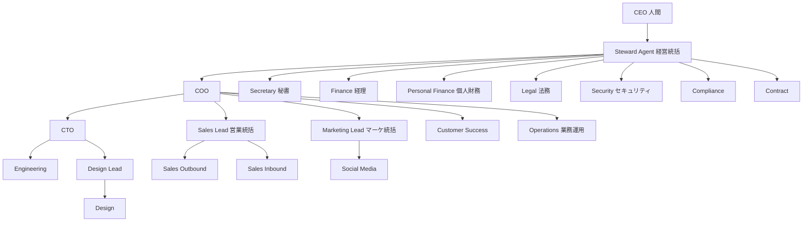

# AI カンパニー — 組織図（16 役割モデル）

**版:** 2026-06-28 · **正本:** 本書 · Agent 定義: [registry.yaml](registry.yaml)

記事「AIで作業はできるのに、事業が回らない人へ」の **16 人 AI 社員** モデルを OrgOS に映射した構成。人間 CEO の判断・承認は OrgOS の **承認ゲート**（`org approval` · `protocol notice approve`）のまま。

## 16 役割 ↔ Agent id

| # | 記事の役割 | Agent id | 定義 |
|---|-----------|----------|------|
| 1 | COO（CEO の右腕） | `coo` | [coo_agent.md](coo_agent.md) |
| 2 | CTO | `cto` | [cto_agent.md](cto_agent.md) |
| 3 | エンジニア | `engineering` | [engineering_agent.md](engineering_agent.md) |
| 4 | デザイン統括 | `design_lead` | [design_lead_agent.md](design_lead_agent.md) |
| 5 | デザイナー | `design` | [design_agent.md](design_agent.md) |
| 6 | 営業統括 | `sales_lead` | [sales_lead_agent.md](sales_lead_agent.md) |
| 7 | 新規開拓（アウトバウンド） | `sales_outbound` | [sales_outbound_agent.md](sales_outbound_agent.md) |
| 8 | 新規開拓（インバウンド・提携） | `sales_inbound` | [sales_inbound_agent.md](sales_inbound_agent.md) |
| 9 | カスタマーサクセス | `customer_success` | [customer_success_agent.md](customer_success_agent.md) |
| 10 | マーケティング統括 | `marketing_lead` | [marketing_lead_agent.md](marketing_lead_agent.md) |
| 11 | SNS 担当 | `social_media` | [social_media_agent.md](social_media_agent.md) |
| 12 | 経理 | `finance` | [finance_agent.md](finance_agent.md) |
| 13 | 個人財務 | `personal_finance` | [personal_finance_agent.md](personal_finance_agent.md) |
| 14 | 秘書 | `secretary` | [secretary_agent.md](secretary_agent.md) |
| 15 | 法務 | `legal` | [legal_agent.md](legal_agent.md) |
| 16 | セキュリティ統括 | `security` | [security_agent.md](security_agent.md) |

**Steward Agent**（`executive_steward`）は 16 人の **統括・要約統合** 役。記事の「自分がいなくても各担当が動く」を **Work Order · Handoff · agent-summaries** で実現する。

**OrgOS 追加（法人 OS）:** `contract` · `compliance` · `operations` — 契約台帳 · 規程/ISO · inbox/outbox。法務・COO と分担（[executive_steward_agent.md](executive_steward_agent.md) 委譲表）。

## 自走のガードレール

1. **読取境界** — 各 Agent の Primary Folders のみ（[folder_access_policy.md](../rules/folder_access_policy.md)）
2. **Skill + CLI** — 数値・期限は決定論 Skill（`steward/core/skills/`）
3. **要約経由** — Steward は `agent-summaries/` のみ原則読取
4. **人間承認** — 契約 · 振込 · wire · 定款登記は CEO/承認者
5. **Work Order** — `docs/reports/routing-queue/` · COO が進捗追跡

## 参照

- [delegate_growth_team.md](../orchestrators/delegate_growth_team.md) — COO からの委譲プロンプト
- [agent_skill_architecture.md](../rules/agent_skill_architecture.md)
