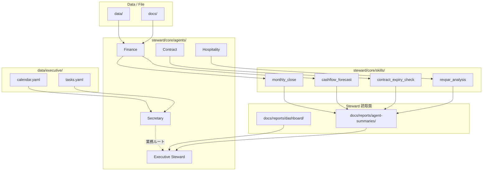

# Steward OS — Agent / Skill アーキテクチャ

> **用語（2026-06-28）:** 製品名は **OrgOS** · **Steward** は **Steward Agent**（経営統括 · Secretary と同列）。本書の「Steward OS」は **OrgOS 参照実装** のレガシー表記 — [orgos-vocabulary.md](../../docs/org-os/orgos-vocabulary.md)

**版:** 2026-06-08 · **上位:** [steward_os_principles.md](steward_os_principles.md)  
**用語:** [docs/org-os/orgos-vocabulary.md](../../docs/org-os/orgos-vocabulary.md) §3–5

---

## 情報フロー

---

## 論理フォルダ（steward-os/）

| 番号 | 論理 | 現行パス（Phase 0） |
|------|------|-------------------|
| 00 | company | `data/company.yaml` · `docs/company/` |
| 01 | business_plan | `data/plans/` · `docs/plans/` |
| 02 | properties | `data/properties/` |
| 03 | finance | `data/finance/` · `docs/company/tax/` |
| 04 | contracts | `data/contracts/` · `docs/contracts/` |
| 05 | rental | `modules.yaml` · `docs/plans/rental/` |
| 06 | hospitality | `modules.yaml` · `docs/properties/*/operations/` |
| 07 | compliance | `steward/standards/iso/`（Read）· `docs/compliance/iso/`（テナント記録） |
| 08 | operations | `docs/io/inbox/` · `docs/io/outbox/` |
| 09 | reports | `docs/reports/` |
| 10 | decisions | `docs/company/*gijiroku*` · `executive-remaining-tasks.md` |
| 10b | executive | `data/executive/` · `docs/executive/`（Secretary SoT） |
| 11 | agents | `steward/core/agents/` |
| 12 | skills | `steward/core/skills/` |
| 13 | rules | `steward/rules/` |
| 14 | prompts | `steward/core/orchestrators/` |
| 99 | archive | `docs/plans/archive/` |

**Phase 0:** 物理移行なし。`data/` と `src/` は維持。

---

## Agent 一覧

| Agent | 日本語 | 定義 | 要約出力先 |
|-------|--------|------|-----------|
| **Steward Agent** | 経営統括 | [steward/core/agents/executive_steward_agent.md](../steward/core/agents/executive_steward_agent.md) | `docs/reports/` · `executive-notes/` |
| **Secretary Agent** | 秘書 | [steward/core/agents/secretary_agent.md](../steward/core/agents/secretary_agent.md) | `docs/executive/` |
| Finance | 財務・計画 | [steward/core/agents/finance_agent.md](../steward/core/agents/finance_agent.md) | `agent-summaries/finance/` |
| Contract | 契約管理 | [steward/core/agents/contract_agent.md](../steward/core/agents/contract_agent.md) | `agent-summaries/contract/` |
| Property Rental | 賃貸モジュール | [steward/modules/rental/agent.md](../modules/rental/agent.md) | `modules.yaml` → summary_dir |
| Hospitality | 宿泊モジュール | [steward/modules/hospitality/agent.md](../modules/hospitality/agent.md) | `modules.yaml` → summary_dir |
| Compliance | コンプライアンス | [steward/core/agents/compliance_agent.md](../steward/core/agents/compliance_agent.md) | `agent-summaries/compliance/` |
| Operations | 業務運用 | [steward/core/agents/operations_agent.md](../steward/core/agents/operations_agent.md) | `agent-summaries/operations/` |

索引: [steward/core/agents/00-このフォルダについて.md](../steward/core/agents/00-このフォルダについて.md)

---

## Skill 一覧（Phase 0）

| Skill | 定義 | 主 Agent |
|-------|------|---------|
| executive_dashboard | [steward/core/skills/executive_dashboard.md](../steward/core/skills/executive_dashboard.md) | Executive Steward |
| schedule_management | [steward/core/skills/schedule_management.md](../steward/core/skills/schedule_management.md) | Secretary |
| one_on_one_prep | [steward/core/skills/one_on_one_prep.md](../steward/core/skills/one_on_one_prep.md) | Secretary |
| external_correspondence | [steward/core/skills/external_correspondence.md](../steward/core/skills/external_correspondence.md) | Secretary |
| travel_booking | [steward/core/skills/travel_booking.md](../steward/core/skills/travel_booking.md) | Operations |
| monthly_close | [steward/core/skills/monthly_close.md](../steward/core/skills/monthly_close.md) | Finance |
| cashflow_forecast | [steward/core/skills/cashflow_forecast.md](../steward/core/skills/cashflow_forecast.md) | Finance |
| contract_register | [steward/core/skills/contract_register.md](../steward/core/skills/contract_register.md) | Contract · Operations |
| contract_expiry_check | [steward/core/skills/contract_expiry_check.md](../steward/core/skills/contract_expiry_check.md) | Contract |
| noi_analysis | [steward/modules/rental/skills/noi_analysis.md](../modules/rental/skills/noi_analysis.md) | Rental Module |
| revpar_analysis | [steward/modules/hospitality/skills/revpar_analysis.md](../modules/hospitality/skills/revpar_analysis.md) | Hospitality Module |
| capex_planning | [steward/core/skills/capex_planning.md](../steward/core/skills/capex_planning.md) | Finance |
| permit_expiry_check | [steward/core/skills/permit_expiry_check.md](../steward/core/skills/permit_expiry_check.md) | Compliance |

追加 Skill は [steward/core/skills/](../steward/core/skills/00-このフォルダについて.md) に随時追加。

**新規 Skill:** [tool-neutral-development.md](tool-neutral-development.md) §2.3 — `runtime: cli` 優先 · `cursor-only` 新規禁止。

---

## CLI = Skill 実装

| CLI | 対応 Skill |
|-----|-----------|
| `steward dashboard` | executive_dashboard |
| `steward sync all` | contract_register / monthly_close |
| `steward forecast` | cashflow_forecast |
| `steward analyze property` | noi_analysis / revpar_analysis |
| `steward alerts` | contract_expiry_check · permit_expiry_check |
| `steward io *` | contract_register（归档） |

実装: `src/commands/` · 定義: `steward/core/skills/`

---

## 横断タスク

事業計画分解等の **Orchestrator プロンプト** は Agent ではなく [steward/core/orchestrators/](../steward/core/orchestrators/00-このフォルダについて.md)。Executive が委譲する。

---

## Secretary ↔ Steward 境界

[secretary_steward_boundary.md](secretary_steward_boundary.md) — 社内経営 OS と社長オペ・社外窓口の分離。

---

## 関連

- [tool-neutral-development.md](tool-neutral-development.md) — **Cursor 非依存開発（必読）**
- [docs/agent_architecture.md](../docs/agent_architecture.md) — 現行パス詳細（レガシー索引）
- [folder_access_policy.md](folder_access_policy.md)
