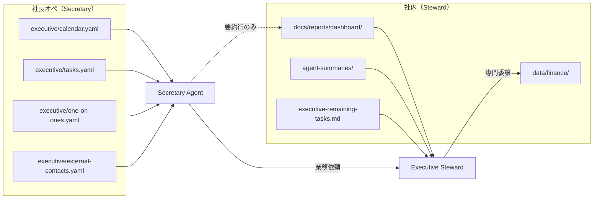

# Secretary ↔ Executive Steward 境界設計

**版:** 2026-06-07 · **上位:** [agent_skill_architecture.md](agent_skill_architecture.md) · [folder_access_policy.md](folder_access_policy.md)

---

## 設計推奨（採用モデル）

テナント（例: 株式会社サンプル商事）の AI 支援は **2 つの窓口** に分離する。

| 役割 | エージェント | 対象 | 主な読取面 |
|------|-------------|------|-----------|
| **社内経営 OS** | Executive Steward | オーナーの経営判断 | dashboard · agent-summaries · executive-remaining-tasks |
| **社長の行動・時間・対外窓口** | Secretary Agent | スケジュール・タスク・1-on-1・社外調整 | `data/executive/` · `docs/executive/` |

**結論:** Steward は **社内向け**、社外の日程調整・連絡の一次受けは **Secretary が主インターフェース**。財務・契約・コンプライアンスの質問は Secretary が受け、**Executive Steward または専門 Agent へルーティング**する。

---

## 責務マトリクス

| 領域 | Executive Steward | Secretary Agent |
|------|-------------------|-----------------|
| KPI・ランウェイ・予実 | ✅ 主担当 | ❌ 拒否・ルート |
| 契約期限・保険 draft | ✅ 委譲・統合 | ❌ 詳細非開示 |
| 社長カレンダー | ❌ 管理しない | ✅ SoT 所有者 |
| 会食・来客調整 | ❌ | ✅ 下書き・調整 |
| 1-on-1 準備 | ❌ | ✅ ブリーフ生成 |
| 社外メール下書き | ❌ | ✅ 一次下書き |
| 経営 P0 残タスク | ✅ 読取 | △ 参照のみ（編集しない） |
| inbox / 書類归档 | ❌（Operations へ） | △ 日程関連のみ |

---

## データ境界



### Secretary が読めるもの（制限付き）

| パス | 条件 |
|------|------|
| `data/executive/**` | R/W（Primary） |
| `docs/executive/**` | R/W |
| `docs/reports/dashboard/` | **要約行のみ**（KPI 表の見出し・P0 件数程度） |
| `docs/reports/executive-notes/` | **サニタイズ済みメモのみ**（財務詳細・契約金額なし） |
| `docs/company/executive-remaining-tasks.md` | Read（重複管理しない） |
| `data/hr/employees.yaml` | Read（1-on-1 紐付け） |

### Secretary が読めないもの

| パス | 理由 |
|------|------|
| `data/finance/**` | 財務機密 |
| `data/contracts/**` | 契約条件・金額 |
| `data/operations/*-secrets.yaml` | L2 機密 |
| `docs/contracts/**` 本文 | 契約詳細 |
| ゲスト PII · `**/records/**` | 個情 |

### Executive Steward が読めないもの

| パス | 理由 |
|------|------|
| `data/executive/**` | Secretary の SoT。混在を防ぐ |
| 社長カレンダー詳細 | 秘書領域 |

---

## 境界ルール（必須）

1. **社外「財務資料をください」** → Secretary は **断る** または人間へエスカレーション。finance YAML は読まない。
2. **社内「ランウェイは？」** → ユーザーは **Steward / Finance** を使う。Secretary は案内のみ。
3. **日程調整メール** → Secretary が下書き。契約条件の交渉は Contract へ委譲。
4. **L2 秘密・ゲスト PII** → いかなる出力にも含めない。
5. **external_visible: false** の予定は社外チャットに露出しない。

---

## 委譲フロー

```
社外依頼 → Secretary（一次受け）
              │
              ├─ 日程・会食・来客 → Secretary が完結（人間承認）
              ├─ 契約・金額・保険 → Executive Steward → Contract Agent
              ├─ 財務・税務 → Executive Steward → Finance Agent
              ├─ 許認可・規程 → Executive Steward → Compliance Agent
              └─ 旅館運用詳細 → Hospitality Agent（日程のみ Secretary）
```

照会フォーマット: [folder_access_policy.md](folder_access_policy.md) §4

---

## ユースケース例

| シナリオ | 担当 | 動作 |
|---------|------|------|
| 取引先から会食の候補日調整 | Secretary | `calendar.yaml` 確認 → 調整メール下書き |
| 社長「来週の 1-on-1 準備して」 | Secretary | `one_on_one_prep` Skill → `docs/executive/` にブリーフ |
| 社外「売上を教えて」 | Secretary | 丁寧に断り、人間または Steward へ誘導 |
| 社長「ランウェイは？」 | Steward | `steward dashboard` · Finance 要約を読む |
| 保険 draft 期限 P0 | Steward | Contract 要約 → executive-remaining-tasks と統合 |
| 宿泊モジュール清掃日程変更 | Secretary + Hospitality | Secretary が日程、Hospitality が運用詳細 |

---

## 関連

- [steward/core/agents/secretary_agent.md](../steward/core/agents/secretary_agent.md)
- [steward/core/agents/executive_steward_agent.md](../steward/core/agents/executive_steward_agent.md)
- [data/executive/00-README.md](../data/executive/00-README.md)
