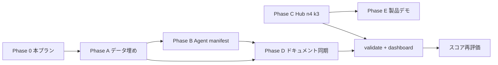

# MAL · OrgOS スコア 90% 超 — 修正プラン

**版:** 1.0 · **日付:** 2026-07-05  
**前提:** MAL 正データは **意図的ダミー**（整合性優先 · L2 口座番号等は gitignore 維持）  
**次工程:** 本プラン承認後 → TBD 一括埋め → `orgos validate --tenant mal` → Hub 稼働確認

---

## 1. 目的

| 用途 | 現状 | 目標 | ギャップの主因 |
|------|:----:|:----:|----------------|
| **OrgOS 製品デモ** | 88% | **≥90%** | Witness Hub が n=2 のみ · MAL に `witness-pool.yaml` 未作成 |
| **MAL 経営シミュ（L1）** | 72% | **≥90%** | tax-profile · 契約 counterparty · 株主名簿 · dashboard 古い TBD 記載 |
| **MAL 法務・税務 SoT** | 45% | **≥90%** | B/S 3 項目 TBD · 申告カレンダー未確定 · teikan 50/50 残存 |
| **AI Agent 実戦（MAL）** | 55% | **≥90%** | 45 Agent 一括登録 vs 有効モジュール 3 の乖離 · jp_medical 過剰有効 |

> **参考:** OrgOS Agent Portability は **95%**（全軸 ≥90%）— 本プランの対象外。  
> 採点方法論: [orgos-scoring-methodology.md](../../../../docs/org-os/orgos-scoring-methodology.md)

---

## 2. 確定前提（Q&A 2026-07-05）

### 2.1 ガバナンス

| 項目 | ダミー正本 |
|------|-----------|
| 株主 | **段燕燕 100%** · 発行 **100 株** · 1 株 **85,000 円** · 資本金 **850 万円** |
| 取締役 | **退任進行中** — 2026-07-02 辞任届送付済 · 効力 **2026-07-31** · 登記申請 **2026-08 予定** |
| `company.yaml` | 登記前のため **段 + 宮城** のまま · `governance_status: director_resignation_pending` 注記を追加 |

### 2.2 財務・税務

| 項目 | ダミー正本 |
|------|-----------|
| 現預金 | **1,000 万円**（2026-07-01 · confirmed）— 済 |
| 期首繰越利益剰余金 | **+500 万円** |
| 消費税 | **免税事業者**（第9期売上 750 万想定 · 申告不要） |
| 税理士 | fictitious 自動生成（例: 税理士法人マルパートナーズ / 担当 山田） |
| 会計ソフト | ダミー（例: freee 会計 · デモ用） |

### 2.3 事業モジュール · Agent

| 有効モジュール | rental · hospitality · travel_booking |
|----------------|----------------------------------------|
| **OFF** | jp_medical_device（REG-025/026 は未施行・参照のみ） |
| **有効 Agent（最小）** | Executive · Secretary · Finance · Operations + rental · hospitality · travel_booking |

### 2.4 契約カウンターパーティ

**方針:** fictitious 名称で自動生成（整合性のみ担保）

| ID | ダミー counterparty |
|----|---------------------|
| CTR-002 | 株式会社番町不動産（売主） |
| CTR-013 | 東京海上ダミー火災保険株式会社（番町） |
| CTR-014 | 同上（亀沢） |
| 亀沢清掃 | 株式会社墨田クリーンサービス（CTR-012 とは別 YAML · cleaning contract 新規 or external-contacts 更新） |

> CTR-003 借主 = **株式会社サウスウッド**（済）— 番町請求書 TBD も同社名・`invoice@southwood.co.jp` で埋める。

### 2.5 Witness Hub

| 項目 | 値 |
|------|-----|
| quorum | **k=3 · n=4**（3-of-4） |
| 実装 | **docker-compose に hub-c / hub-d 追加**（9476 / 9477）+ seed-federation 更新 |
| 登録 Org | MAL + southwood（既存 federation 維持） |

---

## 3. フェーズ別タスク

### Phase A — データ正本 TBD 一括埋め（P0）

**完了条件:** `data/**/*.yaml` に `TBD` ゼロ · `orgos validate --tenant mal` 合格

| # | タスク | 主なファイル | 担当 |
|---|--------|-------------|------|
| A1 | tax-profile 確定（資本金 850 万 · 繰越 +500 万 · 免税 · 税理士ダミー · filing status 更新） | `data/finance/tax-profile.yaml` | Finance |
| A2 | 株主名簿 · teikan-summary 同期（100 株 · 段 100% · 住所ダミー） | `docs/company/shareholder-register.md` · `teikan-summary.md` | Secretary |
| A3 | company.yaml 注記（退任進行中 · public_disclosure 整合） | `data/company.yaml` | Secretary |
| A4 | 契約 counterparty 更新 + 清掃業者 fictitious 名 | `data/contracts/CTR-{002,013,014}.yaml` · `external-contacts.yaml` | Contract |
| A5 | executive 連絡先 TBD 解消 | `one-on-ones.yaml` · `calendar.yaml` · `external-contacts.yaml` | Secretary |
| A6 | chart-of-accounts · fixed-assets の TBD 注記をダミー値 or `demo_placeholder` に | `data/finance/*.yaml` | Finance |
| A7 | debt-plan / business-plan の協議 TBD をダミー narrative に | `data/plans/debt-plan.yaml` · `business-plan.yaml` | Finance |
| A8 | 番町請求書メタ（借主名 · メール · 振込先 ID リンク） | `docs/finance/accounting/invoices/bancho/**` | rental Agent |
| A9 | `kamezawa-secrets.yaml.example` から L1 ダミー例を secrets 側 README に追記（実ファイルは gitignore · ローカルのみ） | example + runbook | Operations |

**検証:**

```bash
npm run orgos -- validate --tenant mal
rg 'TBD' tenants/mal/data --glob '*.yaml'   # 0 件
```

---

### Phase B — モジュール · Agent マニフェスト（P0）

**完了条件:** `modules.yaml` と Agent 有効セットが一致 · jp_medical OFF

| # | タスク | 主なファイル | 担当 |
|---|--------|-------------|------|
| B1 | `jp_medical_device` を `enabled: false` | `modules.yaml` | Operations |
| B2 | **Agent 有効化マニフェスト新規** — モジュール → 必要 Agent の明示 | `data/operator/agents-enabled.yaml`（新規） | Executive |
| B3 | REG-025/026 MD 先頭に「未施行 · jp_medical OFF」バナー | `docs/company/regulations/iryo-kiki-*.md` | Compliance |
| B4 | ISO 13485 関連 dashboard 警告を「モジュール無効」のため info に格下げ（assessment 更新） | `docs/compliance/iso/steward-assessment.md` | Compliance |
| B5 | `orgos operator export` を有効 Agent のみに限定する CLI オプション検討（任意） | `src/cli/` | Platform |

**agents-enabled.yaml 案:**

```yaml
# tenants/mal/data/operator/agents-enabled.yaml
core:
  - executive
  - secretary
  - finance
  - operations
modules:
  rental: [rental]
  hospitality: [hospitality]
  travel_booking: [travel_booking]
# 将来: logistics / customs は intl_trade モジュール有効時のみ追加
```

---

### Phase C — Witness Hub n=4 · k=3（P0）

**完了条件:** 4 Hub health OK · gossip sync · `protocol witness pool status` が k=3 表示

| # | タスク | 主なファイル | 担当 |
|---|--------|-------------|------|
| C1 | MAL `witness-pool.yaml` 作成（4 Hub · k=3） | `tenants/mal/data/protocol/witness-pool.yaml` | Protocol |
| C2 | docker-compose に hub-c / hub-d 追加 | `deploy/witness-hub/docker-compose.yaml` | Platform |
| C3 | seed-federation.ts を 4 Hub 対応 | `deploy/witness-hub/seed-federation.ts` | Platform |
| C4 | southwood テナントにも同一 pool pin（peer 整合） | `tenants/southwood/data/protocol/` | Protocol |
| C5 | 稼働確認 runbook 追記 | `docs/org-os/witness-hub-operations.md` | Platform |

**確認コマンド:**

```bash
cd deploy/witness-hub && docker compose up -d
curl -sf http://127.0.0.1:9474/hub/v1/health  # …9477 まで
npm run orgos -- --tenant mal protocol witness pool status
npm run orgos -- hub gossip sync-all --hub-id HUB-A --data-dir deploy/witness-hub/data/hub-a
```

---

### Phase D — レポート · ドキュメント同期（P1）

**完了条件:** dashboard / executive-remaining-tasks / tax checklist に TBD 残存なし（ダミー確定済み注記）

| # | タスク | 主なファイル | 担当 |
|---|--------|-------------|------|
| D1 | `orgos dashboard` 再生成 | `docs/reports/dashboard/` | Executive |
| D2 | executive-remaining-tasks の P0 チェックをダミー完了に更新（「デモ用確定」明記） | `docs/company/executive-remaining-tasks.md` | Secretary |
| D3 | tax-filing-checklist · fy2026 税務 MD の TBD 行をダミー値反映 | `docs/finance/tax-filing-checklist.md` · `docs/company/tax/fy2026/` | Finance |
| D4 | executive-dashboard-guide の「cash TBD」記述削除 | `docs/plans/executive-dashboard-guide.md` | Finance |
| D5 | contracts index · CTR MD counterparty 同期 | `docs/contracts/00-このフォルダについて.md` | Contract |
| D6 | 宮城退任パッケージに送付日 2026-07-02 を追記 | `docs/company/governance/miyagi-resignation-2026-07/` | Secretary |

---

### Phase E — OrgOS 製品デモ 88→90（P1）

| # | タスク | 効果 |
|---|--------|------|
| E1 | Phase C 完了（Hub 4 台） | Wire 証拠軸 +2% |
| E2 | MAL + southwood wire smoke e2e 再実行 | デモ信頼性 |
| E3 | `operator-console` combined build CI green | 製品デモパス |
| E4 | validate.yml に `--tenant mal` witness pool チェック追加（warn_only 維持） | 回帰防止 |

---

## 4. スコア到達の判定基準

### 4.1 MAL 経営シミュ（L1）≥90%

- [ ] `cash-balance.yaml` confirmed
- [ ] dashboard にランウェイ or 資金見通しが **数値付き** で表示
- [ ] 月次 2026-04〜07 が validate 通過
- [ ] 契約 CTR-002/013/014 counterparty が YAML + MD 一致
- [ ] `ops p0` のデータ起因 issue が 0（実務 P0 は「デモ確定済み」注記で区別）

### 4.2 MAL 法務・税務 SoT ≥90%（ダミー SoT として）

- [ ] tax-profile に capital · retained · shohizei が **非 TBD**
- [ ] 株主名簿 · teikan が **100% / 100 株** で一致
- [ ] filing_calendar の status が `demo_confirmed` または `not_required`（免税）
- [ ] 宮城退任 narrative が company · governance · EVT で一致

> **注:** 実登記・実税務申告との一致は **対象外**（L1 ダミー SoT の内部整合のみ）。

### 4.3 AI Agent 実戦（MAL）≥90%

- [ ] 有効 Agent ≤ **7**（コア 4 + モジュール 3）
- [ ] Work Order / dispatch が有効 Agent のみ参照
- [ ] jp_medical 関連 Skill が MAL validate で warning にならない
- [ ] 各モジュール agent-summaries に最新 1 件以上

### 4.4 OrgOS 製品デモ ≥90%

- [ ] Hub 4 台 health + federation seed 成功
- [ ] `protocol witness pool status` — enabled · k=3 · hubs=4
- [ ] steward-chat / wire-console smoke 合格

---

## 5. 実行順序（依存関係）



**推奨:** A → B → D を同一 PR / 作業単位 · C は deploy 変更のため別コミット可。

---

## 6. リスク · 除外

| 項目 | 扱い |
|------|------|
| L2 口座番号 · Wi-Fi パスワード | gitignore 維持 · `bank_account_id` リンクのみ |
| 実登記 · 実保険加入 | ダミー narrative のみ · 人間 P0 は executive-remaining-tasks に「実務」セクション分離 |
| ISO 13485 実監査 | jp_medical OFF のため Phase B で assessment から除外 |
| OrgOS 厳格 99% | 本プラン対象外（Community UI 等の構造 cap） |

---

## 7. 完了後の再採点

```bash
npm run orgos -- validate --tenant mal
npm run orgos -- dashboard
npm run orgos -- status --tenant mal
npm run orgos -- ops p0 --tenant mal
# 手動: 四用途スコアを本書 §1 表に記入（日付付き）
```

**目標達成日:** Phase A–D 完了後 **2026-07-06** · Phase C–E 完了後 **2026-07-07**

---

## 8. 関連

- [executive-remaining-tasks.md](../company/executive-remaining-tasks.md)
- [witness-hub-governance.md](../../../../docs/org-os/witness-hub-governance.md)
- [operator-layer-spec.md](../../../../docs/org-os/operator-layer-spec.md)
- 宮城退任: [governance/miyagi-resignation-2026-07/](../company/governance/miyagi-resignation-2026-07/)
